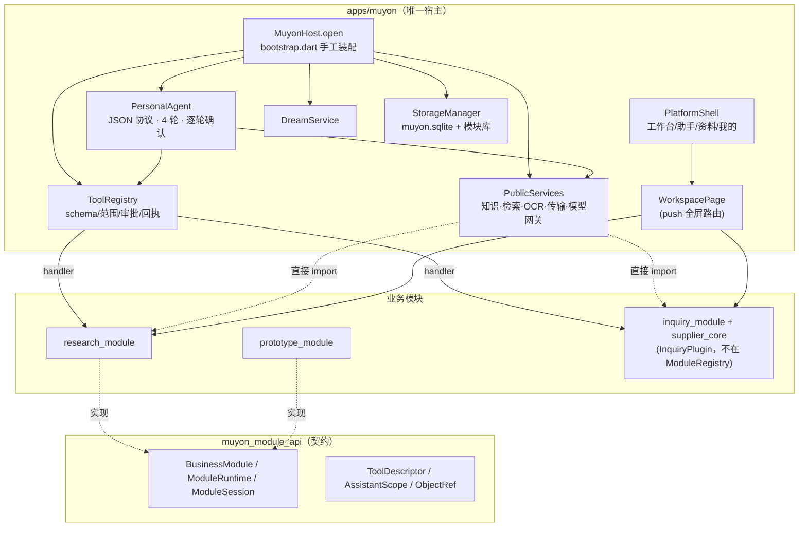
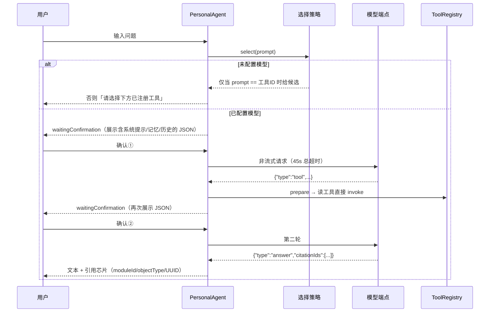
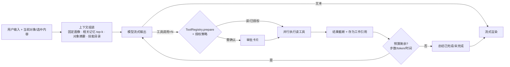
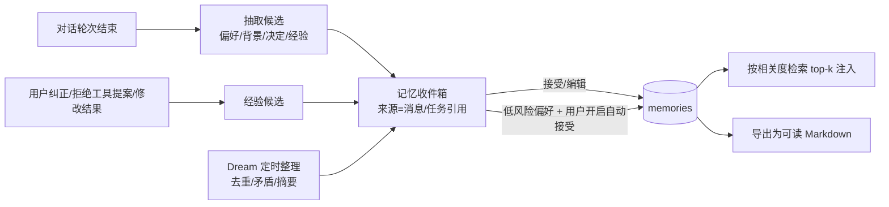

# Muyon 深度研究：架构、业务、体验、竞品与优化方案

日期：2026-10-05 · 基线：`develop@ace1f00` · 性质：研究与建议，不改动产品代码。

---

## 0. 结论先行

**一句话判断：** Muyon 的"安全与数据一致性底座"已经达到很高水准，个人 AI 助手本身仍然偏弱。项目把大量精力放在了证明"不会做错"上，在"好用"和"有用"上投入不够。2026 年同类产品（Meta Muse、xAI Grok Bot、Gemini Spark、OpenClaw、腾讯 ima 等）已经把"会持续干活、会学习、少打扰"做成基本门槛。Muyon 现在的助手做一个三步任务，要用户读三四次 JSON 再点确认；离线时只认精确的工具 ID；记忆只能手动录入。

**最该保留的（真正的护城河）：**

1. 宿主统一管理的 SQLite 存储：迁移目录、漂移检测、单写队列、备份/恢复（`platform/storage_manager.dart`、`backup_service.dart`）。
2. 工具调用通路：参数 schema 校验、范围解析、一次性审批摘要、防重放回执、"按效应点如实区分 cancelled / interrupted"（`platform/tool_registry.dart`）。
3. 出站账本（`outbound_requests`）："记不进账就不发送"（`platform/outbound_ledger.dart`）。
4. 设备身份与 TLS 证书固定、五态独立的传输状态机（`services/transfer/`）。
5. 证据分级文化：D/T/B/M/R 五类证据，不把测试通过冒充真机验收。

**最该改的十件事（按影响排序）：**

| # | 问题 | 一句话方案 |
|---|---|---|
| 1 | 每一轮模型调用都要人工确认原始 JSON | 改为分级授权（本机模型免确认、远程按档案/会话/任务授权），审批卡片用人话说明 |
| 2 | 自定义 JSON 协议、无流式、4 轮上限、45 秒总超时 | 原生 function calling 适配器、SSE 流式、按预算控制的 Agent 循环 |
| 3 | 离线模式只认精确工具 ID（自然语言 0/84） | 命令面板 + 由 schema 自动生成表单；可选本机小模型 |
| 4 | 记忆没有自动来源，Dream 只是整理手录内容 | 对话后抽取候选记忆进收件箱，纠错沉淀为经验，按相关度检索注入 |
| 5 | 插件契约没有真正驱动组装（`routes` 未被使用、询价不在注册表、宿主 19 个文件直接依赖具体模块） | 让契约生效：模块声明路由、工具、对象类型、检索源与结果渲染器 |
| 6 | 两套助手、两个工作台、两个任务中心（Folio「问数据/AI 任务」与 Muyon 助手/执行面板并存） | 宿主模式下由宿主助手统一入口，Folio 的证据界面改为工具结果渲染器 |
| 7 | 两套检索栈、整页切块、JSON 存向量逐条算余弦 | 统一知识服务：段落切块、FTS5 + 向量 + RRF 混合，可选重排 |
| 8 | 信息架构是"应用套应用"，界面暴露 UUID、枚举名、原始异常 | 三栏桌面布局、模块嵌入中区、⌘K 全局入口，对象用人话展示 |
| 9 | 没有 iOS；没有系统通知、分享入口、快速记录 | 补 iOS，补移动端个人助理的基础能力 |
| 10 | 真机证据（R）和真实模型证据（M）基本为零，范围三次调头 | 冻结范围，两周内跑通"真实模型 × 真机"的一条纵向链路 |

**定位建议：** 不去和 Muse、Grok Bot 比"云端 VM 里 24 小时替你点网页"。Muyon 应该做 **"本地优先、结论可核验、业务计算确定、跑在自己设备上的工作助手"**：你的 Mac 或 PC 就是你的"Secure VM"，手机是遥控器。第 6.1 节展开。

---

## 1. 研究范围与方法

- **代码：** 通读宿主 `apps/muyon`（19.9k 行）、契约 `muyon_module_api`（1.0k 行）、`muyon_ui`、`prototype_module`；抽查 `research_module`（10.1k 行）、`inquiry_module`（24.3k 行）、`supplier_core`（23.7k 行）。Dart 源码合计约 80.5k 行，测试代码约 49.5k 行（220 个测试文件）。
- **文档：** `docs/` 共约 556 KB，包括产品与架构总览、需求账本、V0.1 设计、并行开发计划、验收账本、失败矩阵、调用路径审计、工具选择评测、各轮评审。
- **历史：** 166 个提交，集中在 2026-10-04 至 10-05 两天，多个 AI 编码代理并行开发（见并行开发计划第 2 节）。
- **限制：** 容器内没有 Flutter SDK，本次**没有运行**测试和构建，所有判断来自代码与文档阅读。竞品资料来自网络检索摘要。本环境的网络策略拦截了直接抓取网页，所以引用的是第三方报道和检索摘要，不是厂商原文，第 3 节逐项标注来源，引用前应二次核对。

---

## 2. 项目现状全景

### 2.1 产品定位与业务范围

根据 `docs/superpowers/specs/2026-10-04-muspace-product-and-architecture-overview.md`：

> 一个以个人 AI Agent 为核心的跨端工作空间，连接个人资料、完整业务应用、公共能力和自己的设备。

覆盖五条业务线和一个平台：

| 业务线 | 来源 | 现状 |
|---|---|---|
| 个人 AI 助手（主对话/专题对话、执行可视、记忆、Dream） | 新建 | 🟡 框架齐全，能力薄弱 |
| 科研工作台（论文阅读批注、研究卡、关系、提纲、任务包/研究包） | 迁入 research-workbench | 🟡 迁入完成（95–185 项测试），完整链未在真机跑通 |
| 询价与成本（Folio：供应商、物料、报价、预算、技术要求） | 迁入 software-cost-calculator | 🟡 最成熟，478 + 320 项测试；写操作已注册为工具 |
| 原型业务（受限 WebView 展示 Vue 原型、版本、反馈） | 新建 | 🟡 有模块与 WebView 守卫，搭建能力后置 |
| 设备通信（互传、一对一聊天、任务包跨设备执行） | 新建 + 迁入 | 🟡 TLS 固定 + 签名，双设备实机未验证 |
| 平台（工作台、消息、个人、数据与知识、接口与工具、设置） | 新建 | 🟡 |

### 2.2 技术架构



**分层：**

- **宿主：** 启动、导航、工作区与模块绑定、平台服务、资源与设置。
- **契约：** 模块清单（ID、API 版本、依赖）、迁移声明、`ManagedDatabase` 写队列、`ModuleRuntime` 的导入意图/回执、`ModuleSession.resolve/objectPage`、工具描述与范围。
- **存储：** `muyon.sqlite` 存主数据（工作区、绑定、结构目录、对话、执行记录、记忆、通知、出站账本、传输任务）。每个模块一个业务库（`modules/<id>/<id>.sqlite`），另有文件仓与派生索引。
- **工具：** 模块与公共服务注册到 `ToolRegistry`。读工具在范围内直接执行；写/导出/联网工具要宿主签发一次性审批。

### 2.3 关键业务流程

**(a) 助手调用流程（现状）**



一个"查一下 A 项目的预算再比较两家报价"的任务，至少要两次模型确认。涉及写入时还要再加工具确认。每次确认都要读一段缩进 JSON（`screens/assistant_page.dart:135`）。

**(b) 首次导入：** 主库导入意图 → 业务库事务（数据 + 回执 + 变更记录同一事务）→ 主库绑定对账，中断后按回执恢复（`workspace/import_coordinator.dart`）。设计扎实。

**(c) 投影与检索：** 模块变更记录 → `ProjectionService` 幂等更新 `object_catalog` → 检索索引随删除/撤回失效 → 取材前回模块核对（`platform/projection_service.dart`、`services/knowledge/index_invalidation.dart`）。

**(d) 设备传输：** 发现不等于信任 → 指纹比对配对 → TLS 1.3 证书固定 + 发送方 ECDSA 签名 → 送达 / 落盘 / 导入 / 已读 / 接纳五态独立 → 任务包导入不授予执行权，双方确认后由较低设备 ID 一方执行一次（`services/transfer/`、`task_coordinator.dart`）。

**(e) 科研完整链（目标）：** 导入成果和论文 → 阅读检索 → 批注与研究卡 → 限定资料问答 → 导出任务 → 另一设备执行 → 导回 → 人工接纳 → 关联提纲 → 导出报告 → 退出重开仍在。**这条链目前没有端到端证据**（验收账本第 12 行为 ❌）。

### 2.4 实现路径与开发过程

- **阶段：** W0 基线与契约冻结 → W1 核心能力（存储、设计系统、科研阅读、原型、询价存储、引用锚、研究包、设备信任、检索评测）→ W2（调用路径、MCP、执行面板、记忆页、询价工具、Dream、在线任务、工具选择）→ W3 集成与真机验收。当前 W1/W2 大部分完成，W3 未开始。
- **组织：** 五个 AI 编码代理按目录独占并行开发（A 架构/集成，B 前端，C 业务迁入，D 难题攻坚，E 支援），A 负责合并门禁与验收账本。
- **优先级三次调头：** 科研优先 V0.1 → Folio 插件优先 → 平台三层优先（`execution-progress.md`）。命名也换了三次：MuSpace → Miyono → Muyon，文档里仍大量保留 `muspace` 文件名。
- **质量门：** `scripts/verify.sh` 对七个包做静态分析并跑全部测试。CI 只能手动触发（`workflow_dispatch`），PR 不会自动跑。

### 2.5 UI/UX 现状

- **设计基准：** 用户指定沿用 Folio `DESIGN.md`：中性明暗主题、Noto Sans SC、8 圆角、零阴影、克制动效、减少动态、200% 字号。规范质量很高。
- **宿主外壳：** Material 默认的 `NavigationRail`（≥900）或底部 `NavigationBar`，四个入口（工作台/助手/资料/我的）。顶栏另有执行面板、消息中心、个人中心、系统设置四个图标。≥1250 时右侧并排 360 宽助手（`screens/platform_shell.dart:399-507`）。
- **模块：** 通过 `Navigator.push` 打开全屏 `WorkspacePage`。Folio 自带 11 个入口的外壳（含自己的「工作台」「问数据」「AI 任务」），科研也有自己的工作台。
- **助手页：** 消息用卡片，正文是 `SelectableText`，不渲染 Markdown。任务卡片排在全部消息之后，不按时间穿插。引用芯片直接显示 `moduleId/objectType/objectId`，任务卡片显示执行设备的 UUID（`assistant_page.dart:397、417`）。
- **文案：** 所有字符串硬编码中文，没有 ARB 国际化。错误多以 `'$e'` 原样展示。工具页展示原始工具 ID（`platform_shell_knowledge.dart:131、238`），近期工作显示 `scope.kind.name` 这样的枚举名（`platform_shell_home.dart:87`）。

---

## 3. 竞品与同类系统调研（2026）

> 2026 年 6 月之后发布的产品资料来自检索摘要和第三方报道，厂商原文未能直接抓取。数字与功能以官方页面为准，引用前请复核。来源见文末。

### 3.1 通用个人 AI Agent

**Meta Muse（2026-09-08 发布）**

- **定位：** 执行长时间任务的个人 Agent，不是一问一答的聊天机器人。在用户连接的账户里发邮件、订行程、填表、下单。
- **执行环境：** 每个用户一台专属云端 "Muse Secure VM"，自带浏览器，凭据存在 VM 内。
- **审批：** 同一台机器上运行一个和 Muse 在系统层面隔离的 **Sentinel** 代理，Muse 的任何出网动作都要 Sentinel 放行。授权分为一次性、会话、任务、限时、永久五档，**每一档都绑定具体连接器、目的地与用途**，不是笼统的"允许"。
- **记忆与主动性：** 记住用户在意的事，会主动给建议（例如把收藏的菜谱短视频变成购物清单）。评测者也指出，在意外场合翻出记忆会让人觉得被冒犯。
- **形态与定价：** iOS、Android、Mac、Web、WhatsApp，眼镜在路上。免费、$20/月、$100/月三档，按每周 token 配额计，免费档显示用量表。首发仅限北美成年用户（来源对是否含加拿大说法不一）。
- **隐私：** 计划推出 "Confidential VM"，由用户独占密钥。在此之前，当前 VM 与其他用户和公网隔离，但对 Meta 并不保密。

**xAI Grok Bot（2026-08-11 发布）**

- **定位：** 可命名的"AI 同事"，按名字和职责创建，例如研究员、邮件分拣、幕僚长。
- **执行环境：** 每个账户一台持久云端 VM（浏览器 + 文件系统 + 终端），**所有 bot 共用**，合上电脑也继续工作。有评论专门讨论"共享电脑"带来的隔离问题。
- **Teach-a-task：** 录屏演示（≤10 分钟、无音频）后自动生成技能。技能包含：何时使用、所需输入与权限、步骤、**如何验证结果**、返回什么、**哪些步骤必须人工批准**。
- **学习：** 积累偏好、项目上下文、历史任务；**用户纠正一次，下次就照做**。
- **Routines：** 定时或事件触发（Slack、GitHub）运行。可以把 2–6 个 bot 拉进群聊协作、移交任务。
- **插件、形态与定价：** 支持 Gmail、Drive、Calendar、Notion、Slack 等插件。桌面端 macOS/Windows/Linux，加 iOS，Android 计划中。单买 $200/月。

**Google Gemini Spark（I/O 2026，5 月 beta）**

- 24/7 云端 Agent，基于 Gemini 3.5 Flash 与 Antigravity agent harness。支持 Tasks、Skills、Schedules，通过 MCP 接第三方。
- **外发与交易类动作一律停下来请求明确批准。**

**OpenAI ChatGPT**

- Memory 会从对话中**自动抽取**偏好、决定和个人背景，形成持久档案并注入后续会话。Agent 模式可以操作网页完成多步任务。
- 主动推送的 **Pulse 于 2026 年 6 月下线**。这说明"主动推送"做不好就是噪音，要有清晰价值和退出机制。

**OpenClaw（开源、本地优先）**

- 运行在用户自己的电脑上，能操作真实应用与文件。记忆是 **Markdown 文件**（`MEMORY.md` 存长期事实，日志按天追加，只在相关时载入）。
- 有 100+ 个 AgentSkills。社区技能市场约 **20% 的技能存在安全风险**。2026 年修复了一个记忆投毒漏洞，并收紧了未签名技能的安装流程。

### 3.2 知识与科研类

- **Google NotebookLM：** 每个回答都有**行内引用芯片，直接跳到原文段落**。每个笔记本最多 50 个来源，可生成数据表、音频概览。2026 年 6 月起能自主上网补充来源，正走向研究 Agent。
- **腾讯 ima：** 以知识库为核心的"搜—读—写"工作台，背靠微信生态。知识 Agent「copilot」2026-05-25 全面开放，**会记住习惯偏好、知识库内容直接参与任务、支持自带模型 API Key、支持 Skills 封装方法论**。可解析 19+ 种文件格式，支持共享知识库。
- **Elicit / SciSpace / Zotero：** Elicit 主打抽取表格与系统综述流程（Pro 版可筛选 5,000 篇）。SciSpace 主打论文内解释。Zotero 本身没有内置 AI，Beaver 等插件以侧栏形式提供库内检索、PDF 问答、元数据修复。科研 AI 的主流形态是**"在已有资料库旁边放一个侧栏助手"**，与 Muyon"业务页面 + 上下文助手"的设计一致。

### 3.3 本地优先桌面客户端

- **Cherry Studio 2.0：** Agent 作为主入口，支持 60+ 模型供应商和本地模型（Ollama、LM Studio），内置 RAG 与 MCP，AGPL 许可。
- **AnythingLLM：** 以"工作区 + 文档"为核心的 RAG，无代码 Agent 构建器，支持 MCP，三端桌面。
- **Khoj：** 自托管，覆盖浏览器、Obsidian、Emacs、手机、WhatsApp 多个入口，偏文档与研究。

### 3.4 协议与基础设施

- **MCP 2026-07-28 版规范：** **MCP Apps**（工具返回交互式 UI，在沙箱 iframe 中渲染）与 **Tasks**（长任务）成为一等扩展。新增客户端发起的 **elicitation**（表单模式、URL 模式），服务端可以暂停执行向用户要输入。
- **Agent Skills 开放标准（SKILL.md）：** Anthropic 于 2025 年 12 月发布，已有 40+ 平台支持。核心是**渐进披露**：启动时只读名称和描述（约 100 token），匹配后再加载全文，执行时才读脚本。安全研究同时揭示了技能供应链投毒风险。
- **LocalSend：** Flutter + Rust，UDP 组播发现，HTTPS REST 传输，每台设备自签证书，用证书 SHA-256 指纹识别和记忆设备。Muyon 的设备信任方案（P-256 自签 + 指纹固定 + 发送方签名 + 防重放窗口）**在安全强度上不弱于 LocalSend**。

### 3.5 对比矩阵

| 维度 | Muse | Grok Bot | Gemini Spark | OpenClaw | NotebookLM / ima | **Muyon（现状）** |
|---|---|---|---|---|---|---|
| 执行环境 | 每用户云 VM | 每账户共享云 VM | 云 VM | 本机 | 云 | **本机 + 本人设备** |
| 持续运行 | 24/7 | 24/7 + 定时/事件 | 24/7 + 定时 | 本机在线时 | 否 | 否（关闭即中断） |
| 记忆来源 | 自动 + 反思 | 偏好 + 纠错沉淀 | — | Markdown 自动写 | ima：记偏好 | **仅手动录入** |
| 审批模型 | Sentinel 五档、绑定目的地 | 技能内声明审批点 | 外发/交易必批 | 用户自审 | — | **逐次确认，含每轮模型请求** |
| 扩展 | 连接器 | 插件 + 录屏技能 | Skills + MCP | AgentSkills 市场 | ima Skills | 注册工具 + MCP 客户端 |
| 引用可核验 | 弱 | 弱 | 弱 | 弱 | **强（段落级）** | **强（页 + 引句 + 摘要）** |
| 业务确定性计算 | 无 | 无 | 无 | 无 | 无 | **强（Folio 规则）** |
| 数据主权 | 对 Meta 不保密（当前） | 云端 | 云端 | 强 | 云端 | **强 + 出站账本** |
| 移动端 | iOS/Android/WhatsApp | iOS | Android/iOS | 消息渠道 | 全端 | Android（无 iOS） |
| 流式与 UX 打磨 | 高 | 高 | 高 | 中 | 高 | **低** |

### 3.6 对 Muyon 的启示

**可借鉴：**

1. **Muse Sentinel 式分级授权：** 授权"绑定连接器 + 目的地 + 用途 + 时效"。这正好是 Muyon 已有 `PermissionDecision`（`toolId/effect/endpoint/destination/dataCategories/expiresAt`）想表达的，只差把"逐次"扩展为"按档"。
2. **Grok Bot 的技能结构：** 适用场景 / 输入与权限 / 步骤 / 验证方法 / 返回 / 人工批准点。直接对应 Muyon 的科研 skill 与工具效应模型。"纠错即经验"对应 F-DREAM 的经验候选。
3. **ChatGPT / ima 的自动记忆：** 记忆必须有自动来源，用户只做审阅，不做录入。
4. **NotebookLM 的引用芯片：** 悬停预览原文段落，点击跳到页面高亮。Muyon 的引用锚更严谨，只差呈现。
5. **OpenClaw 的 Markdown 记忆：** 可读、可 diff、可备份，正好满足需求 K01"可读文件组织"。
6. **MCP Apps / Tasks / elicitation：** 和 Muyon 的"模块结果回页""长任务""确认"高度同构。可以先按原生 Flutter 实现同构接口，以后再对外暴露。

**应规避：**

1. Pulse 下线说明主动推送要克制，必须可关、可评价、默认低频。
2. OpenClaw 技能市场约 20% 有风险：近期不做开放技能市场，只用本地编写或签名的技能。
3. Grok Bot 共享 VM 的隔离争议：Muyon 的"每模块一个库 + 能力授予快照"方向正确，但同进程静态模块不是安全沙箱（设计文档已说明），不要对外宣称隔离。
4. Muse 的隐私争议说明，"数据去向可见"本身就是卖点。Muyon 已有出站账本和数据去向页，应该放到显眼位置，而不是藏在设置里。

---

## 4. 现有设计中值得保留的部分

| 设计 | 价值 | 证据 |
|---|---|---|
| 业务事实归模块，平台只存引用与投影 | 避免两套事实来源，迁入代码保持原规则 | 架构总览第六节；`projection_service.dart` |
| 宿主统一迁移与漂移阻断，不清库重建 | 升级失败可恢复，不会静默丢数据 | `storage_manager.dart`、`schema_catalog.dart` |
| 意图 + 回执 + 对账的跨库导入 | 不依赖多库原子提交也能保持一致 | `import_coordinator.dart` |
| 审批摘要绑定参数、范围、时效，一次性消费 | 模型和资料内容不能授予权限 | `tool_registry.dart`、`personal_agent.dart:confirm` |
| 按效应点区分取消结果 | 不把"可能已发生"说成"已取消" | `invocation-path-audit.md` 第 1 节 |
| 出站账本，记不进账就不发送 | 数据去向可审计 | `outbound_ledger.dart` |
| 设备信任与五态传输 | 收到不等于导入，导入不等于执行 | `lan-threat-model.md`、`task_coordinator.dart` |
| 证据分级与诚实账本 | 防止"构建通过"冒充"验收通过" | `muyon-acceptance-ledger.md` |

这些是 Muyon 相对所有云端 Agent 的真实差异。下面的优化**不推翻这些机制，只让它们对用户隐形、少打扰**。

---

## 5. 问题清单

严重度：**S1** 直接影响核心价值，**S2** 显著影响体验或可维护性，**S3** 中长期隐患。

### 5.1 产品与定位

**P-01（S1）定位过宽，核心价值缺少一条主线。** 五条业务线、六项平台职责、三端，加上 OCR、向量、Dream、工具选择器、跨设备任务，同时推进。优先级三次调头，命名三次更换。结果是每条线都是 🟡，没有一条线达到"可以每天用"的 ✅。对用户来说，"这个应用帮我把什么事做得比别处好"还没有答案。

**P-02（S1）"以个人 AI Agent 为核心"与实际能力不符。** 助手是全产品能力最弱的部分：

- 未配置模型时，只有输入框内容**恰好等于工具 ID** 才能调用工具（`assistant/tool_selection.dart:44`）。评测里中文、中英混合、释义类题目 top-1 都是 0/28（`tool-selection-eval-2026-10-05.md`）。
- 配置模型后，每轮模型请求前都要确认（`personal_agent.dart:231-262`），最多 4 轮（`:21`）。
- 记忆只能手动录入（见 P-05）。

**P-03（S2）重复入口：** 两个助手、两个工作台、两个任务中心。宿主有「工作台 / 助手 / 执行面板」，Folio 在宿主内仍保留自己的「工作台 / 问数据 / AI 任务」（`inquiry_module/lib/src/app/shell.dart:30-34、385`），而 Folio 的「问数据」还走自己的助手链路（`supplier_core/lib/src/assistant*.dart`）。用户无法判断该在哪里提问、该去哪里看任务。

### 5.2 Agent 内核

**P-04（S1）Agent 循环落后于 2026 年的通行做法：**

1. **自定义 JSON 协议**（`personal_agent.dart:131`）。没有使用供应商原生的 function calling 和结构化输出，模型输出格式不稳定时只能整体失败。
2. **没有流式输出**（`model_gateway.dart:143` `'stream': false`），**总超时 45 秒**（`:114`）。推理模型或长回答很容易超时，等待期间没有任何反馈。
3. **只有 OpenAI 兼容一种协议。** 需求原文要求"能力明确的适配器，逐项验证对话、流式、工具和向量接口"（架构总览第九节），代码里只有一个网关。
4. **固定 4 轮、只保留最近 16 条历史、不做摘要**（`:138`）。上下文超过 256 KB 直接失败（`:243`）。
5. **整份记忆注入系统提示，不做相关性检索**（`_memories`）。记忆一多就会挤占上下文，也会被无关地泄露给远程端点。
6. **token 用量靠估算。** Dream 用"字符数 ÷ 4"估成本（`dream_service.dart:116`），网关不读取供应商返回的 `usage`。

**P-05（S1）记忆和学习闭环缺少输入。** 记忆只来自记忆页手动保存，或采纳 Dream 提案（`foundation_repository.dart:351` 的调用方只有这两处）。Dream 只整理已有记忆。对话、纠错、被拒的工具提案、工作成果都不会成为记忆或经验来源。"越用越懂你"无从谈起，而这正是 Muse、Grok Bot、ChatGPT、ima 的共同核心。

**P-06（S2）工具选择投入错位。** 为一个约 30 个工具的注册表，项目做了 Laya 多阶段评测、合成训练集、Kaggle 双 T4 微调、阈值重加权（`scripts/laya/`、验收账本 D-R8 系列），但**同一题集上的 LLM 基线是 "not measured"**。当时 `public_tools` 的工具描述还是空字符串（评测报告开头）。2026 年主流模型在几十个工具规模下靠原生 function calling 就能做得很好。分类器方案的 p50 在 440–680 ms，而且只覆盖只读工具。这是在关键路径之外投入了不成比例的资源。

（更新：同日 `origin/develop@b1ab08a` 记录门禁 2 确认未通过，`none` 49/60、只读 32/40，用户已决定**暂停 Laya 专门化**。本报告的建议与这一决定一致。下一步是补测 LLM 基线，见 6.2.4。）

### 5.3 架构

**P-07（S1）插件契约没有真正驱动组装，宿主与具体模块深度耦合：**

- 契约要求模块声明 `routes`（`muyon_module_api/lib/src/module.dart:11`），**宿主从未读取它**，全仓没有 `.routes` 的使用。导航全部写死在宿主里。
- 询价模块**不在** `ModuleRegistry` 里（`bootstrap.dart:142` 只登记科研与原型），走单独的 `InquiryPlugin` 通路。
- 宿主有 19 个文件（约 7.2k 行）直接 import 具体业务包。其中**平台公共服务反向依赖业务模块**：`search_service.dart`、`knowledge_service.dart`、`document_parser.dart`、`index_invalidation.dart` import `research_module`，`transfer_service.dart` import `supplier_core/lan.dart`。
- 三个几乎相同的 `_activateXxx` 方法（`bootstrap.dart:234-366`）。
- 后果是"新增测试模块无需科研依赖"（需求 G01）在架构上不成立，每加一个模块都要改宿主多处。

**P-08（S2）检索双栈，质量上限偏低：**

- `SearchService`（科研）和 `KnowledgeService`（公共）各自维护 `page_text` + FTS5。
- **按整页切块**。一页论文可能有几千字，问答取材粒度太粗。
- **向量以 JSON 文本存储，逐文档逐页全量计算余弦**（`knowledge_service.dart:136`、`embedding_service.dart:120-145`）。没有混合检索和重排。
- 300 篇合成语料的召回不错（recall@10 0.961），但真实论文和真实嵌入模型都还没有测（验收账本 9c）。

**P-09（S2）同类能力有多套实现：**

- 模型调用：宿主网关和 `supplier_core` 的 `LlmClient` 并存（审计 G4）。
- 局域网：`supplier_core/lan.dart`（911 行）、科研 `lan_transfer.dart`，再加宿主 `TransferService`。审计 G1 指出科研那条是明文通道。
- 主题：`muyon_ui/theme.dart`、`inquiry_module/app/theme.dart`、科研 `theme.dart` 三处。

这与"公共能力只建设一套"的原则相违背。

**P-10（S2）执行记录 schema 缺失。** `execution_records(id, state, payload TEXT)` 把目标、阶段、消息、预览、工具调用、审批 nonce 都塞进一个 JSON（`workspace_repository.dart:38`）。无法高效查询"某对象相关的全部任务""某端点的全部请求"，也难以做任务时间线和统计。

**P-11（S3）`ManagedDatabase.raw` 是逃生口。** 模块可以绕过写队列直接写库（审计 G7），宿主自己的 Dream 也直接读 `raw`。目前只靠评审约束。

**P-12（S2）平台覆盖：** 只有 Android、macOS、Windows。**没有 iOS**，而个人助理的高频场景在手机上，竞品无一缺 iOS。没有 Linux（科研用户常用）。没有 Web 或消息渠道入口（Muse 和 Khoj 都支持 WhatsApp 一类入口）。

**P-13（S3）长任务和定时任务缺少宿主。** 应用关闭即中断（设计上如实标记 interrupted，这是对的），但没有"常驻节点"概念。Routines、Dream 定时整理、跨设备任务都没有可靠的运行位置。

### 5.4 UI/UX

**P-14（S1）确认体验不可用。** 审批对话框展示的是缩进 JSON（`assistant_page.dart:135`）。模型阶段的 preview 包含完整 `messages`，也就是系统提示里的工具清单 JSON、全部记忆、历史和工具结果。普通用户看不懂，专业用户也不会每轮细读，**审批会退化为条件反射式点击，反而削弱了安全设计的初衷**。

**P-15（S2）信息架构是"应用套应用"：**

- 宿主的 4 个入口加顶栏 4 个图标，「我的」与顶栏的「个人中心」「系统设置」重复。
- 进入模块是全屏 push，模块再呈现自己的完整外壳。Folio 有 11 个入口，含第二个工作台和第二个助手。
- 跨模块的上下文助手在模块页内不可见，因为它挂在宿主外壳的右栏，push 后被覆盖。这和需求 U01"桌面并排"的意图相悖。

**P-16（S2）助手界面基础能力缺失：**

- 不渲染 Markdown、表格、代码。
- 没有流式打字反馈。
- 任务卡片不按时间与消息交错，统一排在消息之后。
- 引用显示 `research/paper/3f2a…` 这样的原始标识（`:397`），没有标题、页码和预览。
- 任务卡片显示设备 UUID（`:417`）。
- 没有停止生成、编辑重发、复制、重新生成等常见操作。

**P-17（S2）文案与可理解性：**

- 原始工具 ID 直接作为标题（`platform_shell_knowledge.dart:131、238`）。
- 枚举名直接显示（`platform_shell_home.dart:87`）。
- 错误以 `'$e'` 原样抛给用户，包括 `StateError`、`stale_confirmation` 这类内部码。
- 首次使用没有引导。用户不知道要先配置模型，也不知道"离线工具"能做什么。

这与 `DESIGN.md`"不把内部标识、调试信息挤进主要业务工作面"的规范直接冲突。

**P-18（S3）移动端个人助理的基础能力缺失：** 没有系统通知（站内通知不会推到系统），没有分享菜单接收（从微信或浏览器"分享到 Muyon"），没有快速记录和语音输入，没有桌面小组件。没有国际化框架，所有字符串硬编码。

**P-19（S3）设计系统落地不一致。** 规范要求 ≥720 时使用 200 宽中性侧栏，宿主却用 Material 默认的 `NavigationRail`（≥900 才出现），助手消息逐条套 `Card`，而规范要求"避免重复嵌套卡片、用背景和细线组织内容"。模块和宿主的视觉层级不统一。

### 5.5 研发过程与验证

**P-20（S1）核心价值缺少真实证据。** 验收账本中，真机业务（R）和真实模型（M）几乎全部是"未验证"，科研完整链为 ❌。大量自动测试（宿主 220、Folio 800+）证明了"不会做错"，没有证明"用户能用起来"。

**P-21（S2）文档和流程成本偏高：** 文档 556 KB，相当于约 80k 行代码的 7 倍字节量。单份代理提示文件 109 KB。评审、共识、复核层层叠加。文档名仍是 `muspace`。三次优先级调头留下的历史状态需要读者自己按日期判断。

**P-22（S2）CI 只能手动触发**（`.github/workflows/verify.yml`：`workflow_dispatch`），而且只在 macOS 上跑。PR 合并没有自动门禁，多代理并行开发时风险尤其高。

**P-23（S3）多代理并行的协调成本。** 两天 166 个提交、42 次合并，计划里已记录"共用工作目录冲突"等问题。代理之间的契约冻结与反复改契约存在张力，`ToolDescriptor.description` 就是事后补的。

---

## 6. 优化方案

### 6.1 产品战略：收敛主线，差异化定位

**定位语（建议）：** Muyon 是跑在你自己设备上的工作助手。资料不离手、结论可核验、业务计算有依据，能替你执行获准的工作。

**与竞品的分工：**

| 维度 | 云端 24/7 Agent（Muse / Grok Bot / Spark） | Muyon |
|---|---|---|
| 主要价值 | 替你在网页与 SaaS 里操作 | 替你在**自己的资料与业务系统**里查询、分析、产出 |
| 运行位置 | 厂商云 VM | **本人桌面作为常驻节点**，手机作为遥控与采集端 |
| 信任来源 | 厂商承诺、隔离 VM | 本机数据、出站账本、可核验引用、确定性业务规则 |
| 关系 | 竞争不过，也不必竞争 | 通过 MCP 双向对接：既调用外部工具，也把本地知识开放给外部 Agent |

**North Star 场景（二选一，先做透一个）：**

- **A. 科研：** "导入一批论文 → 问出带页码引句的回答 → 沉淀研究卡 → 写出提纲"，全程可离线，换设备可接续。对标 NotebookLM + Zotero，差异是本地、可核验、可出包。
- **B. 询价：** "一句话让助手比较报价、核对技术要求、生成询价单草稿，我确认后写入"。对标 ERP 里的 AI 助手，差异是确定性计算和完整业务页面。

**建议先做 B，再做 A。** Folio 模块最成熟（800+ 测试，写工具已注册），离"可以每天用"最近。科研链路依赖真实论文和真实模型评测，更适合作为第二个里程碑。

**范围冻结（下个阶段只做）：** Agent 内核 v2、统一外壳、记忆 v1、询价完整助手链、科研阅读与问答链。**明确后置：** 原型搭建、群聊、OCR 原生三端、Laya 微调、在线任务调度扩展。

### 6.2 Agent 内核 v2（最高优先级）

#### 6.2.1 模型适配层

```dart
/// 能力显式声明，不假定"兼容"等于"相同"。
class ModelCapabilities {
  final bool toolCalling, parallelToolCalls, streaming, jsonSchema, vision;
  final int contextTokens, maxOutputTokens;
}

abstract interface class ModelProvider {
  ModelCapabilities capabilities(ModelProfile profile);
  Stream<ModelEvent> chat(ModelRequest request, {ModelCancellation? cancel});
  // ModelEvent: TextDelta | ToolCallDelta | ToolCallComplete | Usage | Done | Error
}
```

- **适配器：** OpenAI Chat Completions / Responses、Anthropic Messages（`tool_use`）、Gemini、Ollama / LM Studio（OpenAI 兼容带 tools）。不支持 tools 的端点回退到现有 JSON 协议，并在 UI 标注"兼容模式"。
- **流式与超时：** SSE 流式。超时改为"连接 15 秒 + 流空闲 60 秒"，不再用 45 秒总超时。
- **用量：** 读取供应商返回的 `usage`，写入出站账本，替代"字符数 ÷ 4"的估算。
- **保持不变：** 出站账本、显式端点、无静默回退，网关只换协议层。

#### 6.2.2 分级授权（替代逐轮确认）

借鉴 Muse Sentinel，复用现有 `PermissionDecision` 字段：

| 对象 | 默认策略 | 用户可选档位 |
|---|---|---|
| **本机模型**（loopback） | 免确认（数据不出设备） | — |
| **本人设备上的模型**（已配对） | 免确认 | 改为逐次 |
| **远程模型** × 数据类别（对话 / 记忆 / 工具结果 / 文档全文） | 首次使用时弹出档位选择 | 每次 / 本会话 / 本任务 / 限时 N 小时 / 此档案始终；**文档全文默认不超过"本会话"** |
| **读工具** | 范围内自动执行 | — |
| **写工具** | 逐次确认 | 低风险、可撤销的写入可以选"本工作区 1 小时内" |
| **导出 / 联网工具** | 逐次确认，绑定目的地 | 不提供永久档 |

- 授权记录存为 `permission_grants(profile_or_tool, data_categories, scope, destination, expires_at, created_by)`，可在「数据去向」页查看、撤销。
- 每次请求仍然先写出站账本，"记不进账就不发送"保持不变。
- 远程端点的请求预览在授权档内也能随时查看（账本 → 详情），只是不再阻塞。

**审批卡片（替代 JSON 对话框）：**

```
┌ 需要你的确认 ──────────────────────────────┐
│ 写入询价单：A 项目 · 离心泵询价（#INQ-0012）     │
│   状态   open → closed                        │
│   影响   1 条询价单；不发送任何邮件或网络请求      │
│   可撤销 是（询价单可重新打开）                  │
│ [查看技术详情 ▸]           [拒绝]  [确认写入]   │
└───────────────────────────────────────────┘
```

- 模块为每个写工具提供 `describeEffect(params) → EffectSummary`，内容包括对象名、old → new、影响面、是否可撤销。宿主只负责渲染。
- 技术详情折叠，里面保留现有摘要与 JSON，审计能力不丢。

#### 6.2.3 Agent 循环



- **预算替代固定轮数：** 默认 12 步、可配置 token 上限、10 分钟墙钟。耗尽时如实总结哪些完成了、哪些没有。
- **并行读工具：** 一次回复里的多个只读调用并行执行。
- **结果管理：** 超过阈值的工具结果存为工件（`ArtifactRef`），模型只看摘要和句柄，需要时再读取。
- **上下文压缩：** 超过上下文 60% 时，把早期轮次压缩为摘要并保留引用 ID，取代"只留最近 16 条"。
- **任务计划：** 多步任务先出一份可见计划（Todo），执行中逐项更新，执行面板直接展示。

#### 6.2.4 工具选择：渐进披露替代分类器

- 工具按模块和技能分组。系统提示只放"技能目录"（名称 + 一句话描述），模型调用 `load_skill(name)` 后才展开该组的工具 schema。这是 Agent Skills 标准的做法。
- 30 个工具以内可以全量给出，模型原生 function calling 足以胜任。**先在现有 140 题上测出 LLM 基线**（目前是 not measured），再决定是否需要别的方案。
- **Laya 与 Kaggle 微调保持暂停**（用户已于 2026-10-05 决定）。保留评测框架和 140 题，先用它测出 LLM 原生 function calling 的基线。分类器以后只作为离线"命令建议"的可选增强，不作为调用闸门。

#### 6.2.5 离线也真正可用

- **命令面板（⌘K / 移动端搜索栏）：** 每个工具都是一条可搜索命令，支持中文别名和拼音首字母。
- **表单自动生成：** 根据 `parameterSchema` 生成表单（枚举 → 下拉，对象引用 → 对象选择器），离线执行查询和计算。这能把"离线只认工具 ID"变成"离线有完整的命令系统"。
- **本机模型一键接入：** 预置 Ollama、LM Studio 档案并检测是否在运行。Mac 上可选 MLX，使"本机模型 + 免确认"成为默认推荐路径。

#### 6.2.6 Skills（技能）

- 采用 SKILL.md 开放标准。科研模块已有 `research_skill.dart` / `skill_bridge.dart`，可以作为首批技能落地，例如"精读一篇论文""对比两家报价""生成询价单"。
- 技能清单字段参考 Grok Bot：`when_to_use`、`inputs`、`allowed_tools`、`steps`、`validate`、`returns`、`approval_points`。宿主强制 `allowed_tools` 为白名单。
- **近期不做开放市场**，只接受本地编写或签名的技能（吸取 OpenClaw 的教训）。
- 后续可做"从执行记录生成技能"：把一次成功的多步任务固化为技能草稿，用户审阅后启用。这是 Grok Bot teach-a-task 的本地化版本，用执行轨迹代替录屏。

#### 6.2.7 MCP 双向

- **作为客户端（已有）：** 补上 elicitation（服务端请求用户输入时弹表单）和 Tasks（长任务进度）。
- **作为服务端（新增）：** 以只读工具和资源暴露"知识检索、研究对象、询价查询"，**让 Claude、Cursor、Codex 等外部 Agent 使用本地资料**，每次访问写入出站与授权账本。投入小、杠杆大，把 Muyon 变成个人 Agent 生态里的"本地知识与业务节点"。

### 6.3 记忆与学习闭环 v1



- **抽取：** 每个会话结束时（或每 N 轮），用当前已授权的模型生成候选，候选都带 `source_ref`（消息 ID 或任务 ID）。默认进收件箱，不自动生效。
- **纠错沉淀（Grok Bot 式）：** 用户拒绝工具提案、修改助手产出、写下"以后别这样"时，生成"经验候选"。经验在后续任务中被验证 N 次后才标为可信（与需求"一次成功不推广为通用规则"一致）。
- **检索注入：** 固定注入一份很短的个人画像（≤300 token），其余记忆按与当前请求的相关度取 top-k。远程端点只收到相关条目，同时降低泄露面。
- **可读化：** 每个作用域导出一个 Markdown 文件（参考 OpenClaw 的 `MEMORY.md`），满足 K01，也便于用户直接编辑。
- **Dream：** 由常驻节点定时增量运行（见 6.4.6），结果以"本周整理"通知呈现，审阅和撤回机制保持不变。
- **主动性（吸取 Pulse 教训）：** 只做一个可选的"每日简报"（待确认任务、新收文件、过期索引、到期记忆），本地生成，可一键关闭，并记录打开率。打开率持续偏低就自动降频。

### 6.4 架构整改

#### 6.4.1 让模块契约真正生效

扩展 `BusinessModule`，**把宿主对具体模块的知识全部移回模块**：

```dart
abstract interface class BusinessModule {
  ModuleManifest get manifest;
  ModuleSchema get schema;
  List<ModuleRoute> get routes;                       // 宿主据此生成导航
  List<ModuleNavEntry> get navigation;                // 侧栏二级入口
  void registerTools(ToolRegistrar registrar);        // 取代宿主 business_tools.dart
  List<ObjectTypeSpec> get objectTypes;               // 名称、图标、标题字段、页面
  List<SearchSource> get searchSources;               // 取代平台 import research_module
  Map<String, ToolResultRenderer> get renderers;      // 工具结果在对话中的原生卡片（类 MCP Apps）
  Future<ModuleRuntime> activate(ModuleResources r);
}
```

- **询价纳入注册表：** 迁出 `inquiry_plugin.dart`、`inquiry_*_authority.dart`、`business_tools.dart`、`inquiry_write_tools.dart`，放入 `inquiry_module` 或独立的 `inquiry_host_adapter` 包。
- **平台服务只依赖契约**（`SearchSource`、`DocumentProvider`）。可以加 `import_lint` 或 `dependency_validator` 规则：`apps/muyon/lib/{platform,services}` 禁止 import 任何业务包。
- **生命周期统一：** 把三个 `_activateXxx` 合并为 `ModuleHost.activate(id)`，统一记录状态、错误和重试。
- **验收：** 新增一个"空白示例模块"只改模块包和 `bootstrap` 的一行登记，宿主其他文件零改动。这就是需求 G01 的实证。

#### 6.4.2 统一知识服务

- **一个 `KnowledgeService`，多个 `SearchSource`。** 科研 PDF、公共文件、Folio 记录都作为来源接入，各自负责"取材前核对"。
- **段落切块：** 约 300–500 字，带页码、字符偏移、原文引句锚。引用依旧回到"摘要 + 页码 + 引句"，切块只用于召回。
- **混合检索：** FTS5（现有 cjk-bigram + 单字扫描）与向量结果做 RRF 融合。向量以 float32 BLOB 存储，可评估 `sqlite-vec`。规模小时暴力检索也可以，但不要再存 JSON 文本。可选重排模型（本机 ONNX）。
- **评测：** 沿用 `retrieval_eval_test`，加入真实论文与真实嵌入模型，按"同语料收益 / 资源成本"决定默认配置（需求 C03 原则不变）。

#### 6.4.3 消除重复实现

| 重复项 | 处理 |
|---|---|
| `supplier_core` `LlmClient` | 宿主模式下不可达（审计 G4），通过注入网关工厂删除调用路径；独立应用模式已不再发布，可直接移除 |
| `supplier_core/lan.dart` + 科研 `lan_transfer.dart` | 统一到宿主 `TransferService`。把 `transfer_service.dart` 依赖的 `supplier_core/lan.dart` 中的通用部分迁入宿主，科研页面改走宿主通道（审计 G1） |
| 三处主题 | 只保留 `muyon_ui`，模块删除自有 `theme.dart`，加 token 一致性测试（计划 B1 已列） |
| Folio「问数据」与宿主助手 | Folio 的采购证据、来源抓取、导入确认改造成工具和结果渲染器，宿主模式下隐藏 Folio 自带的助手、工作台和 AI 任务入口 |
| `SearchService` 与 `KnowledgeService` | 见 6.4.2 |

#### 6.4.4 执行记录事件化

```sql
CREATE TABLE tasks(id TEXT PRIMARY KEY, conversation_id TEXT, kind TEXT, state TEXT,
  goal TEXT, workspace_id TEXT, profile_id TEXT, device_id TEXT,
  created_at TEXT, updated_at TEXT, finished_at TEXT, previous_attempt_id TEXT);
CREATE TABLE task_events(task_id TEXT, seq INTEGER, at TEXT, type TEXT,
  -- plan|model_request|tool_proposed|approval|tool_result|wait|error|cancel|done
  payload_json TEXT, PRIMARY KEY(task_id, seq));
CREATE TABLE task_objects(task_id TEXT, module_id TEXT, object_type TEXT, object_id TEXT, role TEXT);
```

- 只追加的事件流天然支持任务时间线 UI、审计和"恢复时从最后检查点继续"。
- `task_objects` 支持"对象页 → 相关任务"反查，满足需求 3.1 的双入口。

#### 6.4.5 收紧数据库句柄

`ManagedDatabase` 改为提供 `read<T>(T Function(ReadOnlyDatabase))` 与 `write`。`raw` 标记为 `@Deprecated`，再加分析规则禁止模块使用。宿主内部（Dream 等）同样走 `read`。

#### 6.4.6 常驻节点（Home Node）

- **桌面端可选"常驻模式"：** 托盘或菜单栏常驻，开机自启，承担定时任务（Routines）、Dream、跨设备任务执行、MCP 服务端。
- **手机作为遥控端：** 通过已有的配对 TLS 通道提交任务、查看进度、审批（审批卡片在手机上显示，签名回执回传）。
- **定位上的意义：** 这是对 Muse / Grok Bot "云端 VM"的本地化回答，"你的电脑就是你的 Secure VM"。完全复用现有的设备信任、任务所有权和防重复执行（`task_coordinator.dart`）。
- **边界：** 继续遵守"不承诺 NAT 穿透"。跨网时提示用户自选中继，或改用文件包。

#### 6.4.7 平台

- **iOS：** Flutter 现成支持。重点验证 `flutter_secure_storage`、`pdfrx`、`flutter_onnxruntime` 和后台限制，iOS 端定位为采集 + 阅读 + 遥控端。
- **Linux 桌面：** 科研用户常用，可以低成本补充（WebView 走 `webkit2gtk`，原型模块可先降级）。
- **路由：** 引入 `go_router`，统一 `muyon://object/<module>/<type>/<id>` 深链接。通知、引用芯片、外部 MCP 结果都可以直接跳转到对象页。

### 6.5 UI/UX 方案

#### 6.5.1 信息架构

**桌面（≥1000）三栏：**

```
┌───────────┬────────────────────────────────────┬───────────────┐
│ ⌘K 搜索    │ 面包屑：项目A › 询价 › INQ-0012        │ 助手 · 范围芯片 │
│ ───────── │                                    │ [项目A][INQ-12]│
│ 首页       │                                    │               │
│ 助手       │      中区：模块业务页面 / 对象详情       │ 流式对话        │
│ ── 项目 ── │      （模块嵌入，不再全屏 push）        │ 工具调用卡片     │
│ ● 项目A    │                                    │ 审批卡片        │
│   项目B    │                                    │ 引用芯片        │
│ ── 应用 ── │                                    │               │
│ 询价 ▸     │                                    │               │
│ 科研 ▸     │                                    │ ───────────── │
│ 原型 ▸     │                                    │ 输入框  @对象    │
│ ───────── │                                    │               │
│ 资料       │                                    │               │
│ 设备       │                                    │               │
│ 任务 (2)   │                                    │               │
│ ⚙ 设置     │                                    │               │
└───────────┴────────────────────────────────────┴───────────────┘
```

- **侧栏：** 遵循 Folio 规范（200 宽中性侧栏）。模块的二级入口由 `ModuleNavEntry` 展开在侧栏里，**取消模块自带外壳**。
- **助手常驻右栏：** 范围芯片随中区对象自动更新（满足"切换项目时同步更新上下文"），可以手动钉住或解除。
- **消息、任务、个人：** 收进侧栏底部和顶栏的单一入口，删除重复项。
- **⌘K：** 统一搜索对象、资料、命令（工具）、技能。

**手机（<720）：**

- 底部四栏：**助手 / 工作 / 资料 / 我的**。「工作」页按项目列出模块入口与进行中的任务。
- 任何对象页右上角都有"问助手"，进入时自动带上该对象的范围。
- 全局悬浮"快速记录"按钮：拍照、语音、文本、链接，进入收件箱，由助手稍后整理。
- 系统分享菜单接收（文件、链接、文本），收到的内容进收件箱，绝不自动导入业务库（与五态原则一致）。

#### 6.5.2 助手界面

| 能力 | 规范 |
|---|---|
| 流式输出 | 逐字渲染，支持停止生成；工具调用期间显示"正在查询：A 项目预算…" |
| Markdown | 表格、列表、代码块；金额右对齐并使用等宽数字（沿用 `tabularFigures`） |
| 工具调用卡片 | 默认折叠为一行（图标 + 人话描述 + 状态），展开后显示参数和结果摘要；模块可提供原生渲染器（报价对比表、论文段落等） |
| 引用芯片 | `[1] 论文标题 · p.12`，悬停预览引句，点击跳到阅读器对应页并高亮引句（只有页级时如实显示"页级"） |
| 审批卡片 | 见 6.2.2，内嵌在对话流中，不用模态框 |
| 计划与进度 | 多步任务顶部显示可折叠的 Todo 列表，与执行面板同源 |
| 时间线 | 消息、工具卡、审批卡按时间交错，不再把任务卡统一堆在末尾 |
| 消息操作 | 复制、重新生成、编辑后重发、"记住这个"（直接生成记忆候选） |
| 输入 | `@` 引用对象，`/` 调用技能或命令，拖拽文件，语音输入（移动端） |
| 模型状态 | 输入框旁显示当前模型、位置标签（本机 / 本人设备 / 远程）和当前授权档 |

#### 6.5.3 可理解性与文案

- **禁止在主要工作面出现：** UUID、工具 ID、枚举名、异常类名。工具使用注册的显示名（`ToolDescriptor` 增加 `displayName` 与 `icon`），设备使用设备名，对象使用标题。
- **错误统一映射为"发生了什么 + 你可以做什么"：**

| 内部码 | 用户看到 |
|---|---|
| `stale_confirmation` | 确认已过期（5 分钟），请重新发起 |
| `model_http_401` | 模型拒绝了凭据，请到「模型」检查 API Key |
| `scope_mismatch` | 资料范围已变化，请确认后重试 |

- **首次使用三步引导：** ① 选择模型（推荐本机，检测 Ollama / LM Studio，也可跳过离线使用）→ ② 导入第一份资料或打开示例项目 → ③ 试一个示例任务。
- **国际化：** 引入 `flutter_localizations` + ARB，先抽取中文字符串，英文后补。

#### 6.5.4 信任中心

把「数据去向」从设置深处提到侧栏「设置 › 隐私与数据」的首屏，内容包括：

- 最近 7 天发往每个端点的请求次数、数据类别、字节数；
- 当前有效授权（可一键撤销）；
- 外部 MCP 客户端访问记录。

对标 Muse 的隐私承诺：Muyon 是"可验证"，不是"请相信我们"。

#### 6.5.5 组件库（`muyon_ui`）

新增并统一：`ApprovalCard`、`ToolCallCard`、`CitationChip`、`ObjectChip`、`ScopeChips`、`TaskTimeline`、`PlanChecklist`、`EmptyState`、`ErrorState`、`ModelBadge`。每个组件都提供浅色、深色、窄屏、200% 字号、减少动态的 golden 测试。

### 6.6 研发流程与质量

1. **两周纵向切片（最高优先级）：** 在真实 Mac 和 Android 设备上，配一个真实模型（一个本机、一个远程），跑通 North Star 场景并录屏，把 R 和 M 证据写入账本。之后的每个阶段都以一条真实链路收尾。
2. **CI：** PR 自动触发 Ubuntu 上的 `analyze` + 单元测试（排除 golden），macOS 每晚跑 golden 和集成测试，Android 模拟器跑 `integration_test` 冒烟。保留现有手动 `verify.yml` 作为完整门禁。
3. **文档瘦身：**
   - 根目录 `PRODUCT.md`（定位、范围、North Star）、`ARCHITECTURE.md`（现状图与契约）、`DESIGN.md`。
   - `docs/adr/` 记录关键决定，一事一页。
   - 验收账本由测试标签自动生成，人工只填 R 和 M 证据。
   - 历史评审归档到 `docs/archive/`，并把 `muspace` 文件名统一改为 `muyon`。
4. **评测：** 建立"真实模型 Agent 评测集"。在现有 140 题之上增加多步任务（含写入审批），指标为任务成功率、平均审批次数、首 token 时延、成本。每次改 Agent 内核都要跑。
5. **多代理协作：** 收敛为 2–3 条泳道（内核 / 体验 / 模块），契约变更走 ADR。优先级调整需要用户书面确认并记入 ADR，避免再次三次调头。

### 6.7 路线图

| 阶段 | 周期 | 内容 | 退出标准 |
|---|---|---|---|
| **P0 稳定与取证** | 2 周 | 范围冻结；CI 自动化；North Star B（询价）真机 + 真实模型纵向链；测出 LLM 工具选择基线；文档瘦身 | R、M 证据入账；140 题 LLM 基线出数；PR 自动门禁上线 |
| **P1 Agent 内核 v2 + 外壳** | 4–6 周 | 模型适配层（流式、原生工具）；分级授权与审批卡片；预算式 Agent 循环；命令面板与 schema 表单；三栏外壳；助手界面重做；询价入口去重 | 只读任务审批中位数 0、写任务 1；首 token < 1.5 s（本机）；真实模型多步任务成功率 ≥ 80%（自建集）；离线命令覆盖全部工具 |
| **P2 学习与知识** | 6–8 周 | 记忆 v1（抽取、收件箱、检索注入、Markdown 导出）；经验沉淀；统一知识服务（切块、混合检索）；契约生效（模块注册导航、工具、渲染器）；iOS | 新增示例模块零宿主改动；真实论文问答引用精度与断言支持人评达标；记忆采纳率可度量 |
| **P3 常驻与生态** | 8 周+ | 桌面常驻节点；Routines 与 Dream 定时；手机遥控审批；MCP 服务端；Skills（SKILL.md）；科研 North Star A 全链 | 双设备真机：手机发起、桌面执行、手机审批；外部 Agent 经 MCP 访问本地资料并留痕 |

### 6.8 衡量指标

| 类别 | 指标 | 目标（初值，按实测校准） |
|---|---|---|
| 价值 | 周活跃天数 / 每周完成的助手任务数 | 先建立基线 |
| Agent | 自建评测集任务成功率 | ≥ 80% |
| Agent | 每任务平均人工审批次数（读 / 写） | 0 / ≤ 1 |
| 体验 | 首 token 时延（本机 / 远程） | < 1.5 s / < 3 s |
| 记忆 | 候选采纳率；回答中使用记忆的比例 | 采纳率 > 40% |
| 科研 | 引用定位正确率；关键断言支持率（人评） | ≥ 95% / ≥ 85% |
| 可靠性 | 中断后可正确解释的比例；崩溃率 | 100% / < 0.5% |
| 信任 | 出站请求入账率；授权撤销后生效时间 | 100% / 立即 |

---

## 7. 风险与取舍

| 取舍 | 风险 | 缓解 |
|---|---|---|
| 放宽逐次确认 | 远程端点收到更多数据 | 本机优先；文档全文默认只到"本会话"；账本 100% 入账；授权可见可撤；远程档案首次使用强制选档 |
| 自动抽取记忆 | 误记、隐私、记忆投毒（OpenClaw 已出现过） | 默认进收件箱；带来源；工具结果和外部资料中的"指令"不得成为记忆；只抽取用户本人的陈述 |
| 契约扩展 | 短期改动面大 | 先在询价模块落地，科研、原型跟进；保留旧通路一个版本 |
| Laya 保持暂停（已决定） | 已投入成本 | 评测框架与数据保留，结论作为离线命令建议的增强 |
| 常驻节点 | 桌面资源占用、各系统后台限制 | 默认关闭；资源上限；明确"关机即暂停"，不承诺 24/7 |
| 收敛范围 | 部分需求后置 | 需求账本不删项，只调整阶段，与现有"F-xx 后续交付"机制一致 |

---

## 8. 附录

### 8.1 主要证据索引

| 主题 | 文件 |
|---|---|
| 宿主装配 | `apps/muyon/lib/app/bootstrap.dart` |
| 模块注册 | `apps/muyon/lib/app/module_registry.dart`、`packages/muyon_module_api/lib/src/module.dart` |
| Agent | `apps/muyon/lib/assistant/personal_agent.dart`、`tool_selection.dart` |
| 模型网关 | `apps/muyon/lib/services/models/model_gateway.dart` |
| 工具注册 | `apps/muyon/lib/platform/tool_registry.dart`、`business_tools.dart`、`inquiry_write_tools.dart`、`services/knowledge/public_tools.dart` |
| 记忆 / Dream | `apps/muyon/lib/platform/foundation_repository.dart`、`assistant/dream/dream_service.dart` |
| 检索 | `apps/muyon/lib/services/search/search_service.dart`、`services/knowledge/knowledge_service.dart`、`embedding_service.dart` |
| 外壳 / 助手界面 | `apps/muyon/lib/screens/platform_shell*.dart`、`screens/assistant_page.dart`、`app/app_shell.dart` |
| Folio 外壳 | `packages/inquiry_module/lib/src/app/shell.dart` |
| 需求与验收 | `docs/superpowers/specs/2026-10-04-muspace-product-and-architecture-overview.md`、`docs/implementation/muyon-acceptance-ledger.md` |
| 审计与评测 | `docs/implementation/invocation-path-audit.md`、`tool-selection-eval-2026-10-05.md`、`failure-matrix.md` |

### 8.2 外部来源（检索摘要，未直接抓取原文）

- Meta Muse：[Meta Newsroom](https://about.fb.com/news/2026/09/introducing-muse-personal-ai-agent/) · [Wikipedia](https://en.wikipedia.org/wiki/Muse_(AI_agent)) · [CNBC](https://www.cnbc.com/2026/09/27/meta-muse-ai-personal-agent.html) · [eesel 评测](https://www.eesel.ai/blog/meta-muse-agent-review) · [remio：Trust Is the Real Product](https://www.remio.ai/post/meta-muse-ai-agent-works-but-trust-is-the-real-product) · [DEV：Every Muse User Gets Their Own VM](https://dev.to/devopsdaily/meta-says-every-muse-user-gets-their-own-vm-2dmj) · [Layer3 定价](https://www.layer3labs.io/guides/meta-muse-pricing) · [Yahoo Finance 定价](https://finance.yahoo.com/technology/ai/articles/metas-muse-arrives-three-pricing-183437528.html)
- xAI Grok Bot：[Grok Bot 101](https://x.ai/bot/guides/grok-bot-101) · [Vellum 拆解](https://www.vellum.ai/blog/official-grok-bot-breakdown) · [MindStudio](https://www.mindstudio.ai/blog/grokbot-xai-agent-app) · [Layer3 Teach-a-Task](https://www.layer3labs.io/guides/grok-bot-teach-a-task) · [Composio 指南](https://composio.dev/content/guide-to-frok-bot) · [Medium：shared computer breaks](https://medium.com/@roanmonteiro/grok-bot-in-depth-how-every-feature-works-and-where-the-shared-computer-breaks-547c733601c8) · [codepick 架构](https://codepick.dev/en/guides/grok-bot-architecture/)
- Gemini Spark：[letsdatascience](https://letsdatascience.com/news/google-launches-gemini-spark-personal-ai-agent-50839617) · [HBS AI Institute 备忘](https://aiinstitute.hbs.edu/future-proof-with-ai/memo-july-2026/)
- ChatGPT：[Suprmind 功能汇总](https://suprmind.ai/hub/chatgpt/features/) · [Sentra 记忆对比](https://www.sentra.app/articles/assistant-memory-explained)
- OpenClaw：[Wikipedia](https://en.wikipedia.org/wiki/OpenClaw) · [DigitalOcean](https://www.digitalocean.com/resources/articles/what-is-openclaw) · [freeCodeCamp 安全指南](https://www.freecodecamp.org/news/how-to-build-and-secure-a-personal-ai-agent-with-openclaw/)
- NotebookLM：[Wikipedia](https://en.wikipedia.org/wiki/NotebookLM) · [UChicago Academic Tech](https://academictech.uchicago.edu/2026/04/06/google-notebooklm-an-ai-tool-for-research-and-studying/)
- 腾讯 ima：[腾讯软件中心](https://pc.qq.com/detail/14/detail_36854.html) · [人人都是产品经理测评](https://www.woshipm.com/ai/6266704.html) · [百度百科](https://baike.baidu.com/item/ima/65111768)
- 本地客户端：[Vellum 本地助手对比](https://www.vellum.ai/blog/best-local-ai-assistants) · [Cherry Studio 2.0 评测](https://www.promptquorum.com/local-llms/cherry-studio-ai-desktop-client)
- 科研工具：[Paperguide：Elicit vs SciSpace](https://paperguide.ai/blog/elicit-vs-scispace/) · [Zotero 与 AI](https://papersflow.ai/blog/does-zotero-have-ai-2026) · [Beaver](https://citationstyler.com/en/knowledge/beaver-ai-research-assistant-inside-zotero/)
- 协议：[WorkOS：MCP in 2026](https://workos.com/blog/everything-your-team-needs-to-know-about-mcp-in-2026) · [MCP Apps](https://modelcontextprotocol.info/blog/mcp-apps-ui-capabilities/) · [Agent Skills（Atlan）](https://atlan.com/know/ai-agent/ai-agent-skills/what-are-agent-skills/) · [LocalSend 协议](https://github.com/localsend/protocol/blob/main/v1.md)
