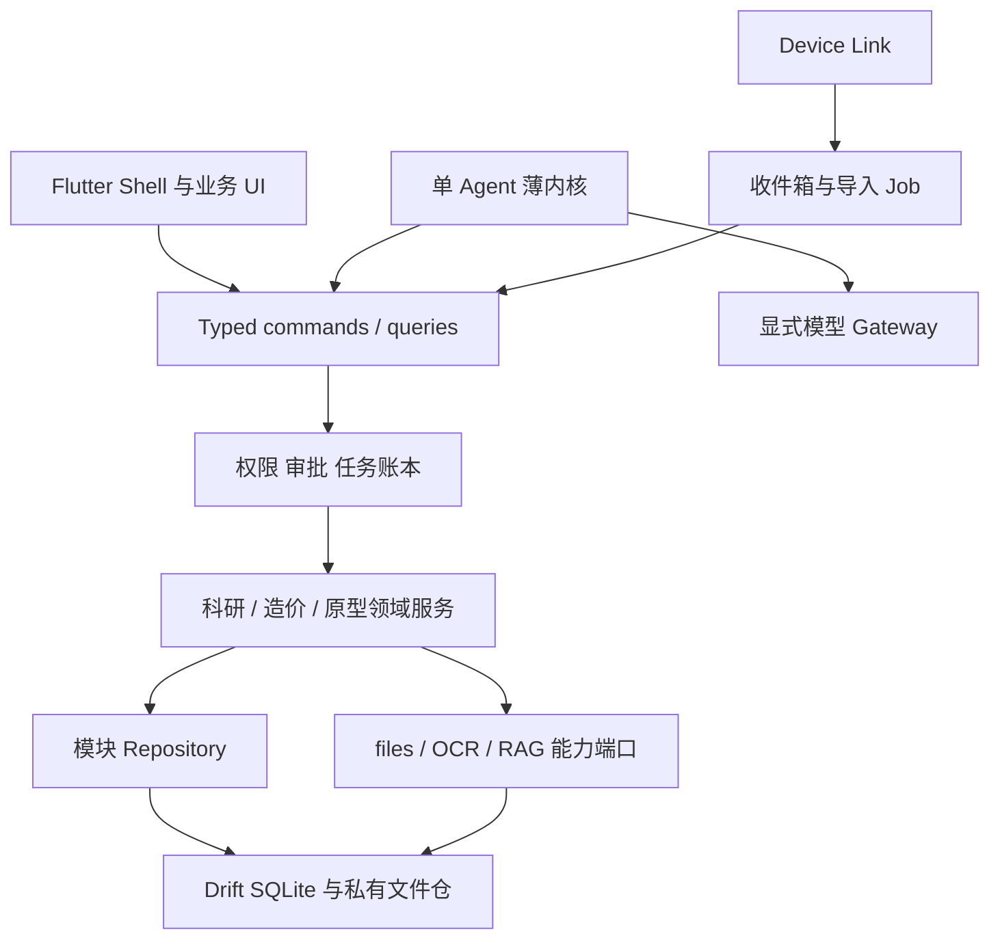
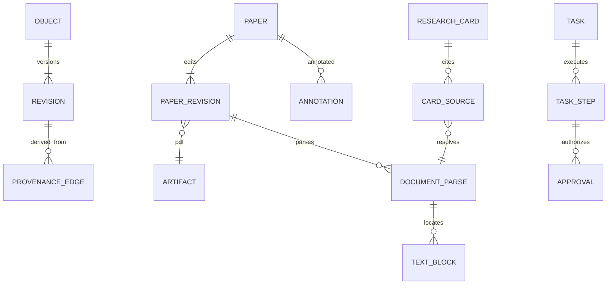
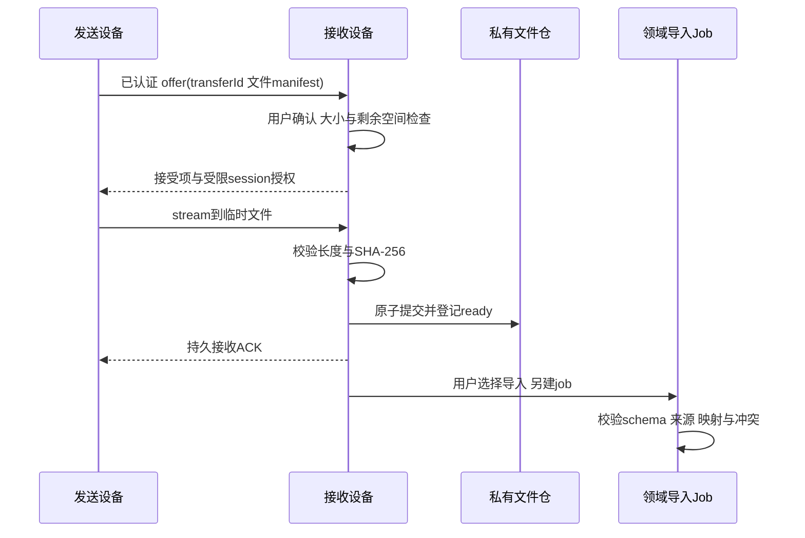

# MuSpace V0.1 正式设计规格

日期：2026-10-03；文档修订：1；状态：已完成设计自审，待用户审阅。产品 V0.1 不代表模型、运行时或依赖版本已锁定。

## 1. 目标、授权与事实边界

MuSpace（木易工作空间）是以个人 AI Agent 为核心的本地工作空间，支持 Android、macOS、Windows。用户可以直接使用完整业务界面，也可以让 Agent 通过相同领域接口协助工作。无账号、无云服务、无生成模型时仍能导入、阅读、批注、编辑、关键词检索和手工整理资料。

本规格承接用户已批准的设计建议。当前阶段只写规格与自审；不写产品代码、不 scaffold、不安装依赖、不下载模型、不创建外部项目。用户审阅本规格后才写实施计划；实施计划另经审阅并选定执行方式后才进入开发。其他项目只作只读证据，不继承其任务写权限，也不修复 research-workbench 的另一个任务阻塞。

下文“决定”表示本次产品约束；“建议”表示可替换的技术设计；“候选/门槛”表示没有 MuSpace 真机验证，不可作为已交付事实。2026-10-03 只读核实 `/Users/muyi/Downloads/dev/muspace` 为空；没有需要迁移的现有产品内容。用户级 `.agents` 仅见归档，没有本项目活跃技能目录。设计流程采用 brainstorming 技能；本地 archify 技能已查阅，本轮以书面 Mermaid 表达关系，不另产交互图。

已验证的有限事实：相邻架构探针在 vivo V2324A / Android 16 上通过 Flutter 嵌受信冻结 Vue 页面、本地资源、搜索筛选、窄屏入口抽屉、先关抽屉再返回 Flutter、模拟状态进程重开恢复。宽表仍需横滑。macOS、Windows、后台杀进程恢复、完整辅助功能和性能没有通过该探针验证；单次 Activity 冷启动数值不作为产品指标。证据见 [窄屏验收](../../../../workspace-architecture-spike/VUE-NARROW-RESULT.zh.md)；该相对路径由本规格最终保存位置解析。Flutter 是用户已确定的主框架，不重新开展 Tauri 选型。

## 2. 范围与业务闭环

首版以“原生文本论文导入 → 元数据核对 → 阅读批注 → 限定论文提问 → 回跳引用 → 研究卡 → 本人手机接续”为验收主线。模型可用时增加生成回答；没有模型时保留证据检索与研究卡编辑。电脑到手机接续通过显式研究包传输完成，不暗含全库同步。

| 范围 | 首版承诺 | 后置边界 |
|---|---|---|
| 科研 research-workbench | 论文库、PDF 阅读、批注、限定范围检索/问答、引用列表、研究卡、研究包 | 扫描页 PaddleOCR 是文本闭环后的独立增量；复杂公式/表格结构解析不承诺 |
| 造价 software-cost-calculator | 一个确定性计算切片，验证 UI/Agent 共用契约、输入单位和结果版本 | 完整估算项目、规则库与报表属第二阶段 |
| 原型 mes-security-model | 保留插件与受信展示适配边界 | 完整原型展示插件及 Web 交互桥后置，既有 Vue 探针不等于正式插件 |
| Agent | 单 Agent、受限工具、持久账本、审批、证据与结果核验、显式模型端点 | 多 Agent、Laya 训练/上线、Dream 自动整理后置 |
| LAN | 本人设备文件/链接/研究包；双方在线一对一文字与附件 | 群聊、离线消息服务器、公网 relay、全库自动 sync、远程 Agent 执行不纳入 |
| 基础能力 | 私有文件仓、类型化命令/查询、任务与 jobs、FTS 检索 | 动态插件市场、任意脚本执行、巨大关系图不纳入 |

产品范围分成可独立验收的切片：文本科研是基础闭环；LAN 接续依赖该闭环；扫描 OCR 依赖阅读定位与派生版本机制。三者不捆绑成一次大规模实施。后续计划必须保留这个顺序，但本文件不分配工期或实施任务。

## 3. 架构与模块依赖

决定采用本地模块化单体、静态编译的第一方插件。建议以 Dart pub workspace 管理应用与内部包，共用依赖解析；Riverpod 使用稳定 API 管理注入与界面状态，go_router 负责语义路由。具体发行版本在后续兼容性验证后锁定。Flutter 官方的 UI/数据分层用于组织代码；MuSpace 增加必要领域服务以实现 UI 与 Agent 复用，而非为每个按钮增加服务层。[Flutter 架构指南](https://docs.flutter.dev/app-architecture/guide)、[Dart pub workspace](https://dart.dev/tools/pub/workspaces)。

只保留一个 shell、一个共享契约层、三个运行能力包与业务模块，不把“中心”实现成独立服务器：

| 逻辑模块 | 职责 | 允许依赖 |
|---|---|---|
| app_shell | 导航、布局、插件装配、设置、任务/通知入口 | 所有公开接口；只在装配处引用 adapter 实现 |
| workspace_contracts | ID、ArtifactRef、权限作用域、类型化结果、命令描述 | Dart 基础库；不依赖 Flutter、SQL、模型 |
| local_data | Drift SQLite、私有文件仓、对象登记、版本/来源、索引与迁移 | contracts；平台存储 adapter |
| workspace_runtime | 命令注册/调度、权限、审批、任务账本、jobs、持久事件 | contracts；通过端口使用 local_data |
| agent_runtime | RouteProposal、有限执行循环、gateway、证据组装与核验 | contracts、runtime 公开接口；不读业务私表 |
| device_link | 配对、LAN 会话、聊天 outbox/ACK、文件收件箱 | contracts、runtime；存储与 TLS 平台 adapter |
| research / cost / prototype | 完整业务 UI、领域服务、领域表、插件公开入口 | contracts、runtime、自己数据 repository；公共能力端口 |

OCR、RAG、files 是 local_data/平台适配侧的可注册能力，不各建一套“中心”。数据中心是统一登记与资料管理视图；接口与工具中心是注册目录及能力设置；消息中心是聚合入口。三者不接管模块业务规则。

依赖约束：插件之间不能直接调用私有 repository；跨域操作经公开 command/query。领域层不依赖 UI、Agent 或模型供应商。数据层不解释造价公式、论文分类规则。注册描述与 handler 在编译期配套，不允许从网络载入 Dart/JS 插件。禁用插件后旧资料仍可从数据视图导出，能力入口显示不可用。

第一方静态插件运行于应用信任边界内，权限是产品执行约束，不宣称能沙箱隔离恶意 Dart 代码。后置 Web 展示只允许受信冻结本地资源；外部导航、文件读取和原生桥必须另作审查，不能把 WebView 存在视为安全隔离证据。

## 4. 数据模型、关系与文件生命周期

决定使用 Drift SQLite 与应用私有文件仓。领域事实存强类型表，禁止 EAV 式万能属性库。对象登记只是跨模块定位、版本、删除与来源的薄层。ID 建议采用随机 UUID，跨设备导入不依赖文件路径或自增 rowid。

| 记录 | 核心字段与约束 |
|---|---|
| objects | objectId、kind、ownerModule、scopeId、headVersion、createdAt、updatedAt、deletedAt；kind/模块不可随意改写 |
| object_revisions | objectId、version、parentVersion、contentDigest、actor、originDeviceId、createdAt；同对象版本本机单调递增，历史不可原地改写 |
| provenance_edges | derivedObjectId+version、sourceObjectId+version、relation、transformId、createdAt；来源绑定具体修订 |
| artifacts | artifactId、digest(SHA-256)、byteLength、mediaType、storageKey、state；storageKey 只在 files adapter 内解析 |
| papers / paper_revisions | paperId、标题、作者列表、年份、标识符、pdfArtifactId；元数据用户修订与自动提议区分 |
| document_parses / text_blocks | parseId、paperId+version、parserManifest、pageIndex、pageLabel、bbox/quads、text、method、confidence；唯一解析版本定位 |
| annotations | annotationId、paperId、artifactDigest、parseId、定位、原文快照、用户文字、version |
| research_cards / card_sources | cardId、内容、状态、来源定位集合、sourceVersion；用户卡不被模型直接覆盖 |
| tasks / task_steps / approvals | 用户目标、步骤输入摘要/哈希、状态、策略修订、授权、结果与核验引用 |
| jobs / domain_events / notifications | 后台工作、事务后持久事件、可读/已读通知分表 |
| chat_threads / chat_messages / message_outbox | 对端、messageId、内容/附件引用、本地提交状态、ACK；与 Agent 对话分类型 |
| paired_devices / transfers / imported_revisions | 公共身份元数据、凭据句柄、传输状态、导入来源与冲突映射 |

JSON 仅用于有 schema 的作者列表、manifest、命令负载快照等边界数据，不用于替代核心关系和业务表。外键、唯一约束和事务维护引用一致性；模块负责其表迁移，统一 schemaVersion 按顺序执行并备份。schemaVersion、领域 object version、wire protocol version、模型 manifest revision 是四种不同版本，不能混用。

`ArtifactRef = {artifactId, digest, mediaType, byteLength}` 是可传递引用，不是文件系统权限。读取时再验证调用方 scope；不把绝对路径提供给 Agent 或对端。同一字节哈希可共用存储，访问权来自对象关联，不从知道哈希获得。跨设备导入共享 objectId 与来源修订，但本地 version 重新登记；用 `(originDeviceId, objectId, originVersion, digest)` 去重。同一来源修订不同 digest 视为冲突或损坏，拒绝自动覆盖。

定位规范：pageIndex 从 0 起计；展示页码为 pageIndex+1，另保留原 PDF pageLabel。bbox/quads 采用页面未旋转、左上原点、归一化 0..1 坐标，保留 cropBox 与 rotation 用于转换；PDF 原生坐标在 adapter 处转换。文本范围绑定 parseId 和 blockId，不能将 OCR 新解析的 offset 套用旧解析。引用另存短原文快照、原文件 digest 与解析版本，缺少 geometry 时明确为页级定位。解析升级不会无声迁移批注；保留旧定位，提供重新锚定提议，未确认时标记过期。

文件写入流程：受限临时目录流式写入 → 核对长度和 hash → 原子移动到私有仓 → 数据库事务登记 ready。仓与 SQLite 没有共同原子事务，因此使用 staging/ready 状态及启动对账；未登记孤儿可清理，记录缺文件为 unavailable，不伪造成功。外部文件只经系统选取/分享显式复制，不持久保留任意路径读取授权。

删除先将对象 tombstone，立即从检索、上下文、索引读取中排除，再通过 provenance 标记摘要/记忆/向量失效。受影响用户研究卡保留用户内容并显示“来源已删除”，删除派生缓存中的来源片段；若用户选择连同相关内容删除，再明确列出范围。活动任务重新核验版本和权限后才能继续；模型响应晚到也不得写入被删除对象。旧备份、已导出研究包和对端副本无法远程保证擦除，界面明确本机删除范围。凭据、模型密钥、配对票据不进入研究包或普通备份。

持久事实、原始文件、用户批注与卡是不可由索引替代的资产。FTS、向量、缩略图、自动摘要均可重建；索引故障不使资料不可读。首版提供手动备份/导出与恢复校验；数据库升级先保留可恢复副本，不以应用二进制回退代替数据库回退。

Drift 官方支持 native 平台路径，但 SQLite 加密不是“用了 Drift 就自动开启”。当前文档以 sqlite3 新版与 SQLite3MultipleCiphers 为较直接路径，旧 SQLCipher 配置不能照搬。具体组合仍是候选，版本未锁定。首个开发闭环可使用私有目录和系统磁盘保护；涉及正式敏感资料的发布门槛必须验证数据库及附件加密、密钥丢失恢复和备份边界。不能仅加密数据库却宣称整个资料仓加密。[Drift 平台](https://drift.simonbinder.eu/platforms/)、[Drift 加密](https://drift.simonbinder.eu/platforms/encryption/)。

## 5. 类型化接口、权限与错误契约

统一目录注册 `Command<I,O>` 与 `Query<I,O>`。内部使用 Dart 强类型 DTO；Agent/LAN 导入边界使用同一 DTO 的版本化 schema codec，拒绝未知危险字段及不兼容 major schema。查询无业务副作用；命令可以返回结果或 jobId。长作业必须先持久登记，再返回已接收，不能把内存 Future 当任务账本。

描述包含：稳定 commandId、schemaVersion、输入输出 schema、所属模块、能力需求、资源 scope、read/write/export/network effect、幂等模式、审批规则、结果核验器、取消能力。VS Code command registry 是统一入口的参考；MuSpace 的权限、幂等与持久化是本产品设计，不由该参考自动提供。[VS Code Commands](https://code.visualstudio.com/api/extension-guides/command)。

调用上下文包含 principal(localUser/agent/job)、taskId/stepId、requestId、resourceScope、expectedVersion、deadline、cancellationToken、idempotencyKey；调用者不能自行声明更高权限。dispatcher 从当前任务授权构造 context，领域服务在读取和提交前检查对象与版本。UI 与 Agent 均经过同一校验，UI 显式操作可形成相应一次性授权。

| 契约示例 | 输入 | 输出/核验 |
|---|---|---|
| research.importPaper | 已选 ArtifactRef、目标工作区、元数据提议 | paperId 或 jobId；hash、paper/parse 登记一致 |
| research.search | paperIds、query、检索模式、limit | hit[]，含 paperVersion、parseId、页定位与短证据 |
| research.answerWithinPapers | paperIds、问题、modelProfileId | answerDraftId、citation[]；每条引用在限定集合内且可解析 |
| research.saveCard | draft 或手写内容、sources、expectedVersion | cardId/version；读回内容 digest 一致 |
| files.exportResearchPackage | 明确对象修订集合、用户确认的范围 | ArtifactRef；manifest、hash、来源完整且无凭据 |
| device.sendOffer | peerId、允许发送 ArtifactRef 集合 | transferId；仅表示 offer 建立，不表示已接收 |
| cost.calculate | quantity(十进制字符串)、unitPriceMinor(整数)、currency、ruleRevision | totalMinor、舍入解释、inputDigest、ruleRevision |

造价切片规则仅为 `totalMinor = quantity × unitPriceMinor`，最终按 half-up 舍入到货币最小单位；quantity≥0、unitPriceMinor≥0，currency 必填，不自动换汇、不加税、不补缺参数。缺单位/币种或不支持的规则返回 invalid_input。该切片是确定性契约测试，不是正式造价业务结论。UI 和 Agent 输入相同 DTO，结果及 ruleRevision 必须完全一致。

结果统一为 success(value, evidenceRefs, resultingVersion) 或 failure(code, userMessage, retryDisposition, outcome, correlationId, details)。`outcome` 为 not_started / known_failed / unknown / committed；`retryDisposition` 为 never / safe_same_key / after_user_action / reconcile_first。错误码最小集合：invalid_input、not_found、permission_denied、approval_required、version_conflict、capability_unavailable、cancelled、deadline_exceeded、storage_full、integrity_failed、transport_unavailable、unsupported_schema、unknown_outcome。timeout 不自动等于失败；发生在提交后可能为 unknown。

幂等规则：本地变更的结果与 idempotencyKey、输入 digest 在同一事务持久化；同 key 同输入读回原结果，不同输入拒绝。只读查询可安全重试；外部网络动作须按对端 ACK/状态核对，不承诺跨系统 exactly-once。未知结果禁止换 key 盲重试。普通可恢复错误就地显示并保留输入，用户不必先学习系统故障中心才能继续业务。

权限按资源与动作授予，首版无需复杂企业 RBAC：当前工作区 read、指定对象 write、选定资料 export、指定 peer send、指定模型端点 network。Agent 的默认范围是用户当前明确选择的论文集合，不能扩大为全库。审批页展示对象/修订、动作、传出内容、目的端点、预计结果和撤销限制，授权绑定 inputDigest、作用域、端点身份、策略修订与有效期；参数或版本变化立即失效。研究卡草稿可自动生成；覆盖用户内容、删除、传输和远程模型首次传出对应内容需明确授权。配对不等于授权每次发送，更不授予 remoteAgent 执行。

## 6. Agent、任务状态与证据链

建议薄执行内核：解析目标 → RouteProposal → 权限及前置校验 → 必要审批 → 调用确定性领域流程 → 结果核验 → 展示产物。一个任务只有一个 Agent 执行控制者。论文导入、解析、索引、引用核验用确定流程；模型只承担理解/提议/生成，不决定权限或计算结果。此选择与 Anthropic 对 workflows/agents 的区分及从简单结构开始的建议一致，但持久账本和审批是 MuSpace 规格。[Building Effective Agents](https://www.anthropic.com/engineering/building-effective-agents)。

`RouteProposal` 输出候选 commandId、schema 化参数、证据来源、理由及需补信息；没有执行权。先用显式入口/规则，再可选 LLM 选择；未知工具、越界资源、缺参数直接拒绝或请求澄清。Laya 等选择器后置：用去隐私固定案例离线比较正确工具/参数/越权率与延迟，再在 shadow 模式仅记录提议；必须证明优于现有选择器才另行批准替换。本轮不安装或训练。

| 状态对象 | 状态与转移 |
|---|---|
| 用户 Task | queued → running ↔ waiting_approval / waiting_capability；running → verifying → succeeded；也可 failed / cancelled / needs_reconciliation |
| Task Step | prepared → waiting_approval → dispatched → verifying → committed；拒绝/未启动可 cancelled，已调用未知结果转 unknown |
| Background Job | queued → running → succeeded / failed / cancelled；进程终止后 expired lease → recovery 判断 |
| 生成回答 | draft → verified / unsupported / stale；只有 verified 引用可标为已核验，仍不等于科学事实已证实 |

审批拒绝结束对应步骤，任务可等待用户换目标；版本冲突等待修订输入，不无限循环。任务总状态 succeeded 只在所有必要步骤产物核验后进入。每步在 dispatch 前持久写入 operationId、输入摘要/hash、资源修订、模型/工具 manifest、审批引用；结果保存 outputRef/digest、引用集合、核验结论、时间、错误/outcome。日志保留必要操作轨迹，不保存或展示模型隐藏推理，不把聊天文本当账本。

恢复时逐个检查 dispatched 步骤：本机事务按 key 查结果；LAN 按 messageId/transferId 查 ACK；模型生成若没有返回只可标为未完成生成，重新生成需形成新尝试及预算记录；不将已传出数据称为已撤回。无法核对的副作用停在 needs_reconciliation，提供“核实结果”操作，不能从 running 直接重新执行。

取消是“停止后续调度并尽力中断”，不是撤回：未提交步骤取消；已提交写入仍存在；传出的文本/文件无法保证收回；传输取消清理接收方未提交临时文件，已 ready 文件需用户另行删除。取消时同时记录已完成产物和未决步骤；若有未知副作用，取消请求与 needs_reconciliation 并存，不能用 cancelled 掩盖未知结果。

建议默认单任务上限：8 次工具调用、2 次模型调用、3 次同工具连续失败即暂停；重型 OCR/索引为有页数/文件字节预算的 job，不按模型循环计费。达到预算显示可审阅的已完成结果和续跑范围，续跑要求用户明确选择。数值是初始控制建议，实施计划可按实测修订，任何配置都不得移除权限校验。

消息中心只做聚合：domain event 是已发生事实，notification 是可读提醒，Task 是用户目标，Job 是后台执行，Chat 是会话。事件随业务事务写入持久 outbox，以 eventId 去重消费；刷新通知不能再次执行业务命令。后台 job 以 lease/checkpoint 防止同一工作重复提交；Android 不保证常驻，系统终止后在下次前台恢复，首版不要求全天候守护。

## 7. 模型 Gateway、记忆与可撤回整理

模型 profile 明确分为本机、本人电脑端点、指定远程端点，展示实际执行位置。本人电脑上的推理服务必须单独配置身份与访问授权，LAN 配对不会自动启用模型调用。每个 profile 指定 endpoint identity、模型标识/修订、上下文上限、隐私策略、token/超时预算及 secret handle；密钥存系统安全存储，不落入聊天、日志或普通备份。

本机 profile 不可用时返回 capability_unavailable 并保留手工业务；绝不静默切到本人电脑或云。调用远程 profile 前组装最小证据片段，并让用户确认端点与资料范围；未选资料、凭据和其他工作区记忆不能传出。切换端点或扩大材料需要重新授权。所有远程服务的留存/telemetry 条款须在 profile 启用前核验，网络阻断测试证明离线路径不偷发请求。

记忆区分以下类型，均带 scopeId、sourceRefs、createdAt/observedAt、revision、状态及删除传播边：

| 类型 | 地位与写入规则 |
|---|---|
| 原始来源 | 文件、论文文本、原消息；不可被摘要替代 |
| 业务事实 | 用户确认元数据、计算结果、批注；领域表管理 |
| 主题记忆 | 用户批准的主题说明与偏好；限定工作区/主题，不默认全局 |
| 可再生摘要 | 模型/规则派生缓存，绑定来源修订与生成 manifest；可删除重建 |
| 经验 | 操作成功/失败及核验结果提炼；不是系统指令，不授予新权限 |

V0.1 不做自动跨会话“永远记住”。只在用户明确保存时产生主题记忆；摘要不会升级为事实。来源被修订时派生项 stale，删除时不可检索；向量仅是派生索引，同样执行 scope 与 tombstone 检查。导入材料和对端文字视为数据，其中的“忽略指令/调用工具”没有授权地位。

Dream 后置为限预算后台整理：只提议去重、摘要、主题关联、经验条目，写入候选修订；用户可查看来源差异并接受/撤回。不得扩大资料作用域、执行外部副作用、修改生产代码或配对凭据。撤回以新修订恢复旧内容和重建派生索引，不虚称已经外发的信息可撤回。

## 8. PDF、OCR 与 RAG

PDF 阅读器具体实现为候选，需测文本选择、缩放、旋转、坐标和授权许可。产品参考 Zotero 的阅读批注、注释进笔记和回跳原文体验，MuSpace 不承诺兼容 Zotero 内部存储或在线同步。[Zotero PDF Reader](https://www.zotero.org/support/pdf_reader)。

原生文本 PDF 优先提取，不整份无差别 OCR；按页检查文本覆盖、乱码与渲染，疑似扫描页标记需 OCR，可人工选择，混合文档按页处理。原始文件保持完整。OCR 结果保存 model/parser manifest、页码、bbox/quads、识别文本及可用置信度；识别质量不足不冒充可信业务事实。首版后续扫描增量只覆盖可读正文与页级回跳，不承诺复杂表格、公式或所有阅读顺序正确。

OCR 唯一家族为 PaddleOCR：PP-OCRv6_small 首要验证，tiny 低资源候选，PP-OCRv5_mobile 回归基线；这里是模型家族名称，不锁定未测权重 commit。官方 v6 文档存在 tiny/small/medium 分档；官方 Android 部署资料说明一条部署路径，不能推断新版模型已适配 MuSpace。[PP-OCRv6](https://www.paddleocr.ai/main/en/version3.x/algorithm/PP-OCRv6/PP-OCRv6.html)、[Paddle Android 部署](https://www.paddleocr.ai/main/en/version2.x/legacy/android_demo.html)。

建议 ORT CPU 为三端 native adapter 候选，Android Kotlin/JNI、macOS/Windows 原生 binding 封装统一端口；必须验证模型导出、算子、预后处理和识别字典。Paddle 官方 Android 示例与 ORT 方案不是同一路径，不能将前者成功等同于后者验证。ORT 不兼容时仍只在 PaddleOCR 家族内重新评估运行路径；CPU 性能不足不能自动换其他 OCR 或远程上传。[ORT Mobile](https://onnxruntime.ai/docs/get-started/with-mobile.html)。

RAG 基线是 FTS5，中文方案明确为应用层中文字符 bigram 分词，保留英文/数字词，索引和查询使用同一规范；原文单独存储，bigram 位置不直接作引用坐标。单字检索使用受限原文匹配并显示结果范围，避免默认 unicode61 被误认为中文词法分词。后续可比较词典分词 adapter，改变时重建索引。[SQLite FTS5](https://sqlite.org/fts5.html)。

候选 embedding 是 `intfloat/multilingual-e5-small`，模型卡确认 384 维；检索使用 query:/passage: 前缀、masked average pooling、L2 normalization，实际导出和 tokenizer 一致性仍须验证。固定 model digest、tokenizer digest、maxLength、切块参数、pooling、normalization、量化方式和索引 manifest；不能混用不同 manifest 的向量。[模型卡](https://huggingface.co/intfloat/multilingual-e5-small/raw/main/README.md)。

sqlite-vec 作为可关闭、可重建 adapter；未通过平台加载/打包和向量一致性门槛时保留 FTS。没有 embedding 时明确返回 lexical 模式，不伪造语义命中。[sqlite-vec](https://alexgarcia.xyz/sqlite-vec/)。建议切块上限 384 tokenizer tokens、重叠 48，尊重段落/页边界并保存 block span；数值待固定语料检索对照后决定。FTS/向量检索先约束 paperIds 和可见 scope，合并排序后再次核验版本与删除状态，不能先全库送模型再过滤。

回答流程：用户选论文 → 检索该范围 → 组装带定位片段 → 模型生成带 citationId 的草稿 → 程序核对 citationId 与来源范围/版本 → UI 展示回答和可点击引用。无可用证据则明确不足，引用不存在不得显示“已核验”。程序能核验引用存在与原文匹配，不能证明每个推论正确；用户研究卡保留生成标记与证据，需用户确认保存。资料版本变化时标 stale，继续阅读仍可回看旧文件修订。

## 9. LAN 配对、聊天与文件协议

决定仅支持本人设备、本地网内、双方在线一对一会话。UDP multicast 只找地址，不建立身份；受限网络可使用用户手输地址或 QR 地址，不做全网扫描。应用未进入接续/会话功能时不常驻发现。发现广播只含临时 instanceId、协议 major 和监听地址，不广播论文、聊天或长期凭据。没有公网 relay 或后台离线服务器。

建议 HTTPS/WSS，QR 带外交换当前监听端证书 SHA-256 指纹及一次性至少 256-bit 随机票据。票据建议 5 分钟到期、使用即失效、限制尝试次数；QR 包含协议和地址不代表信任地址。扫码设备只对本次配对握手使用被扫描的精确指纹，完成双向身份确认和本机接受后建立每对设备独立凭据。后续会话使用精确 peer 证书 pin 加应用层 challenge/response；双方角色互换时也须验证相应 pin。证书轮换必须由旧身份授权并显示确认，丢失凭据需重新配对。

TLS 实现仍是硬门槛：确认连接对象、平台信任链/精确 pin 验证、hostname/SAN 处理、撤销与轮换策略、重放防护及票据日志清除。禁止全局 `badCertificateCallback => true` 或通用“忽略证书错误”。如平台栈不能安全实现上述自签证书握手，暂停 LAN 发布并选择经过审查的 adapter；不能为联通而降级 HTTP。mTLS 可作为后续实现选项，不写成已验证事实。系统密钥存储 adapter 和 pair secret 只存句柄，身份私钥不导出。

LocalSend 提供无外部服务器的发现、预先 offer 与传输参考；MuSpace 增加明确配对、文字会话及领域包导入，并不宣称协议兼容。LocalSend 的 HTTP 选项或发现 fingerprint 语义不照搬为 MuSpace 安全策略。[LocalSend 协议](https://github.com/localsend/protocol)。

文本消息 envelope：protocolMajor、conversationId、messageId(随机 UUID)、senderDeviceId、sequence、sentAt、body、attachmentRefs。时间与 sequence 仅作单发送方排序，不声称跨设备全局时钟。接收方验证 peer 后在事务中按 `(senderDeviceId, messageId)` 插入消息并登记 ACK，再发送 ACK；发送方只有在 ACK 持久后显示“对端已保存”。重复 messageId 相同 digest 重发 ACK，不产生第二条消息；不同 digest 拒绝。已保存不等于已阅读。

outbox 状态：draft → queued → sending → acknowledged；连接中断为 pending，保持原 messageId，双方再在线时可按 key 续发。没有服务端替用户代收；用户可取消未发送条目，已 ACK 的消息不能保证从对端删除。首次接收会话和附件仍由接收方接受，已配对陌生 offer 不自动落业务库。

offer 拒绝不开始 stream；文件名仅作显示，去除路径穿越/保留名，storageKey 由接收方生成。hash 不匹配、超长、空间不足或撤销会清理临时数据，不 ACK 成功。首版中断后整文件重传，仍使用同一 transferId 并先查接收状态；断点续传后置。每次仅一个活动文件流，避免把整文件装入 Dart 内存。

研究包 manifest 包含 schema major、packageId、来源设备公共 ID、对象来源修订、依赖文件 hash/长度、论文/卡/批注定位和阅读进度，不含凭据、任意可执行脚本或全库资料。导入拒绝未知 major、外部路径与越界引用；重复来源修订跳过；本机已修改同对象则保留双方并提示选择，绝不 last-write-wins 自动覆盖。传输 ACK 与导入成功是两种结果，界面分别显示。

接续是快照交换：手机保存并继续阅读，后续编辑产生本机新修订；返回电脑需再显式导包并处理冲突。删除也不自动传播到对端。建议初始安全预算为文字 UTF-8 64KiB、单文件 256MiB、单 offer 1GiB、最多 32 项、WSS 控制帧 128KiB；超限明确拒绝，用户分包。它们是协议预算建议，不是吞吐、内存或延迟实测承诺；最终值由第 11 节门槛决定。

## 10. 页面信息架构与主要流程

桌面：侧栏为工作区/助理/工作/资料，中央为当前业务，右侧上下文助手可收起；助手继承当前选定论文与范围并明确显示。设置、工具目录、模型、设备、任务/通知用次级入口，避免占满主导航。窗口宽度不够时侧栏折叠、助手改 drawer，不以缩小字体维持三栏。

手机固定四栏：助理 / 工作 / 资料 / 我的。工作内进入科研、造价及后续原型插件；论文阅读占独立全屏，批注和助手使用 sheet/独立页；系统返回先关闭 sheet/drawer，再回业务页，再回工作入口。我的含模型、设备、存储、工具能力设置。LAN 一对一会话从助理的设备会话入口进入，与 Agent 会话清楚标识身份。

| 页面/状态 | 主要操作与反馈 |
|---|---|
| 工作 → 科研库 | 导入、筛选、搜索、查看解析状态；重复文件提示已存在并定位原论文 |
| 导入页 | 选文件、预览标题/作者提议、核对保存；解析失败仍可阅读原文件并手改元数据 |
| 阅读器 | 页导航、选区批注、引用列表、上下文问答；引用跳回页与高亮，来源缺失给明确状态 |
| 助手 | 显示选定材料、执行位置、当前步骤与审批；无需模型时提供关键词检索入口 |
| 研究卡 | 用户编辑、引用回跳、生成标记、修订历史、保存确认、导出研究包 |
| 设备接续 | QR 配对、选择包、接受 offer、传输进度、导入结果和冲突选择 |
| 任务详情 | 已完成产物优先，随后步骤证据、等待项、取消和核实结果 |
| 资料 | 按类型/来源浏览、打开所属模块、导出/删除；管理项不替代业务首页 |

主流程中，导入/批注/研究卡立即可用；模型设置不挡住阅读。用户保存卡之后可选择“在手机继续”，预览对象与文件清单，手机接收并导入后打开相同 paperId 对应修订和阅读页。缺少原文件时允许打开卡，但引用明确不可定位，不显示虚假回跳。

视觉方向：浅色参考 Dify 的清晰工作台，深色参考 Grok 的低干扰阅读，布局参考 Claude，字体和助手交互参考 DeepSeek Harness；Apple/Adobe 的动效只用于状态衔接。字体选用可核验许可的系统字体回退，中文可读、可缩放；不下载来源不明品牌字体。支持系统减少动效、键盘焦点、语义标签与屏幕阅读。Palantir 仅作后续关系视图启发，首版采用引用列表与来源详情。

## 11. 发布与模型门槛

所有候选通过可记录门槛后才进入依赖锁文件/模型发布 manifest；固定准确 artifact digest 与许可。未通过门槛采用指定降级或停发对应能力，不能无限等待一个未定义的“以后实测”。下列数值均为验收建议目标，不是已测结果；后续实施计划若调整需给理由与对照证据。

| 门槛 | 有限验证与证据 | 未通过处理 |
|---|---|---|
| PDF 正文闭环 | 合法固定语料至少 12 份，中英单/双栏、旋转、混合页面；每份导入、选择批注、20 个定位回跳、重开；引用页与选区全部正确或明确页级降级 | 修复 reader adapter；不发布带错误定位的问答/批注 |
| OCR 增量 | 固定 30 页中英扫描正文与退化样本、人工真值；v6_small 对比 tiny/v5_mobile，报告 CER、阅读顺序、bbox、冷/热 p50/p95、峰值RSS、包体、电量/热情况 | 原生文本版照常可用；扫描仅阅读，OCR 能力不标 ready |
| OCR 质量候选目标 | 清晰正文 CER≤5%；退化样本逐页展示失败与人工修正；Android 热 p95≤5秒/页且额外RSS≤512MiB，实际设备记录；超标不自动选 tiny | 在 Paddle 家族内重评质量/性能折衷，用户批准后调整目标 |
| Embedding/ORT | Android、MacBookAir、真正 Windows 上与参考输出比较、维度/归一化/检索排序；记录导出及tokenizer hash、算子、runtime、线程/RSS | 禁用语义检索，保留 FTS |
| 中文/混合检索 | 至少 40 个限定论文问题，人工相关页集合；Recall@5 建议≥0.85；scope 越界和已删命中为0；比较 FTS 与 hybrid | 保留达到门槛的模式，明确当前检索能力 |
| 引用/生成 | 固定20问，包括无答案/恶意指令/删源；全部引用可解析，范围外来源为0，缺证据明确提示；人工抽查论断支持程度并记录模型修订 | 只展示检索证据，不将未核验回答标成功 |
| native SQLite/索引/加密 | 三端 release 加载、FTS可用、sqlite-vec启停/重建；数据库与文件加密、key丢失/轮换、备份恢复与迁移中断 | FTS替代vec；敏感资料正式发布受阻直到保护门槛通过 |
| LAN/TLS | 三端两两组合共3组，各测双向；错pin/过期票据/重放均拒绝；断网、重复ACK、接收后ACK丢失、hash坏包、空间满不重复导入 | 对应平台 LAN 不发布；不得关闭证书验证 |
| 平台生命周期 | 断网无模型完整阅读编辑检索；前台退出/进程终止重开，后台终止后前台恢复，未决步骤不盲重试 | 修复持久账本/恢复；不承诺后台常驻 |
| License/telemetry | 逐项核对模型权重、转换产物、字典、tokenizer、runtime、reader、字体与插件许可，归档URL/日期/digest/NOTICE；网络阻断观察非必要请求 | 不打包未获许可资产；非必要telemetry默认关闭或移除 |

Android 门槛：真实设备 release APK 安装、升级保留资料、系统选取/分享、权限按需、LAN 发现受限网络、返回栈和后台恢复；当前 vivo 探针只作为一部分参考。macOS 门槛：完整 Xcode、原生插件及文件/网络权限、arm64 release 实机运行与签名流程；要发布 Intel 则另测，不能默认通过。Flutter 官方从 3.44 起 SwiftPM 为 iOS/macOS 默认，旧插件仍可能触发 CocoaPods fallback；本机缺完整 Xcode 是现有环境阻塞，缺 CocoaPods 只在选定插件需 fallback 时成为阻塞，不列为恒定前置。[Flutter 3.44 官方说明](https://flutter.dev/blog/whats-new-in-flutter-3-44)。

Windows 门槛：真正 Windows 的 Flutter/Visual Studio C++ 工具链构建，SQLite/PDF/ORT/TLS DLL 加载、字体与文件名、安装升级及 LAN 运行；Mac 交叉静态检查不能替代。首版平台最低 OS 和 CPU 架构由实际插件支持交集与上述 release 验证决定，未测平台不能标“支持已交付”。本规格的 Android/macOS/Windows 是产品目标而非本轮发布声明。

## 12. 可验收标准与证据提交

以下是未来产品验收条件，本轮完成的是设计文件及自审，不声称测试已执行。

1. 关闭网络并不配置模型，能完成导入原生文本 PDF、核对元数据、批注、中文检索、编辑研究卡；重开保留数据，无隐式联网请求。
2. 配置并明确选择模型后，只对所选论文回答；每条引用携带文件/解析修订与页定位，点击可回跳；无答案有明确反馈，切换云端不会静默发生。
3. UI 和 Agent 共用 import/saveCard/cost.calculate 接口；不合法输入、权限与版本冲突结果相同，造价相同输入产生同结果及规则版本。
4. 删除来源后立即不能从 FTS、向量、记忆或新模型上下文检索；旧卡显示失效来源，晚到响应不能复活资料；本机删除不声称擦除对端/备份。
5. 审批绑定参数与目的端点；改参数/修订必须重新审批。断电/超时在提交边界后通过 key 对账，未知结果停止盲重试；取消展示已提交与未决动作。
6. 本人设备配对、在线文字/附件、研究包导入可闭环；重复消息只一条，接收 ACK 与业务导入分开，改过的本机卡不被外来包自动覆盖。手机接续读取正确论文修订与进度。
7. 未授权设备、错误证书、重放票据均被拒绝；配对不能调用 Agent 工具；导出包不含身份凭据，恶意文件路径不越出临时目录。
8. 桌面与手机导航可操作；手机阅读/抽屉返回语义正确，320–430 logical px 范围可达，不用宽表横滑作为科研主交互；减少动效与键盘/语义标签基本可用。
9. 各平台标 ready 的能力具有对应真机 release 证据；未通过 OCR/vec 等门槛显示具体不可用原因和已有替代业务，不伪造成功。

验收记录统一包含：场景ID、输入语料hash与许可、应用commit/build、平台/设备/OS、模型/runtime/解析/索引manifest、步骤、期望与实际、截图或结构化输出、失败限制。性能报告包含冷/热、样本数、p50/p95和峰值内存，禁止单次运行外推。每个验收项同时覆盖正常业务与与其直接相关的一项恢复路径，不把所有故障验证都排在科研闭环之前。

## 13. 简短架构决策记录

| 决策 | 理由 | 取舍与重评条件 |
|---|---|---|
| Flutter 本地模块化单体 | 用户已定主框架，三端共享业务与布局 | 不重开 Tauri 选型；平台native能力用adapter验证 |
| 静态第一方插件 | 先确保完整业务与Agent接口一致 | 不提供动态热载；未来第三方插件需另做信任/沙箱设计 |
| 领域表+薄对象登记 | 保留模块类型与规则，同时支持来源/跨模块引用 | 增加修订/来源维护；不退化为EAV |
| 单 Agent+确定流程 | 首科研流程稳定，结果可追溯 | 扩大自主性必须由真实案例证明收益并重新审阅权限 |
| 显式快照接续 | 服务本人设备互传，控制同步复杂度 | 手工冲突处理；全库sync另做规格 |
| 原生文本先行，Paddle后补 | 优先真实科研价值，模型未测不阻塞阅读 | 扫描问答在OCR质量与定位门槛通过后开放 |
| FTS必备，向量可选 | 无模型也可检索、索引可重建 | 语义效果经固定语料对照后启用 |

## 14. 设计自审与交接

自审日期：2026-10-03；方式：全文人工交叉核对与占位/链接/范围检查。

| 检查项 | 结论 |
|---|---|
| 业务与依赖 | 首科研闭环独立可用，LAN通过收件箱/导入job进入领域接口，领域规则未移入万能中心 |
| 版本与身份 | object本机version与来源修订、schema、protocol、model manifest分开；跨设备冲突不静默覆盖 |
| 离线与降级 | 无模型不挡阅读/编辑/FTS；ORT/Paddle/vec仍为候选，无静默云回退 |
| 安全语义 | 发现不认证、配对不执行Agent；TLS仍需审查，禁止全局忽略证书；取消不等于撤回 |
| 状态与证据 | Task/Job/Event/Notification/Chat分开；unknown先对账，ACK不等于导入或阅读；核验引用不冒充事实正确 |
| 数据与删除 | 文件/DB提交有对账；原始来源与派生缓存分开；本机删除限制与用户卡失效提示明确 |
| 平台与来源 | Android Vue探针未外推三端；Mac完整Xcode与条件CocoaPods区分；Windows必须真实环境 |
| 范围与占位 | 无待填章节或无依据工期；OCR/向量/TLS等以有限门槛、输出证据和失败处理表达 |

尚待产品实测的门槛已集中列于第11节，不影响书面设计交付。本规格待用户审阅；收到对本文件的明确批准后，下一阶段仅编写对应切片的实施计划。本轮不生成计划、不实施产品代码。

来源访问日期均为2026-10-03；官方资料描述外部组件能力，不代表本产品实测。网页未锁定为永久事实，实际选依赖时必须再次核查许可、兼容性与安全行为。以上链接均用于事实支撑或产品参考，MuSpace新增的契约与目标已明确标为设计。
