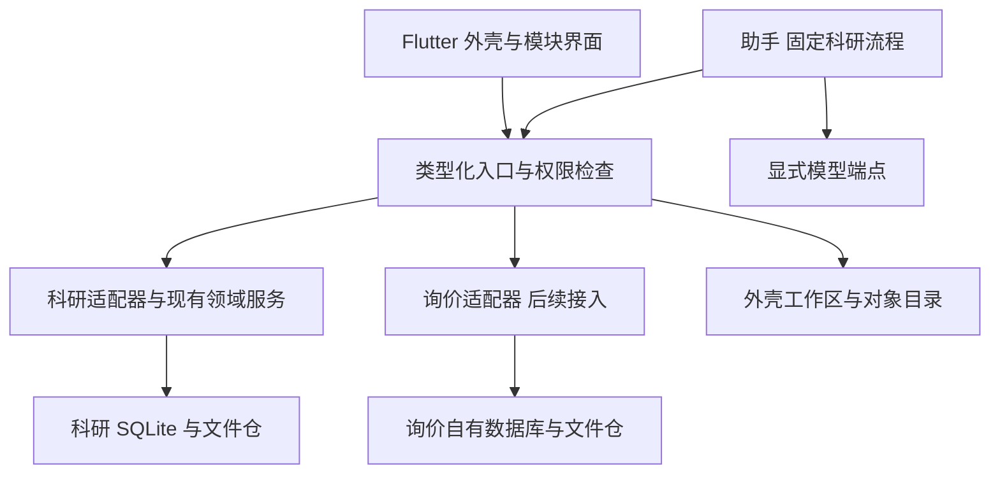

# MuSpace V0.1 设计规格

修订 2 · 2026-10-03 · 待用户审阅。本文是设计，不是实施计划或功能完成报告。

配套：[一页 PRD](2026-10-03-muspace-v0.1-prd.md)、[现有项目复用矩阵](2026-10-03-muspace-reuse-matrix.md)、[审查处置与自审](../../reviews/2026-10-03-muspace-spec-review.md)、[本地证据索引](../../evidence/2026-10-03-muspace/README.md)。

## 1. 产品范围与选择

MuSpace 是个人 AI Agent 为核心的本地工作空间，Flutter 主框架已定。用户既可直接操作科研与询价等完整业务界面，也可让助手调用同一领域服务。模型是可选协助能力；断网或无模型时仍能导入、阅读、批注、编辑、关键词检索和人工整理。不强制云、账户或全库同步。

**推荐方案 A：外壳＋现有模块。** 复用 research-workbench 与询价台账的领域规则、数据、阅读/交换与独立应用入口，逐步通过类型化适配接入。各模块初期保留自己的 SQLite 和私有文件仓，外壳统一目录与访问边界，不立刻合库或重写为 Drift。research-workbench 的案例、阅读升级继续由原领域任务负责；MuSpace 只消费其已完成契约和补充外壳需求，不再实现第二套案例、证据或修订库。

方案 B 是替换 workbench、统一数据后重写科研界面，可获得更统一的布局，但当前会重复建设已存在的导入、笔记、任务/结果、关系与提纲能力，增加迁移风险，本轮不选。A 是此次修订建议，尚待用户审阅，不是对兄弟仓迁移或任务暂停的授权。

**V0.1 建议发布 macOS arm64＋Android**，验收主线为文字 PDF → 人工元数据 → 阅读批注 → FTS → 限定论文问答 → 研究卡 → 研究包导出/导入；保留 skill、任务结果包、已有关系图和提纲入口。macOS 完整 Xcode 是门槛，不能把缺工具链当通过。Windows 保留构建级兼容目标，未来在现有或另经授权的 Windows CI/环境检查；本轮不建 CI，构建通过也不等于实机验收。三端总体路线不取消。

本人设备互传和双方在线一对一文字/附件是已确认需求；完整 IM、PaddleOCR、Dream/Laya、完整询价与原型接入、向量引擎及应用级加密建议独立后续规格，不作为本次科研发布共同前提。分期变化与数据保护边界列为待用户确认事项，不能理解为取消需求。

## 2. 外壳与领域边界



| 单元 | 责任 |
|---|---|
| 外壳 | 工作区、导航、对象目录、模型设置、授权与调用记录；Riverpod 稳定 API 管理状态，go_router 管理语义路由 |
| 公共契约 | 命名空间引用、文件引用、类型化输入/结果、错误、授权范围；不含业务规则 |
| 科研模块 | 原快照/skill、PDF、笔记、关系、任务/结果、提纲；增量阅读/FTS/锚点/卡与科研包由该领域服务负责 |
| 询价模块 | 供应商、联系人、物料、报价、项目预算及交换的实际分支契约；不由外壳重新计算价格或变成乘法工具 |
| 窄适配器 | 文件选取/分享、模型请求、模块对象查询与变更；较晚加入 TLS 文件传输、OCR 等 |

未来提取公共包可采用 Dart pub workspace，但先经接口兼容审阅，不复制兄弟仓 `lib`。第一方静态模块属于应用信任边界，产品权限不宣称隔离恶意 Dart 代码。受信 Web 展示后置，需独立验证资源、导航与原生桥。数据/工具/消息“中心”是管理视图与注册表，不是新增服务器。

跨域引用 `NamespaceObjectRef = {moduleId, storeInstanceId, objectType, objectId, revisionRef?}`。外壳目录只保存引用、显示摘要、可用状态和更新时间；模块数据库是唯一事实来源。适配器负责把原 skill `kind/id@rev`、任务整数修订或询价修订 ID 映射为不透明 `revisionRef`，保留来源语义。外壳不额外维护第二套业务修订链，也不跨库使用 SQL 外键。跨库失联显示不可用，不重新创建缺失对象。

## 3. 首版数据与内容身份

以下是逻辑数据责任，不是要求统一数据库 DDL。新增字段/表由对应模块追加迁移；旧库先备份，实际迁移编号重核，原计划不能直接照搬到已变化主工作区。

| 所有者 | 必要记录与字段 |
|---|---|
| 外壳 | `workspaces(workspaceId,title,createdAt,lastOpenedAt)`；创建/改名/切换，不删除旧库；`workspace_modules(workspaceId,moduleId,storeInstanceId,rootHandle)` 绑定模块工作区/项目，当前工作区持久保存 |
| 外壳 | 对象目录存 NamespaceObjectRef；`model_profiles(profileId,endpoint,location,modelId,capabilityManifest,secretHandle)`；范围授权与调用日志存端点身份、论文集合、内容 hash、结果与时间 |
| 科研 | 复用 projects/documents/entries/notes/tasks/runs/outline 与来源快照；论文元数据新增强类型 title/authors/year/DOI 字段及人工修订，不替代原 JSONL 字段 |
| 科研 | `reading_progress(documentId,pdfDigest,pageIndex,scrollRatio,zoom,updatedAt)`；每设备保存，研究包显式带出选定进度 |
| 科研 | 解析快照含 parser ID/version、规范化方式、PDF digest、page、文本与可用几何；`chunks(chunkId,pdfDigest,parserManifest,page,span,text,workspace/projectRef)` 与 FTS 是可重建派生数据 |
| 科研 | `research_cards(cardId,revisionId,parents,bodyMarkdown,citationRefs,authorKind,createdAt,deletedAt)`；citationRefs 为结构化锚点数组，正文使用稳定 citationId 引用，不靠 Markdown 链接反推来源 |
| 科研 | 文件/解析引用与导入回执、operationId、删除标记和清理记录；不新增首版 memory/Dream 表 |

**内容锚点与元数据修订分离。** `EvidenceAnchor = {pdfDigest,pageIndex,quote:{exact,prefix,suffix},bbox?,textPosition?,parserManifest?}`。pageIndex 从 0 起，UI 展示物理页＋1，可另存 PDF pageLabel。bbox 为未旋转页、左上原点 0..1 归一化，保留 cropBox/rotation 转换。textPosition 仅相对指定解析快照，不套在新 parser 输出上。旧页码/引句笔记可保留为页级锚点，升级精确锚点需用户确认。

修改标题、作者、DOI 不改变 PDF digest，不使内容引用失效。PDF 字节变化形成另一内容身份；引用继续指向旧 PDF。重新解析时先比原页 exact/prefix/suffix 和可用位置，唯一匹配才可提出重锚结果，多候选或无匹配显示“需确认”，不得猜选第一条。W3C TextQuoteSelector 是结构参考，不能保证重复引句、OCR 变化或阅读顺序变化时唯一恢复。[W3C 引句选择器](https://www.w3.org/TR/annotation-model/#text-quote-selector)。

新增可交换卡/笔记修订使用全局 UUID revisionId 和 parents（根为空），本地递增编号只展示。旧领域修订保真映射，不强制改造成 UUID；询价 DAG 的内容寻址 ID 继续由其自身模块负责。去重键为 `(namespace, objectId, revisionId)`，digest 用于验证内容，不进该键：同修订不同 digest 必须发现冲突。导入新修订若本机 head 是其祖先则快进，传入祖先只补历史，不回退；并发分支保留两 head，由用户选择/合并生成新修订；父记录不齐先暂存不可声称快进。此规则参考已有询价 DAG，但不假定该开发分支已可整体发布。

文件写入使用暂存 → 长度/hash 校验 → 原子落盘 → 数据库登记；文件与 DB 不共用原子事务，因此启动时对账 staging、孤儿和缺失文件，缺文件显示不可用。文件引用 `ArtifactRef={artifactId,digest,mediaType,byteLength}` 不包含任意绝对路径，知道 hash 不授予读取权限。

删除先软删并立即排除 FTS、问答上下文和派生引用查询，清除/失效化相关摘要与 chunks；用户卡保留自写内容并显示来源已删除。提供明确“永久删除”：先列影响范围，取消引用该资料的待运行请求，再 purge 内容记录、派生文本与解析快照；共享 blob 仅在本模块有效记录/保留修订/进行中导出引用数为 0 时回收，外壳不跨库删除共享资产。仅为冲突防护保留无内容 tombstone/修订 ID。仍被其他卡/历史引用的文件说明未回收并让用户决定一并清除；对备份、已导出包和对端副本不承诺远程擦除。晚到模型响应不能复活已删来源。

## 4. 类型化接口与最小执行流程

UI 与助手使用同一领域服务、输入校验和权限检查。约五个公开科研工具足够首版；普通编辑界面仍可有窄类型化方法，不强迫每个按钮暴露给模型。

| 工具 | 作用与结果 |
|---|---|
| research.importMaterials | 输入系统选取的 PDF/既有研究或 skill 包引用、工作区；输出对象引用和导入回执，不执行包内指令 |
| research.searchEvidence | 输入所选论文、查询、limit；输出 page/quote/锚点与索引状态，限制在本工作区 |
| research.answerWithinPapers | 输入所选论文、问题、显式 profile；固定执行检索→生成→引用核验，输出草稿/引用或证据不足 |
| research.saveCard | 用户确认 Markdown、citationRefs、expectedRevision；输出新卡修订，覆盖需精确授权 |
| research.exportPackage | 输入明确对象/内容清单、导出目的地；输出已校验包引用与 manifest；传输另需授权 |

注册描述包含 schema、read/write/export/network 效应、资源范围、输入输出和取消语义。参考 `siq_mcp` 的具名工具、schema 与只读入口，但 MCP readOnlyHint/openWorldHint 只是元信息；宿主授权检查及实际只读数据库连接才限制执行。模型仅提议工具与参数，不决定权限或询价计算。

本地变更用事务内 `operationId + inputDigest` 回执：同 ID 同输入读回原结果，异输入报冲突；SQLite 提交后即 committed，响应丢失也可读回。写入前核验输入/版本，事务提交后读回结果；“核验失败”不能假装回滚已提交内容。纯查询正常返回错误，不建立通用审批/lease 工作流。

科研问答只有一条固定流程。长导入/索引可持久保存简短任务记录：queued → running → succeeded/failed/cancelled；进程终止后判断本机回执或重建派生索引，不对全部 UI 操作布置全套状态机。模型不可用直接返回 capability_unavailable、保留输入并提供检索；仅用户明确选择重试才建立新尝试，不自动等待或回退。回答先核验来源锚点与范围再保存草稿，用户确认后另行保存卡；技术核验仅证明引用存在，不证明科学论断正确。

错误至少包含 invalid_input、not_found、permission_denied、version_conflict、capability_unavailable、cancelled、storage_full、integrity_failed、transport_unavailable、unsupported_schema，并带用户说明和 correlationId。只有网络传输等外部副作用不确定时增加 unknown_outcome：按外部回执/对端状态先核对，再允许同 ID 重试；不能换 ID 盲重发。模型请求超时是未完成生成/可能已计费，不视作本机资料写入成功。

取消停止后续步骤并尽力中断；已提交卡仍存在，已发出的模型片段/文件不能被撤回。界面同时显示已完成产物与未决外部动作。原任务结果包技术 completed、人工 accepted 与科学判断分别保持，普通通知/聊天文本不充当执行回执。

## 5. 元数据、检索与模型

导入默认离线人工标题/作者/年份编辑，文件名只能给可修改建议。用户明确点“按 DOI 补充”才请求 Crossref，展示将发送的 DOI 与目标服务并预览候选差异；无 DOI/请求失败仍可人工保存。联网不自动上传 PDF。[Crossref REST API](https://www.crossref.org/documentation/retrieve-metadata/rest-api/)。

V0.1 保留既有目录/ZIP、skill JSONL、task/result 包和 Markdown 报告；新增科研包承载 PDF/卡/锚点。BibTeX、RIS 直接解析与导出，以及 Zotero 库/批注同步后置：当前没有对应 codec，需单独定义字段/多记录匹配、引用格式与附件映射；不把 CSV/Markdown 导出称为这些格式兼容。可通过现有包导入 PDF 和人工元数据，不宣称 Zotero 一键迁移。

正文检索采用可重建 FTS5，先复用阅读升级的文本提取/索引接口。中文初始建议字符 bigram＋英文数字词；查询将有限有效词用 OR 取候选，BM25 排序前限定工作区和论文集合，再以短语命中/覆盖率筛选。规范化与 query/index 版本一致，限制去重词数（建议≤16）、过滤常见噪声词，保留原文作引句，单字采用限定范围原文匹配。无索引明确“尚未索引”；坏索引不等于无结果。用中文长句、常见词、罕见词和同页重复引句回归，不能靠无限 OR 获得假召回。

FTS 基线或可选向量对照未达 PRD 检索目标时，退回明确的关键词页级引用，提示缩小问题；没有相关证据不生成有依据回答。小语料可评估 Dart 精确 cosine，不作毫秒级事实承诺。multilingual-e5-small（384 维）仍是候选，需固定 tokenizer/pooling/normalization/model manifest；sqlite-vec 非首版依赖，独立验证后再选择。[FTS5](https://sqlite.org/fts5.html)、[E5 模型卡](https://huggingface.co/intfloat/multilingual-e5-small/raw/main/README.md)。

Gateway 首版只实现用户配置的 OpenAI-compatible HTTP adapter：验证的子集是 `/v1/chat/completions` 的 model/messages、非流式文本与超时/错误处理；tools、JSON mode、stream、vision、embeddings 不因“兼容”名义自动支持。Ollama/LM Studio 的具体版本和模型需分别跑合同夹具，未验证字段显式不支持。[LM Studio 兼容说明](https://lmstudio.ai/docs/developer/openai-compat)。

默认端点仅回环地址，不打开模型服务 LAN 监听。本机 profile 必须验证模型实际在本机执行、禁用提供方 cloud/proxy 模式；localhost 只能说明第一跳位置，Ollama 可通过本地 API 使用云模型，不能将回环地址当作离线证明。Android 本地 LLM 后置；手机无已授权端点仍可完整阅读编辑检索。本人电脑跨设备 profile 要使用认证 TLS 受控 adapter，指定远程 profile 要普通 HTTPS 验证和凭据；均不得因本机失败自动启用。Ollama 本地 API 无鉴权，因此不能默认暴露到 LAN/公网。[Ollama 认证](https://docs.ollama.com/api/authentication)。

模型出站授权与单动作审批分开：前者绑定 endpoint identity × 论文 ID＋内容 digest 集合 × 数据类别（问题/证据片段/元数据）× 期限，允许用户在范围内多次提问；论文内容换版、端点身份变化或过期需重授。每次调用复查范围、删除状态和类别，记录实际片段 contentHash、资料 digest、模型 profile 与时间，不将日志本身送模型。覆盖/删除/导出/发送等单动作确认绑定精确 inputDigest、对象修订、目的地；改参数重新确认。密钥存安全 secret store，日志只保存句柄；外来资料中的指令是资料，不产生权限。

## 6. 研究包与设备接续

先复用 ResearchExchange 的 manifest、路径/大小/hash 校验、冻结文件和结果导入接口。保留 v1 包；新增科研接续包用独立 `packageType/schemaVersion`，不冒用 skill schemaVersion 或 task 包版本。手机可通过系统文件选取/分享导入，不要求新 IM 协议；分享 adapter 仍需实际平台验收。

包必须包含选定的原 PDF 字节、元数据、卡 Markdown 与 citationRefs、必要解析快照（文本规范化、页/位置、parser ID/version）、选定阅读进度、来源修订与完整文件 hash 清单。与论文内容相关的引用不能只打包标题。PDF 无权限导出时允许显式“无原文包”，界面预告只能读卡不能保证回跳。文件路径/大小、未知 major、缺文件与 hash 不符先拒绝或显示不完整预览，不先写业务库。

手机导入同 hash PDF＋兼容解析快照时不必重解析，按原 geometry/引句回跳；reader/parser 不兼容时保留原快照与 exact/prefix/suffix，仍打开原 PDF 页，提示“仅页级定位，精确高亮需确认”。不能偷偷用新 offset。旧包无快照的页码笔记同样页级展示，非精确引用。导入数据变更遵守第3节修订规则；接续是显式快照往返，不是后台全库 sync。

既有 LAN 是 HTTP、限时单文件下载，不具备已验证的保密性或对端身份认证。源码当前上限150MiB，与 README 的30MiB不同；沿用前需以选定提交合同重新确认。**正式 MuSpace 网络传包须完成 TLS 升级；未通过时关闭该入口，科研 release 仍可走系统分享/人工文件交换。** 不以新 UDP 发现、长连接、聊天 outbox 或 IM 为科研前置。

TLS 升级复用传包流程但另审网络 adapter：QR 带外证书/公钥指纹＋一次性高熵票据用于绑定 peer identity；普通 CA HTTPS 继续校验链和 hostname/SAN，pin 是附加身份限制。自签本地设备连接需专用、仅作用于已配对 peer 的验证路径，同时验证精确 pin、签名/有效期、票据绑定地址/服务身份以及重放/轮换，不能简单用 pin 替代一切检查或全局忽略证书。mTLS 仍非已验证事实，配对不授予 remoteAgent 权限。

接收确认必须区分“传输字节接收/校验/落盘”“业务导入完成”“用户已读”；旧服务发送完不等于持久接收 ACK。未来 TLS adapter 如增加回执，须以 transferId 和 manifestDigest 去重，ACK 丢失先核对接收状态。前台显式启动传输后，离开发现页不会自动中断用户已确认会话；关闭发现只停止发现广播/新入口，停止传输是另一个操作。后台不承诺常驻接收，恢复前台可检查未决传输。

后续在线一对一 IM 单独定义会话、文字/附件、outbox/ACK、对端身份与接收许可；本人设备互传与双方会话是不同概念，排除群聊不推断“只能与自己聊天”。V0.1 文本/链接可作为显式文件交换条目，不能宣称已满足完整 IM。

## 7. 页面结构与可测交互

```text
桌面： [工作区 / 助理 / 工作 / 资料] | [当前科研业务] | [可收起上下文助手]
科研： [文库＋导入] → [阅读＋笔记] → [证据检索/问答] → [研究卡/导出]
保留： [Skill条目] [研究关系] [任务与结果] [论文提纲/Markdown报告]
手机： 底栏 [助理] [工作] [资料] [我的]
阅读： 全屏PDF + 页导航；笔记/引用/助手用 sheet；返回先关sheet再回文库
我的： 模型与授权、设备与文件接续、存储/备份、工具目录
```

新建/切换工作区后，只展示该工作区绑定项目。手机助手未选择论文时提示选择；可给普通解释但必须显式选择模型，并标为非资料回答，不擅用全库或联网。选定论文和实际模型执行位置始终可见；无模型提供检索入口。传包先预览范围，手机导入完成后再打开对应 PDF 与进度。

视觉采用清晰浅色工作台、低干扰深色阅读、侧栏＋主内容＋上下文助手的层级，系统中文字体与明确的字号/间距/颜色 token；DeepSeek Harness 仅指此前助手交互参考，不作为框架依赖。本版不以品牌拼贴或巨大关系图替代页面设计，已有科研关系图继续从科研入口使用。支持320–430 logical px、200%字号、键盘焦点、屏幕阅读语义、系统减少动效；具体断言见 PRD，而非“基本可用”。

## 8. 发布门槛、保护边界与后续路线

macOS/Android 需真实 release 环境验证导入、PDF/定位、保存重开、索引、导出与系统分享；完整 Xcode、签名/公证和 PDF native 库许可是 Mac 门槛。Flutter≥3.44 的 SwiftPM 默认与旧插件 CocoaPods fallback 按实际依赖确定，不预设所有项目必须装 CocoaPods。Windows 只记录构建兼容级状态，未有真实设备记录不标“实机已支持”。本轮不安装或配置工具链/CI。[Flutter macOS](https://docs.flutter.dev/platform-integration/macos/building)、[SwiftPM 默认](https://flutter.dev/blog/whats-new-in-flutter-3-44)。

平台网络验收分别覆盖 Android INTERNET 与多播启用时 MulticastLock 的获得/释放和受限 Wi-Fi；macOS client/server entitlements、当前 OS 本地网络隐私许可及用户拒绝路径；Windows 后续构建/设备阶段的防火墙、专用/公用网络和 listener 关闭。新发现能力未使用时不申请其额外权限。[Android MulticastLock](https://developer.android.com/reference/android/net/wifi/WifiManager.MulticastLock)、[Apple 本地网络隐私](https://developer.apple.com/documentation/technotes/tn3179-understanding-local-network-privacy)。

V0.1 建议应用级数据库/附件加密后置，但系统私有目录、按需系统文件权限、安全 secret store 是发布必需；桌面不宣称以目录隐蔽抵抗同用户进程。明文文件、DB、系统导出的研究包与普通备份可能被已授权用户、同用户进程或获得设备权限者读取；系统全盘加密也不保护解锁后的同用户访问。本版建议用于个人单用户、用户有权存储/导出的论文与笔记，不作为共享机器隔离、多用户服务或高机密资料保护方案。该发布边界需要用户审阅；如要求应用级静态加密，应先完成独立保护规格再发布相应资料场景。

| 保留路线 | 后续独立规格与启动门槛 |
|---|---|
| PaddleOCR | 仅 PaddleOCR 家族：v6_small 优先、tiny 低资源、v5_mobile 基线；真机质量、bbox/中文阅读顺序、冷/热 p50/p95、RSS、许可和模型/runtime分别测。ORT CPU仍候选，移除无依据 Android 5秒 p95 硬承诺，桌面均值不推手机性能 |
| 向量/RAG扩展 | 固定语料比较 FTS、可选 E5+Dart cosine、sqlite-vec；质量/包体/内存及可重建性证明收益后选择 |
| 在线一对一 IM | 按已确认文字/附件需求单独设计配对/连接生命周期、持久 ACK与去重；无群聊、离线服务器、公网 relay |
| Dream | 限预算、可审阅撤回的后台摘要/主题整理；不扩权，不改生产代码，不替代原始来源或业务事实 |
| Laya | 可替换工具选择器候选；固定案例离线和 shadow（只记录不执行）对照后决定；本轮不安装/训练 |
| 询价与原型 | 接入选定实际领域分支；询价保留供应商/物料/报价/预算，原型展示隔离与完整 UI另验，不继承展示探针的安全/性能结论 |
| 应用级加密 | DB＋附件＋索引＋备份、key恢复/轮换和安全存储共同验收；不以加密DB宣称所有资料受保护 |

各核心需求的验收、规模与性能目标见 PRD；未达目标回到明确可用功能，不伪造“成功”。本文件不更改兄弟仓计划、不决定其执行顺序，也不包含新实施计划。用户审阅本修订后才进入 MuSpace 计划阶段。
