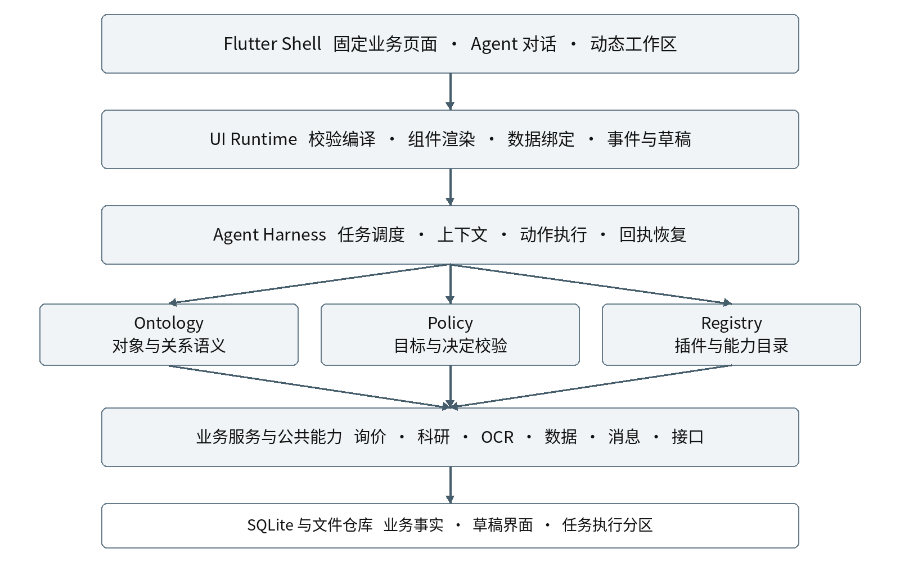
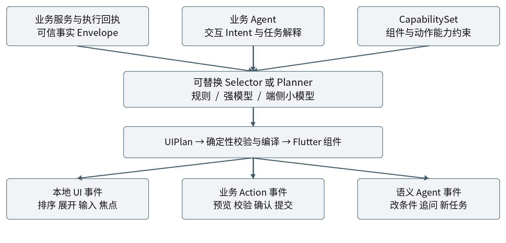
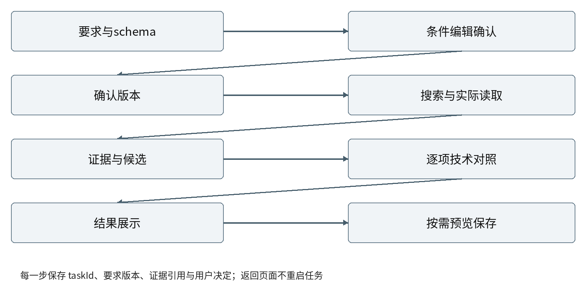
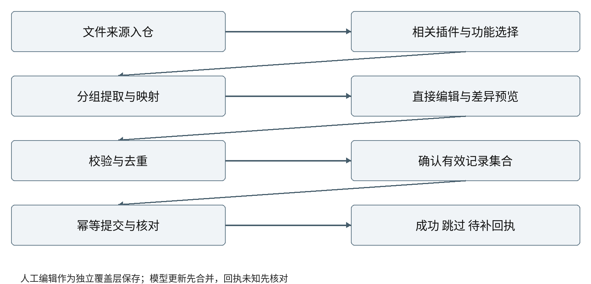

# Muyon AI Agent 与智能交互整体设计方案

> 2026-10-09：界面部分的具体化与用户决定见 [AI 原生界面方案](../../../design/ai-native-ui-redesign-2026-10-09.md)（以对话为中心、本体驱动的业务卡片、插件页面冻结）；授权以 [ADR-0002](../../../adr/0002-graded-assistant-authorization.md) 为准，模块契约以 [ADR-0004](../../../adr/0004-module-contract-v2.md) 为准。

> 文档发布说明（2026-10-08）：本文作为整体设计基线发布，保留原设计版本。模型章节的教师目标仍在后续细化中，原有候选与实验路线不是最终定案；后续细化另行版本化，不阻挡主体方案评审。

基于现有架构  访谈需求基线  智能交互与端侧模型研究

可审议版本  2026年10月8日

建议保留 Flutter、现有业务服务和固定业务界面，以个人 Agent 统一入口、可恢复任务运行时和模型无关的动态工作区，完成设备选型与文件整理两条业务闭环。端侧小模型作为可替换的界面选择或规划能力，与主线开发并行验证。

### 整体设计的四个重点

- 把真实业务做完：技术条件先确认，候选逐项有据；文件先选用途，草稿可直接编辑，有效部分确认后入库。

- 让交互随任务变化：条件卡、对照表、字段表单、图表和证据入口可以组合变化，业务数据、确认范围和用户编辑保持稳定。

- 让工作现场能回来：业务事实、界面草稿和任务执行分开保存，离页与重开恢复原任务；平台不能继续时显示真实暂停。

- 让模型路线可替换：先建立规则与强模型基线，再评估 Selector、Planner 和蒸馏；训练成果按同一协议接入，不阻塞 AUTH 和业务闭环。

### 本文件的使用边界

本文是独立的整体设计方案，供产品、架构、客户端与模型研发共同评审。它继承《Muyon AI Agent 能力与设计需求规格说明书》的40条需求和30条验收，不替代原规格，也不按 V0.1 切割目标。里程碑仅安排实现次序。

文中协议、模块名和代码样例是建议契约；现状描述、公开研究事实、设计建议与待验证项分别标识。本文交付不等于各候选 SDK、模型、数据外发、训练任务或生产修改已获逐项实施批准。

阅读建议：先看第1至5章建立整体判断；研发重点看第6至15章契约与状态；第16至20章是业务闭环；第21至29章用于实验、迁移、验收和决策。

## 2026-10-10 总体设计一致性补记

保留本文原版与架构决定。本轮已确认方案/已合机制/在途与待验证的分层说明见[AI原生方案一致性补记](../../../design/ai-native-ui-redesign-2026-10-09.md)，固定develop `7773b7d96bc99f173b57a723d61526fba0df49ff`，执行顺序见[版本化交付队列](../../../tasks/NEXT-DELIVERIES-2026-10-10-v1.md)。PR26已合仅stream/2协商与旧版拒绝门槛；F5b/c、F3b、F4c仍在途，不称完整typed/collection/33组件或编辑重算已验收。保持现有Intelligent UI组件范围、单runtime、共用校验渲染与原有授权；[leader技术采纳](../../../tasks/AIUI-5-leader-contract-decision.md)不等于生产验收。

用户已确认[输入预测胶囊](../../../tasks/UX-PREDICT-1.md)与[对话视频](../../../tasks/UX-VIDEO-1.md)需求，设计待审、未派实现：点击胶囊只填入，普通问答无新增业务确认，首次/未授权远程模型端点与外发仍需既有gate确认；视频会话播放/全屏/下载分清来源权限、取消重复动作和模型消费，播放不自动送模型。二维双脸吉祥物方案失败，统一几何2.5D/真3D资产仍待选择。新增公共接口或架构实质改动先决策记录/ADR提案，不覆盖旧用户决定。来源为父线程 `01a0f1f6-9060-7550-a2f0-c9bdd66e6019` 本次委派及“新改动记得更新总体设计”。

## 1  设计结论与继承关系

本次调整是把已确认的业务体验需求变为可执行架构。固定业务页继续承载稳定的业务入口和完整对象详情；Agent 工作区承载理解任务、汇总证据、动态表达和跨插件协作。二者共用相同业务服务、对象身份与动作回执。

### 1 1  继承已有方案的正确边界

用户提供的整体架构已包含 Shell → UI Runtime → Harness → Ontology、Policy、Registry → 业务服务的逻辑层次，以及三路交互、三类状态、轻量业务语义、预览提交、版本与幂等。本文保留这些设计，不把它们重新包装成新发现。

| 保留 | 补强 | 避免的误用 |
| --- | --- | --- |
| Flutter 与 UI1 v6 设计体系 | 将视觉令牌和业务组件扩展为动态组件目录 | 设计体系完成不等于动态运行时完成 |
| 领域服务与 SQLite | 为证据、草稿、任务和界面投影补齐稳定身份及恢复 | 不重建平行业务数据库 |
| 工具注册 授权 执行 回执 | 统一接入个人 Agent 与插件内 Agent | 不把所有点击都送入模型 |
| 固定页面与业务路由 | 增加动态工作区与可持久返回锚点 | 不由模型伪造详情页 |
| 本地优先 | 执行器可在本机或明确配置的远端 | 不把可信边界等同强制云服务器 |

### 1 2  本次新增的明确设计

- 将业务事实 Envelope、交互 Intent、能力集合 CapabilitySet、UIPlan、UiEvent 与 Patch 分离，阻止表达模型重新发明业务值。

- 为人工编辑设置字段级覆盖层和 revision 检查；模型刷新遇到冲突时保留人工值，给出差异，而不是整面重绘覆盖。

- 建立插件命名空间、版本协商、依赖、迁移、停用历史视图与降级契约，让动态页面有可维护生命周期。

- 将端侧训练、组件目录、语义协议和评测集形成版本化交接包；先做导出数值与端侧可行性检查，再扩大训练。

### 1 3  交付判据

评审首先判断用户能否完成两条闭环，并能从业务页返回继续工作。模型质量、界面审美和性能均需独立证据；漂亮截图、JSON 合法或单次演示均不能替代端到端验收。

## 2  依据与事实边界

| 依据 | 本方案采用的内容 | 证据等级 |
| --- | --- | --- |
| 需求规格 2026年10月8日 | SYS SEL IMP ANA UX EXE SUB 共40条；AC-01至30 | 已确认目标 [R1] |
| 用户现有架构说明 | 逻辑分层 三路交互 三类状态 轻ontology | 用户提供的设计基线 [R2] |
| 已有项目回报 | Flutter 领域服务 SQLite 工具执行链；UI1 v6完成 | 历史静态或交付回报 [R3] |
| OpenAI Intelligent UI | 训练内容布局交互决策；可流式组件库及compiler | 官方披露 [S1] |
| A2UI Flutter GenUI | 协议与可选Flutter适配方案 | 官方公开候选 [S2至S5] |
| 端侧模型及UI蒸馏研究 | Selector与Planner实验路线及评估限制 | 研究输入 不是Muyon效果 [S6至S8] |

### 2 1  公开产品研究能说明什么

OpenAI 已公开描述模型学习如何选择内容、布局、视觉与交互，并使用可流式组件库和编译器逐步显示界面。其内部描述语言、补丁格式、点击协议和持久化机制未披露；“native”也不足以证明其底层就是操作系统原生控件。本文借鉴职责分离，不声称复刻内部实现。[S1]

Structured Outputs 的结构约束与增量接收可以帮助生成合法数据；生成端约束解码使用的语法机制，与宿主把 UI 描述编译成组件树不是同一个编译步骤。ChatKit、MCP Apps 或公开 SDK 不能作为 ChatGPT 内部实现的证据。[S9]

### 2 2  现状不能越界推断

已有诊断曾指出旧 Folio 的原始 JSON 呈现、采购技术约束接线、网页取证能力和全局 Agent 工具接入存在不足。这些是对应历史基线的静态发现，不能外推为当前版本全部仍然存在。普通聊天已保存，也不自动证明候选证据和在途任务恢复完整。

项目基线已从 640bac5 推进至回报中的 c1dbe2d automatic；C2 WIP 不计入完成。正式实施应重新记录目标提交、已有 AUTH 收尾状态与回归结果。本文没有重新审阅最新源码，不提供未经核对的文件行号或当前缺陷结论。

### 2 3  建议与批准分开

整体方向采用本地优先、业务闭环优先。SDK、模型家族、数据格式具体字段和性能阈值属于可审议建议。训练与开发可并行；使用 Kaggle 已有免费额度前仍需核对实际可用资源与安全凭据流程，不新增付费、不上传真实业务数据。

## 3  总体逻辑架构



图1 逻辑责任边界。箭头表示调用或依赖，不要求拆成微服务；本地单应用可先实现全部核心层。

Shell 管导航与稳定交互；UI Runtime 只接收受约束的界面描述与数据引用；Harness 管任务和执行；Ontology、Policy、Registry 作为横向支撑；领域服务维护权威业务事实。数据和回执向上形成投影，界面事件按语义路由向下执行。

共享公共中心提供 OCR、文件解析、数据查询、消息和接口接入。插件内 Agent 与个人 Agent 都经统一能力目录和执行链调用业务服务，不保留“插件里可用、全局入口不可用”的第二套接线。

Edge UI Engine 可独立封装为接口与组件层：输入可信事实、交互意图、可用能力；输出 UIPlan 或选择结果。它不拥有业务数据库，不执行任意代码，不决定授权。

## 4  部署与离线边界

逻辑层次与部署位置分别建模。可信执行器可以是当前设备上的领域服务，也可以是用户明确配置的桌面常驻执行器或远端服务。任务记录 executionTarget，界面只显示真实可用的能力。

| 部署形态 | 可承载的工作 | 边界与恢复 |
| --- | --- | --- |
| 单机离线 | 已有业务数据查询 草稿编辑 固定页面 本地解析与规则渲染 | 无在线来源与云模型时说明不可用；已有数据仍可用 |
| 单机联网 | 在线搜索 远端模型推理 本地业务提交 | 仅发送该动作需要的数据；本地仍保存任务与回执 |
| 可选桌面常驻 | 经配置的长任务 文件处理与较大本地模型 | 电脑睡眠离线会暂停；手机不能假称后台仍运行 |
| 可选云执行 | 用户明确启用的远端能力或任务 | 不是基础使用前提；目标 数据范围 状态可见 |

### 4 1  离线能力应按配置声明

离线不等于本机必有强模型。没有本地模型时，业务页面、历史结果、手工编辑、规则选择和确定性计算仍可运行；需要语义生成的步骤停在可解释状态。若已安装并验证本地模型，才列入对应能力。OCR、文件预览和格式解析也需逐端核对实现。

### 4 2  三端一致与平台差异

Android、macOS、Windows 共用对象身份、要求版本、草稿与动作语义；布局依屏幕适配。Android 锁屏、后台限制，桌面睡眠、退出与权限变化分别形成执行能力事件。界面退出不取消任务，但不能据此承诺进程结束后仍可无限执行。

调度器维护运行租约或明确的执行心跳。恢复时先检查执行器和在途动作，随后更新为执行中、暂停或结果未知；不以一条旧的“运行中”消息当作实时状态。用户能看到继续、取消和查看已得结果的入口。

### 4 3  同步与远程调用不混为一谈

调用云模型只传所需上下文，不自动启用全量同步。跨设备同步若后续实施，需要独立定义对象所有权、版本冲突、文件可达性及删除语义；当前主线先保证同一设备可靠保存与恢复，不以搭建同步系统阻塞业务闭环。

## 5  能力与业务语义

能力按“插件 → 业务域模块 → 场景工作流”组织。每个模块并列引用对象与关系、查询与动作、视图与路由、业务规则；这些是能力定义和复用单元，不是逐层创建 Agent 的组织树。

| 层次 | 询价场景示例 | 责任 |
| --- | --- | --- |
| 插件 | procurement 询价与采购 | 清单 注册 依赖 版本与停用 |
| 业务域模块 | 项目要求 设备候选 询价台账 | 权威schema 对象身份 业务规则 |
| 场景工作流 | 设备选型 文件整理 项目分析 | 组织步骤 决定点 回执与恢复 |
| 并列能力 | requirement对象 search动作 compare视图 | 可独立注册并组合复用 |

### 5 1  轻量 Ontology 的最小内容

先用类型定义、稳定字段 ID 和显式关系描述业务语义：Project 关联 RequirementSet；Candidate 关联型号配置和 Evidence；ImportDraft 关联目标 schema 与记录集合；Receipt 指向真实业务对象。存储沿用现有领域模型与 SQLite，先不引入图数据库。

字段契约包含类型、单位、枚举、必填、身份规则、空值语义与来源要求。查询和写入均引用同一字段 ID，显示名可本地化。插件负责价格口径、技术范围、唯一键和业务校验，模型不能仅凭名称相似合并对象。

### 5 2  查询与动作是不同能力

Query 返回数据快照、版本与来源，可在本地过滤、排序或计算。Action 声明副作用、目标、输入 schema、执行位置、幂等与回执查询。场景工作流组合这些能力，不绕开真实业务服务直接修改表，也不把“模型说完成”当作成功结果。

### 5 3  让模型按需看到能力

Registry 为当前任务提供相关插件和动作的精简 CapabilitySet，同时保留查看全部入口。文件用途选择先插件再功能。能力摘要可以检索加载，业务规则和实际校验仍在执行器侧生效；模型漏看规则不能令动作绕过校验。

对不可用、版本不兼容或未安装插件显示真实状态；不得生成存在感很强却不可执行的按钮。用户自填用途可成为待映射意图，不能自动创造不存在的插件。

## 6  插件注册与生命周期

建议以 manifest 描述插件身份及兼容性，以运行时注册表绑定真实实现。manifest 是能力声明，不携带可被模型执行的任意脚本；具体命名沿用仓库惯例时可通过适配层转换。

```json
{
  "pluginId": "muyon.procurement", "pluginVersion": "1.0.0",
  "contractVersion": "muyon.capability/1",
  "dependencies": ["muyon.files", "muyon.data"],
  "domains": ["project", "requirements", "equipment"],
  "schemas": [{"id": "equipment", "version": 3}],
  "actions": ["equipment.preview", "equipment.commit",
              "equipment.receipt.get"],
  "views": ["candidate.compare", "equipment.detail"],
  "routes": ["equipment/:objectId"],
  "executionTargets": ["local"],
  "migration": {"from": [2], "strategy": "explicit_adapter"},
  "historyFallback": "readonly_snapshot"
}
```

### 6 1  命名空间与版本协商

插件 ID、对象类型、动作和视图均有命名空间。运行时协商 contractVersion、schemaVersion、catalogVersion 与组件能力；未知必需能力时拒绝执行并给出可理解原因。不得只因语义版本号看起来兼容就跳过字段和动作差异检查。

### 6 2  升级不破坏在途草稿

升级先检查未完成任务与草稿，执行可回滚迁移或兼容读取；影响数据含义、目标或确认范围时生成差异预览并重新确认。旧字段不能静默删除。历史任务保留当时 schema、视图标识和最小只读快照，必要时由旧版适配器展示。

### 6 3  停用和卸载

停用先阻止新的执行并保留历史入口；有在途写入时先核对结果。历史卡降级为只读字段与来源，不冒用其他插件的动作。卸载造成来源或路由不可达时显示失效原因，仍能返回原对话。用户数据删除是独立操作，不随 UI 组件缺失而隐式发生。

以上版本号是契约示例，不表示现有仓库已采用这些名称、版本或迁移实现。

## 7  统一动作与执行

沿用现有工具注册、授权、执行、回执和恢复链，在入口侧做统一。所有有业务含义的操作转换成受注册约束的 ActionRequest；纯界面行为由本地处理，复杂意图才进入 Agent。

| 事件路线 | 常见动作 | 执行路径 |
| --- | --- | --- |
| 本地 UI | 展开 排序 分页 焦点 直接编辑草稿 | UI Runtime → 本地状态或草稿仓库 |
| 业务 Action | 校验 去重 预览 提交 查询回执 | Runtime → Harness → 领域服务 |
| 语义 Agent | 修改条件 解释差异 新任务 深入讨论 | Runtime → Agent → 受约束的能力调用 |

### 7 1  预览和提交分成两步

preview 返回目标、变更集、校验结果、受影响版本与预览摘要。用户确认生成 Decision，commit 只接受被确认的目标、字段和记录集合。服务端或本地执行器核对版本和决定，不信任前端传入的 confirmed=true。

```text
ActionRequest = {
  actionId, taskId, executionTarget, targetRefs,
  schemaVersion, inputVersion, decisionId,
  recordIds, idempotencyKey, expectedRevision, arguments
}
ActionResult = {
  operationId, status, receiptId, itemResults,
  businessObjectRefs, actualRevision, recoverability
}
```

### 7 2  从点击到真实成功

按钮点击先记录意图，执行器接受后进入提交中；只有正式回执才显示成功。输入无效、过期确认、能力缺失与结果未知分别呈现。单条记录失败不吞掉其他条目的成功回执，也不自动把整个批次标失败后重提全部。

### 7 3  幂等与未知结果

同一确认范围和业务操作复用幂等键，重复点击不新增第二笔。超时可能发生在写入成功之后，因此恢复优先按 operationId 或幂等键查询回执；仅在确认未执行且允许重试时继续。客户端去重不能替代业务执行器的幂等保证。

自动重试面向暂时故障，采用有界退避和任务资源预算；永久失败、访问拒绝和缺用户决定转为阻塞。替代来源可以继续读取，但不绕过访问限制，也不借重试扩大动作范围。

## 8  任务上下文与协作

个人 Agent 是用户统一入口，Harness 是可持续任务的宿主。Conversation 管交流和位置，Task 管目标与状态，Run 管一次执行尝试；三者关联但不合并。切换页面只改变观看位置，不释放任务状态。

### 8 1  面向执行的上下文包

上下文由目标、已确认条件版本、当前阶段、可用能力、业务对象引用、证据索引、待决问题和剩余预算组成。长原始资料留在文件或证据仓库，按需取片段；Compact 保存结构化继续点和来源引用，同时记录压缩覆盖范围。

- 每次继续先核对 taskRevision、RequirementSet 与 schema 版本，防止摘要更新后使用旧要求。

- 保留搜索表达、已读去重来源、失败入口和待核参数；摘要不能抹去 unknown、conflict 或明确不满足。

- 推理产生的暂时结论与权威业务值分开。可观察进度来自工具与执行事件，不呈现私有思维链。

### 8 2  任务拆分以用户目的为准

独立新请求建立新 Task，原任务按资源队列继续；补充原要求、修改参数或更正错误留在原任务。关系不清时只问一个选择题。队列区分等待用户、等待资源与正在执行，不能把排队等同运行。并发上限由真机与真实工作负载决定。

### 8 3  按需使用子 Agent

并行检索、独立资料提取和主任务引用子对话时，可创建有边界的子 Agent。交接包含目标、数据引用、允许能力、输出 schema、截止条件与回报方式；父任务负责合并冲突和向用户解释。不是每个插件层级、按钮或字段都派一个 Agent。

用户界面限制为主对话加一层子对话。运行时可有受控内部任务图，但不展示无限嵌套窗口，也不据此承诺无限 Agent。子任务的外部动作授权不被概要复制到父任务。

### 8 4  主任务引用最新子成果

子成果完成后出现简短结果卡，主任务不因可见卡片自动吸收结论。主任务明确引用或查询时，通过读取子任务的最新版本产生概要，标明版本和读取时间；发现源版本变化则重新读取或标明截止点。关闭浮层只保存现场，不取消任务。

## 9  三类状态与持久恢复

| 状态域 | 权威内容 | 主要写入者 |
| --- | --- | --- |
| 业务事实 | 项目 设备 台账 原始文件 证据与回执 | 领域服务与已确认业务动作 |
| 界面与草稿 | UIPlan 投影 用户编辑 展开 焦点 返回锚点 | UI Runtime 与草稿仓库 |
| 任务执行 | 阶段 输入版本 决定 调用尝试 暂停与继续点 | Harness 与执行器 |

三个状态域可以共用 SQLite 和本地文件系统，但必须明确所有权与事务边界。模型给出的布局计划不能直接重写业务事实；界面显示成功不能直接推进业务回执；消息历史持久化不能代替任务与草稿恢复。

### 9 1  建议的最小持久模型

在现有数据层上增加或对齐 conversations、messages、tasks、runs、requirements、sources、evidence、drafts、draft_field_overrides、decisions、operations、receipts、ui_surfaces 与 navigation_anchors 的语义实体。名称为建议，不要求逐项新建表；已有等价能力应复用。

每项实体有稳定 ID 与 revision。重要编辑、用户决定、动作出队和结果回执在可恢复提交点落盘。建议以快照配合轻量事件记录恢复，避免第一步就建设全量事件溯源平台；事件去重用稳定 eventId。

### 9 2  恢复顺序

- 先加载业务对象引用、草稿和用户覆盖层，再加载最新兼容 UIPlan；计划不可用时用确定性只读或可编辑回退视图。

- 再核对未完成 Operation 的实际回执，把结果未知与尚未执行分开，禁止机械重放全部调用。

- 随后恢复任务队列、当前步骤、打开的子对话、阅读位置和返回锚点。焦点恢复遵从平台可行性，不能丢掉已保存的输入。

### 9 3  返回与锁屏的验收边界

返回、切插件、锁屏、系统终止和应用重启是不同测试。能继续运行的场景保持执行；受平台限制则暂停并说明。恢复后业务结果、候选证据、人工编辑和步骤应一致。当前尚无本方案对应的三端真机验证结果，不能标为已实现。

## 10  固定界面与动态工作区

固定业务页面保留完整业务操作和真实对象导航；动态工作区把当前任务需要的信息与动作组织在同一处。动态不是随意改变布局，而是让确认、比较、分析和编辑各有适合的表达，并保证用户能预测动作结果。

### 10 1  与 UI1 v6 的衔接

复用现有字体、间距、颜色、圆角、状态、导航与可访问规范，补充 CatalogItem 的属性 schema、数据绑定、事件、只读态、加载态、错误态和降级态。新组件必须能用固定样例独立渲染，再接入生成流程。不要把 UI1 设计体系已完成解释为动态协议或组件运行时已经完成。

| 任务阶段 | 默认表达 | 必须保留的信息 |
| --- | --- | --- |
| 澄清和确认 | 单选 多选 可编辑条件表单 | 自填入口 条件原文 版本与确认作用 |
| 持续执行 | 可更新的简明进度卡 | 真实阶段 读取统计 暂停与阻塞 |
| 候选比较 | 设备卡与技术对照表 | 型号配置 不满足 未核验 来源 |
| 文件整理 | 分组表格 字段表单 冲突对照 | 直接编辑 用户值 来源 目标归属 |
| 分析和交付 | 摘要 表格 适用图表 文件卡 | 计算口径 数据版本 引用和真实入口 |

### 10 2  动态组合的自由度

Planner 可以选择组件、分组、顺序、布局和渐进展示；不得删除强制业务字段、隐去不确定性、改写数值或新增未注册动作。窄屏可转为卡片和分步编辑，宽屏可并排对照。跨端一致指语义和状态一致，不要求像素相同。

本地排序、展开和编辑不等待模型返回。用户正在编辑时，界面更新只改不冲突区域，保留稳定 nodeId、焦点与滚动锚点。真正需要变换布局时保存现有草稿，并给用户清晰的继续位置。

### 10 3  成果优先和多级展开

主对话呈现结论、当前阶段和需要处理的决定；展开后依次看到阶段、调用与来源、原始资料。网页用标题摘要和来源卡，JSON 用字段或树形视图，避免原始资料刷屏。变化频繁的进度更新原卡，重要决定和最终结果成为稳定消息。

## 11  语义契约与数据流



图2 模型只规划表达，受控运行时负责校验与渲染；用户事件按三路分流，不要求每次点击经过大模型。

| 契约 | 负责内容 | 不负责内容 |
| --- | --- | --- |
| Envelope 或 DataSnapshot | 业务对象 值 版本 来源 缺失与冲突 | 不直接规定布局 |
| Intent | 任务阶段 交互目的 必显项 建议动作 | 不重写业务事实 |
| CapabilitySet | 可用组件 schema 动作 平台和限制 | 不扩大真实授权 |
| UIPlan 或 ViewSpec | 组件树 绑定 布局 事件路由 | 不成为业务数据库 |
| UiEvent 与 Patch | 用户动作 局部变化 基础revision | 不凭点击宣称成功 |

ViewSpec 是通用视图描述，UIPlan 是具体一次可渲染的计划；可实现为同一结构，但需保持语义层与运行时实例的区别。Envelope 由业务服务或经过校验的抽取结果构造；模型输出只引用已存在的对象和字段。

协议候选适配在引擎边缘：无论采用自有轻量描述、A2UI 或 Flutter GenUI，都先满足 Muyon 的版本、持久草稿和动作规则，再处理外部格式互转。

## 12  业务事实信封样例

以下示例使用虚构设备与测试数值，仅说明合同结构，不代表真实选型结论。实际业务对象的值、来源与判断由领域服务提供；UI 模型引用 factRef，不再次生成事实正文。

```json
{
  "contract": "muyon.facts/1", "snapshotId": "snap-081",
  "taskId": "task-select-01", "revision": 12,
  "requirementSet": {"id": "req-01", "version": 3},
  "objects": [{
    "ref": "candidate:c1", "type": "equipmentCandidate",
    "identity": {"model": "TEST-A", "configuration": "base"},
    "facts": [{
      "fieldId": "range.max", "rawValue": "100 units",
      "value": 100, "unit": "test_unit",
      "state": "verified", "evidenceRefs": ["ev-7"]
    }, {
      "fieldId": "price", "value": null,
      "state": "not_disclosed", "evidenceRefs": []
    }],
    "matches": [{"requirementId": "r-1", "state": "pass",
                 "factRefs": ["candidate:c1/range.max"]}]
  }],
  "sources": [{"id": "src-2", "kind": "fixture",
    "readState": "success", "contentHash": "test-hash"}],
  "evidence": [{"id": "ev-7", "sourceId": "src-2",
    "locator": {"page": 2, "field": "range.max"},
    "appliesTo": {"model": "TEST-A", "configuration": "base"}}]
}
```

### 12 1  事实状态不能压成空值

建议区分 verified、unverified、not_disclosed、not_applicable、read_failed 与 conflict；条件匹配另用 pass、fail、unknown、conflict。读取成功不代表字段已核验；提取到字符串也不等于技术条件通过。空值带原因，界面必须保留其语义。

### 12 2  来源与证据分开

Source 记录 URL 或文件、读取时间、标题、内容版本、实际读取状态与去重标识。Evidence 指向原文位置、适用型号配置和提取值。搜索结果摘要是线索，不能被提升为已读全文；设备不同配置的数据不能拼成一个候选。

### 12 3  事实与展示一致性

显示短文本和图表可由确定性格式化器生成，单位换算保留原始值与换算规则。UIPlan 的事实绑定必须能解析到当前快照；找不到字段时显示缺失并降级，不能让模型填一个“看起来合理”的替代值。

## 13  交互意图与界面计划

Intent 把业务 Agent 的表达目标与 UI 模型的布局判断分开。它描述“需要让用户完成什么”，不固化每个像素。RequiredBindings 与 mandatoryStates 由场景规则产生，用于检查不能遗漏的条件、来源和不确定性。

```text
{
  "intentId": "intent-22", "taskId": "task-select-01",
  "purpose": "compare_candidates", "snapshotRef": "snap-081",
  "requiredBindings": ["requirements", "candidates.matches"],
  "mandatoryStates": ["fail", "unknown", "conflict"],
  "allowedActionRefs": ["candidate.open", "candidate.previewSave"],
  "audienceMode": "work", "preferredDensity": "comfortable"
}
{
  "contract": "muyon.ui/1", "surfaceId": "surface-22",
  "revision": 4, "catalogVersion": "catalog-1",
  "snapshotRef": "snap-081", "intentRef": "intent-22",
  "root": "root-22", "nodes": [
    {"id": "root-22", "type": "Stack",
     "children": ["compare-22", "sources-22"]},
    {"id": "compare-22", "type": "CandidateComparison",
     "bindings": {"items": "/objects", "requirements": "/requirementSet"},
     "events": {"open": "candidate.open",
                "save": "candidate.previewSave"}},
    {"id": "sources-22", "type": "EvidenceList",
     "bindings": {"items": "/evidence"}, "collapsed": true}
  ]
}
```

### 13 1  组件目录应同时支持精细组合与业务复用

底层提供 Stack、Grid、Text、Field、Select、Table、Chart 等基础组件；业务层提供 RequirementEditor、CandidateComparison、ImportReview 和 ReceiptSummary。模型可以组合，关键业务组件内部的必显项和动作边界由确定性代码保证。

### 13 2  Selector 与 Planner 的接口差别

Selector 只从有限合格视图中选取并给出置信或拒识结果；Planner 生成多个组件的结构与绑定。两者均不能越过 Catalog 和事实引用校验。若 Selector 已能解决常见阶段，无需用自由生成承担额外不确定性；复杂场景再启用 Planner。

字段与类型均为建议内部协议。它们不是 ChatGPT 内部格式，也不是未经适配的 A2UI 官方消息。

## 14  事件补丁与人工编辑

动态更新以稳定 surfaceId、nodeId 和 revision 为基础。事件携带用户操作对象和观察到的版本；补丁只更新允许路径。用户草稿与模型建议分开保存，任何来自模型的补丁均不得直接覆盖已编辑字段。

```text
UiEvent = {
  eventId: "evt-51", surfaceId: "surface-import-7",
  nodeId: "row-3-price", type: "draft.field.edit",
  observedRevision: 8, draftRevision: 15,
  payload: {recordId: "row-3", fieldId: "price", value: 120}
}
Patch = {
  patchId: "patch-52", surfaceId: "surface-import-7",
  baseRevision: 8, nextRevision: 9,
  ops: [{op: "replace", nodeId: "progress", path: "text",
         value: "已整理 6 条，2 条待补"}],
  preconditions: {snapshotRevision: 12}
}
```

### 14 1  字段级合并规则

草稿持有 extractedValue、normalizedValue、userOverride、来源及各自版本。重新解析更新提取层；若用户已编辑，展示值继续采用 userOverride，新增来源建议进入差异列表。清除人工覆盖需用户明确操作，不能借“刷新页面”或更换布局隐式完成。

| 冲突类型 | 处理 | 用户看到什么 |
| --- | --- | --- |
| 补丁版本过旧 | 拒绝应用 请求最新计划或重算受影响局部 | 保留当前界面与输入 |
| 模型与人工改同字段 | 保留人工值 记录候选差异 | 可查看新建议并选择采用 |
| 业务对象版本变化 | 重新校验预览 确认受影响范围 | 旧值 新值 变化原因 |
| schema变化或节点移除 | 先保存草稿 映射可兼容字段 | 无法映射项仍可查看和修复 |

### 14 2  流式显示与提交

接收端缓冲不完整消息，仅在形成可校验的节点或完整补丁后原子应用；不得执行半条 Action。重复 eventId 或 patchId 去重，乱序先核对基础版本。渐进展示可以先给骨架与已验证结果，最终确认控件必须绑定完整、稳定的输入版本。

保存和提交按钮有稳定语义。用户只是编辑、展开、点赞式表达或选择候选，不等于授权业务写入。动作回执更新对应记录状态，不能由新的布局描述直接把记录标为已入库。

## 15  运行时与协议选型

### 15 1  接收端校验和编译链

UI Runtime 依次执行消息边界解析、schema校验、目录与版本协商、节点引用和循环检查、事实绑定校验、必显项检查、动作路由检查、资源限制，再编译成受控 Flutter Widget 树。节点数量、深度、文本和图表数据规模设可配置上限，先测量后定值。

不接受模型生成的任意 Dart、JavaScript、SQL 或网络地址作为可执行动作。HTML 文件阅读使用受限预览，外部资料中的“指令”仅是资料内容；界面动作只能引用已注册能力。必要校验内建在现有执行链，不另起庞大安全平台。

| 候选 | 可借鉴或复用 | 采用条件 |
| --- | --- | --- |
| 自有轻量协议 | 最小语义与持久化控制清晰 | 维护schema 校验器 组件与迁移的成本可接受 |
| A2UI 0.9.1 | 目录 组件 数据绑定 动作和流式描述 | 先做适配验证；1.0仍为candidate [S2] |
| Flutter GenUI 0.10.4 | Flutter catalog 解析 surface与数据模型 | 后端无关但alpha；Windows等三端逐项验证 [S3 S4] |
| AG UI | 可选事件与传输封装 | 确有跨运行时收益才采用，不是前置条件 |

### 15 2  默认建议与决策门

默认先确定 Muyon 语义契约，使用已有 Flutter 组件实现最小垂直闭环，同时做 A2UI 与 GenUI 适配实验。只有流式恢复、人工编辑保留、真实动作、三端表现和版本迁移通过同一测试集，才决定扩大 SDK 使用。协议能表达不等于三端产品成熟。

### 15 3  降级顺序

计划无效或小模型低置信时，先用场景的确定性标准布局；若缺所需组件，降为字段表、来源列表和注册动作；表达仍不足时再请求强模型重规划。模型不可用不阻止用户继续编辑已持久草稿或进入固定业务页。

降级不丢数据、不隐藏 unknown 和冲突，也不扩大动作。为生成路径、组件能力与模型版本设 feature flag；可切回稳定渲染器而不迁移业务数据。A2UI 和 SDK 版本在实施时再次锁定。

## 16  设备选型完整时序



图3 设备选型闭环。确认版本后才进入正式条件检索；默认成果停留在聊天和候选草稿。

### 16 1  分步责任与数据落点

① Agent 读取项目要求与台账 schema，生成有原文定位的 RequirementSet 草稿。② Runtime 展示可编辑条件卡，用户确认硬条件、可放宽项和单位，保存 Decision 与要求版本。③ Harness 创建检索运行，持续调用搜索和读取，把线索、成功读取、失败和重复分别落盘。

④ 业务服务汇总 Evidence 与 Candidate，确定性比较逐项要求，Agent 解释缺口。⑤ UI Engine 按内容组织每设备一卡、技术对照与折叠来源。⑥ 用户要求保存时打开目标台账的字段预览；缺价格或联系人可以保留候选，不妨碍技术交付。确认后执行真实写入并呈现回执。

### 16 2  一条闭环的完成含义

完整候选或最接近候选均可形成有价值结果，但必须说明未满足、未披露和未核验条件，以及实际停止原因。默认展示不会自动新增台账；普通聊天、候选和证据仍持久保存，用户返回后能从原处继续。

## 17  选型证据与条件变化

### 17 1  可核验的证据生产

搜索器产出线索；读取器产出实际内容和访问状态；抽取器产出带定位的参数候选；领域比较器根据要求、单位和适用配置给出 pass、fail、unknown 或 conflict。模型负责选择下一步核验方向与解释，不把未知参数填成通过。

已读网页数仅计实际成功读取并去重的页面。PDF 文档、动态网页、受限页面与搜索摘要分别标记读取方式和覆盖范围；读取器未支持某类内容时如实报告并尝试合法替代，不将摘要拼接称为完整阅读。

### 17 2  运行中改条件的具体处理

- 收到修改意图后暂停依赖旧条件的新动作，展示新旧条件和影响；在途请求仍归属于旧版本。

- 用户确认后生成新 RequirementSet 版本，重新评估候选匹配。可复用来源与原始证据，但新结论必须引用新版本。

- 用户不确认则保持原任务；取消变更可继续旧版本。旧证据不删除，新旧结果不可混成一次完整匹配。

| 异常 | 继续方式 | 交付说明 |
| --- | --- | --- |
| 资料冲突 | 并存证据 按型号配置重新核验 | 显示冲突 未解决前不标通过 |
| 页面不可访问 | 记录失败 换公开或授权来源 | 说明无法读取 不冒充无结果 |
| 新增价值降低 | 按任务预算与覆盖评估停止 | 列最近覆盖和剩余缺口 |
| compact后继续 | 从结构化继续点加载 | 保留要求版本 来源去重和待核项 |
| 断网或执行器退出 | 暂停 保存候选和队列 | 恢复后核对状态再继续 |

### 17 3  搜索停止与成本

停止可能因为证据足够、重复新增占主导、达到已允许预算、真实访问障碍或用户停止。具体阈值由任务样本验证，不预设“固定查24页”或“无限搜直到找到”。结尾交付当前成果和未解决项，不声称穷尽全网。

### 17 4  结果质量检查

测试需专门放入型号名称相近、选配参数与标准参数不同、单位缺失、来源互相矛盾、技术符合但价格缺失的样本。验收看候选事实和动作是否正确，不能只看最终回答是否像一份采购建议。

## 18  文件导入完整时序



图4 文件整理闭环。先选插件再选功能，混合用途分组整理、统一预览，有效记录确认后部分入库。

### 18 1  输入到预览

① 文件入本地仓并记录格式、版本与可达位置。② 解析/OCR 判断内容，Agent 推荐相关插件，用户必须先选择插件与功能；提供查看全部和自填。③ 混合内容允许多选用途，按目标 schema 分组映射，字段保留原值、规范值与定位。

④ Runtime 展示分组表格或卡片供直接编辑。⑤ 领域服务做必填、单位、归属和业务校验，再执行确定性重复检查与不确定冲突对照。⑥ 用户确认有效记录集合；执行器按集合提交，返回成功、跳过、待补与具体错误。

### 18 2  中断后继续

用途选择、当前分组、人工编辑和冲突决定在关键动作后保存。重开时回到相同步骤，恢复预览而不是重新解析覆盖。已成功记录固定关联回执；用户补齐待补记录时只续办未完成集合。

## 19  草稿合并与入库回执

### 19 1  DraftRecord 的最小结构

```text
DraftRecord = {
  recordId, targetPlugin, targetType, targetObjectRef,
  schemaVersion, revision, originRefs,
  fields: {fieldId: {
    rawValue, normalizedValue, unit, sourceRefs,
    userOverride, overrideRevision, validation
  }},
  duplicateState, conflictRefs, commitState, receiptRef
}
```

Excel 定位到工作表和单元格；Word 定位段落或表格；PDF 定位页码和区域；截图定位图像区域；Markdown 定位段落或行号。源文件内容变化后旧锚点必须带版本，不能跳到新内容却声称还是原证据。

### 19 2  去重规则由业务域定义

完全相同是身份可靠且业务比较字段相同，自动跳过并计数。有差异或身份不确定时展示新旧值与来源，等待选择。唯一键、容差、单位归一化和空值语义由插件定义；相似度可帮助找候选，但不能直接授权覆盖。

### 19 3  部分提交的状态转换

| 记录状态 | 允许动作 | 下一状态 |
| --- | --- | --- |
| 待校验或待补 | 直接编辑 重新校验 | 有效或继续待补 |
| 完全重复 | 查看依据 | 跳过 |
| 冲突待定 | 选择保留 更新或新建 | 重新校验后可确认 |
| 有效待确认 | 显示目标与字段预览 | 已确认待提交 |
| 提交中或结果未知 | 查询回执 | 成功或可恢复失败 |
| 成功 | 查看业务对象和回执 | 不进入重复新增集合 |

### 19 4  计数与回执校对

批次回执按 recordId 返回状态、businessObjectId、错误和 receiptId；汇总必须与明细一致。示例中“成功6条、跳过2条、待补2条”只是呈现形式，不是性能或批量上限。重新提交前重新校验未完成记录及其确认版本。

文件损坏、扫描模糊或部分无法解析时，仅阻断受影响范围；已识别内容可以保留草稿。任何推断归属都标为建议，用户确认后再作为目标，不能把上下文猜测写成文件原始事实。

## 20  分析导航与子对话

### 20 1  真实项目查询和计算

查询先固定项目、对象范围、时间、单位和业务口径，返回带版本的 DataSnapshot；计算交给确定性工具，记录公式、输入、舍入与缺失处理。Agent 解释结果并选择表格或图表；图表的轴、单位、样本范围与空值处理来自事实契约。

缺少数据时给出可计算部分和缺口，不伪造数值。查询与分析不自动写台账；需要保存结论时复用预览和确认流程。分析模板应从真实项目问题集形成，避免先建通用仪表盘再寻找用途。

### 20 2  真实业务导航和文件预览

导航事件携带 pluginId、routeId、objectId 和 returnAnchor。业务卡打开已有真实页面与关联对象，逐层返回时恢复 conversationId、messageId、taskId、scrollAnchor 与草稿。对象失效或插件停用时显示错误并保留返回入口，不创建假页面。

Markdown、HTML、PDF 默认进入渲染预览，下载和可适用源码在次级入口；PDF 不伪装成可编辑 Markdown。预览记录 fileVersion 和阅读位置。HTML 使用受限阅读能力，文件内容不能直接触发业务 Action。

### 20 3  子对话不污染主任务

从引用入口打开一层半透明浮层，保存独立会话、输入草稿与阅读位置。子成果自动形成简短结果卡，平时静默保留入口；主任务仅在引用时读取最新版本。未引用的子任务不改变主任务计划，关闭也不隐式取消。

主任务读取子成果时由按需 subagent 生成概要，概要带 sourceRevision、readAt、状态和证据入口。若读期间源更新，重新核对或明确读取截止，不重复推送完整历史。用户可按需回查可观察执行详情。

### 20 4  消息时间与可访问操作

发送时间、已读事件和任务执行状态分列。手机右滑查看时间、左滑引用的目标已确认，具体冲突与可发现性需测试；桌面和无手势使用者有可见替代入口。已读定义仍需产品决策，不能用任务开始或完成时间代替。

## 21  模型角色与路线

业务强模型负责理解需求、组织检索、解释证据和处理复杂语义；UI 选择或规划层负责决定表达形式；确定性 Runtime 负责事实绑定、渲染与动作。小模型不接管业务事实、复杂选型判断或写入授权。

| 路线 | 用途与收益假设 | 必须比较的代价 |
| --- | --- | --- |
| 规则渲染 | 常见流程低延迟 可离线 易恢复 | 复杂组合覆盖率 维护成本 |
| 单强模型 | 直接按语义契约输出UIPlan | 延迟 费用 格式与事实保持 |
| 强模型加Selector | 强模型做业务 有限视图由小模型选 | 额外路由复杂度 拒识与错误选型 |
| 强模型加Planner | 小模型生成组合计划 | 结构有效率 多轮编辑和端侧资源 |
| 蒸馏Planner | 将高质量计划沉淀为领域表达能力 | 来源许可 泛化 维护与训练成本 |

### 21 1  Laya 的适用边界

Laya 是有限选项、评分或是非决策候选，可用于选择布局族、判断是否需要表格或转给 Planner；它不是任意 UI 树生成器。应锁定仓库提交和 checkpoint，核对原生训练、校准与导出路径，不直接套用通用 SFTTrainer。[S7 S8]

研究记录指出 README 与新 finetune guide 的数据分割口径需核对。正确处理是锁版本、审代码并明确 train/dev/calibration/test 的实际使用；不能在未复现前断言必然泄漏。parallel 路径先按 eager 验证，不能默认等价于 ONNX 可部署。

### 21 2  生成式 Planner 与蒸馏

组合 Planner 可比较 Qwen 等合适模型家族，最终型号由许可、结构输出、端侧资源和实测确定。UI 蒸馏论文在两个 React/TypeScript 领域、单轮设置中报告4B学生接近教师的相对评分；这不是 Muyon 业务成功率、Flutter 三端质量或手机速度保证，也不证明无损。[S6]

### 21 3  主线不等待模型胜出

Edge UI Engine 同时支持规则、强模型和小模型实现。候选模型未过门槛时继续用规则或强模型；通过 feature flag 小范围启用，并保留回退。AUTH 收尾、业务接线、证据、草稿和恢复不依赖小模型训练完成。

## 22  数据训练与评测

### 22 1  当前起点与教师数据路径

用户已建立 Hugging Face 数据集仓库 muyon-intelligent-ui-selector-datasets；截至本轮公开检查仅有 .gitattributes，不能写成已有训练集。数据管线工作已启动组织，但蒸馏、训练效果和端侧性能尚未取得验证结果。[R4]

教师样本优先由用户参与现有 ChatGPT、Claude 对话生成并导出，不依赖付费 API。初始数据只用合成或明确可用的脱敏样例，不上传真实业务资料。现有订阅、人工复制或非商业用途不能自动证明训练和分发许可；每类来源记录用途条件，许可未明样本隔离，不进入正式训练或公开分发。

### 22 2  样本契约与分组

每例保存 scenarioFamily、taskStage、Envelope、Intent、CapabilitySet、合格计划集合、必显事实、禁用动作、预期交互、来源与许可状态。一个输入可有多个合格布局，不把教师的唯一排版当作唯一正确答案。

训练、开发、校准、测试按场景族和模板血缘隔离，近似改写、同源对象、模板扰动不能跨集合泄漏。校准集只用于阈值与置信校准，测试集冻结。曾建议的24个样例仅是起步方案，不是已完成的 gold 集。

### 22 3  质量评测必须分层

| 评测层 | 观察内容 | 失败处理 |
| --- | --- | --- |
| 契约正确 | schema 节点引用 绑定 动作白名单 | 拒绝并回退 |
| 业务忠实 | 值 单位 来源 unknown和conflict完整 | 视为关键错误，不由美观抵消 |
| 交互完成 | 编辑 确认 返回 恢复与真实回执 | 端到端复现并归因 |
| 表达质量 | 信息顺序 清晰度 密度 可访问性 | 人工评审配合一致规则 |
| 系统成本 | 首个可用内容 延迟 内存 能耗 失败率 | 按端和模型对照测量 |

规则、单强模型、强加小和蒸馏在同一冻结样本、目录和任务配置上比较，保留失败样本与置信区间。新增目录、新 schema、多轮更新与人工修改后补丁属于必测分布变化，不能只测新建静态页面。

## 23  端侧导出与训练交接

### 23 1  先小规模验证部署可行性

先选极小可重复样本完成原始模型推理、微调冒烟与导出检查。比较 eager 与候选运行时的数值、分类结果、拒识和动态输入支持，再在目标设备验证内存、冷启动、延迟与耗电。若导出不成立，先调整运行时或模型路线，不扩大训练制造不可部署资产。

| 决策门 | 需要的证据 | 未通过时 |
| --- | --- | --- |
| G1 契约可用 | 两条业务闭环的规则版本可操作可恢复 | 修业务与Runtime，不调模型掩盖 |
| G2 端侧可行 | 锁定版本 数值一致 支持算子 真机记录 | 换路径或保持强模型/规则 |
| G3 质量有收益 | 同一测试集 比基线降低成本或提高体验 | 不扩大使用 |
| G4 可交接可回滚 | 完整版本包 兼容检查 feature flag回退 | 保留实验状态 |

### 23 2  交接包的内容

交付 modelId、权重校验值、基础模型与许可、tokenizer、预处理、catalogVersion、contractVersion、数据版本与分割清单、训练配置、校准参数、导出配置、运行时依赖、目标设备报告、已知失败和 fallbackPolicy。组件目录改变时标明是否需重训或重新校准。

模型接口返回选择或计划、使用版本、耗时和可解释的失败分类。置信值的含义需经校准，不能把任意分数直接显示成“准确率”。程序加载不兼容包时拒绝启用，回到稳定路径。

### 23 3  免费资源与发布边界

Kaggle 采用用户已允许的免费额度，真实配额、运行时长、GPU类型与会话保存能力在开跑前核对；不新增付费，不为赶进度默认购买算力。凭据通过安全流程处理，不写入训练脚本、数据集或文档。

数据集仓库初始内容、来源权利、可见性和发布范围需清楚分开。允许训练并不自动等于允许公开所有教师输出或权重；对发布用途未明的来源做独立许可记录和隔离。此设计文档不启动训练或改变仓库权限。

## 24  代码保留改造与新增

下表按逻辑责任给出改造范围，不能作为未经验证的目录或文件清单。实施前对目标提交做短平快核对，映射到真实模块、现有测试和迁移约束。

| 责任区域 | 处理 | 落地结果与核对点 |
| --- | --- | --- |
| Flutter Shell与UI1 v6 | 保留并扩展 | 导航设计令牌复用；增加动态surface入口 |
| 固定业务页面 | 保留 | 真实对象与关联导航；不被模型页替代 |
| 领域服务与SQLite | 保留并补齐 | 草稿 证据 任务引用与迁移；避免重复表 |
| 工具注册授权执行 | 复用并统一入口 | 个人与插件Agent共用目录和真实回执 |
| AUTH当前收尾 | 持续主线 | 不被新SDK或训练任务改成前置依赖 |
| Folio和消息呈现 | 核对后适配 | 结构化结果 折叠资料 稳定卡片ID |
| 任务持久与恢复 | 核对后补强 | 任务不依附Widget；未知写入先核对 |
| 文件OCR与解析 | 复用并补齐格式 | 字段来源锚点 部分失败 类型差异 |
| 网页证据能力 | 核对支持矩阵 | PDF 动态页与读取覆盖诚实表达 |
| 语义契约和Catalog | 新增或统一 | Envelope Intent UIPlan Event Patch |
| 草稿字段合并层 | 新增或适配 | 人工覆盖 版本冲突 回执续办 |
| Edge UI Engine | 可独立新增 | 规则强模型小模型同接口 feature flag |
| 训练与评测工具链 | 复用并扩展 | 复核K1至K4 E1 ADR0005；数据与导出 |

### 24 1  先做调用链纵向切片

选择一个已有询价对象和一个真实文件导入目标，从全局 Agent 入口走到现有服务与回执，找出实际断点后补适配。不要先全面重构领域层，也不因引入动态 UI 重写成熟业务规则。

### 24 2  对历史诊断的使用方式

旧报告只提供需核对的风险清单。确认当前版本仍存在问题后才建立修复任务；已修复项登记回归证据。尤其不能将“候选/在途恢复未证明完整”夸大成“返回后所有文字必然清空”。

## 25  实施里程碑与可回滚迁移

里程碑按验证依赖安排，整体目标不拆成发布版承诺。业务主线与模型实验并行，任何模型路线失败不阻塞已可用的固定页面、规则渲染和真实业务动作。

| 里程碑 | 交付与出口 | 主要依赖 |
| --- | --- | --- |
| M1 统一基线 | 锁目标提交 复用矩阵 两闭环样例 AUTH状态 | 现有仓库与规格 |
| M2 契约纵向闭环 | 确认卡 真实Action 事实与草稿持久 回执 | 业务schema 现有执行链 |
| M3 动态工作区 | 目录 绑定 patch 人工覆盖 多级展开与返回 | M2稳定语义 |
| M4 业务与恢复覆盖 | 选型持续搜索 文件部分入库 三端异常回归 | 真实输入与设备 |
| M5 端侧实验接入 | G2至G4通过时接Selector或Planner | 独立训练与导出结果 |
| M6 可维护推广 | 兼容迁移 停用历史 降级 可观测验收 | M3至M5各自证据 |

### 25 1  迁移顺序

先增量引入契约适配器与独立存储字段，保留旧入口；再用相同业务调用生成新界面投影。新旧渲染切换只改变展示，不双写业务。草稿迁移保留原始来源和人工编辑，迁移失败停在可恢复状态。

历史消息可按需转换成可读卡片，但不把旧文本推断为已核验事实或已授权决定。未能重建结构的历史记录保持原文与只读入口，不能因统一格式而丢证据。

### 25 2  回滚设计

以功能开关分别控制动态渲染、协议适配、Selector、Planner和模型版本。发现关键错误时关闭相应路径，使用稳定布局与原业务页面；业务对象、草稿和回执继续可读。数据库迁移优先增量兼容，发布前验证旧应用读取范围或提供明确恢复策略。

### 25 3  不制造相互等待

客户端先用固定 fixtures 和规则计划验证交互；数据管线按同一协议生成样本；模型侧以目录快照训练。联调只交换版本化契约包和评测结果，不让“等待训练完成”成为业务执行、证据处理与恢复的阻塞理由。

## 26  验收与故障注入

原规格30条 AC 保持为产品验收基线。本文补充技术验证，不降低原要求。每次测试保留样本、平台、应用提交、模型/目录/协议版本、输入与动作、结果、截图或回执证据；未运行项保持未验证。

| 验证组 | 关键注入 | 通过的可观察结果 |
| --- | --- | --- |
| 选型 AC01至10 | 未知参数 型号配置冲突 改条件 compact | 证据不丢 不擅改条件 版本一致 |
| 文件 AC11至18 | 模糊OCR 重复 差异 缺项 schema变更 | 用途先选 人工编辑保留 部分提交可续 |
| 分析导航 AC19至22 | 空值 失效对象 文件预览 返回 | 计算有据 真实页面 保位不清草稿 |
| 执行 AC23至25 | 离页 锁屏 进程终止 断网 超时 | 真实暂停 恢复核对 无重复写入 |
| 子对话 AC26至29 | 关闭重开 概要过期 读取时源更新 | 一层浮层 最新引用 不复制授权 |
| 整体 AC30 | 三端和离线能力组合 | 完整业务闭环与能力边界诚实 |

### 26 1  智能 UI 专项

测试无效节点、未知组件、非法绑定、旧revision、乱序和重复补丁、半条流消息、超大表格、隐藏未核项、伪动作、用户编辑时刷新、目录升级后旧卡恢复。成功标准是错误被隔离、用户工作保留、适当降级并能继续业务，不只是抛出异常。

### 26 2  质量与性能阈值

关键业务不变量作为发布阻断项：不得篡改事实、不得无确认写入、不得重复副作用、不得无提示覆盖人工编辑。任务成功率、检索覆盖、延迟、内存、并发和电量目标先测基线再设门槛，当前不虚构绝对数字。

性能测量区分首个可用内容、整体计划完成、控件响应、任务总耗时和模型推理时间；表格滚动卡顿不能被平均模型延迟掩盖。统计按Android、macOS、Windows及实际硬件分别报告。

### 26 3  发布前证据

完成清单应同时包含自动测试、业务样本人工复核、三端操作录像或截图、恢复回执核对和版本矩阵。先验证两条闭环的完整用户路径，再扩充模型效果；静态截图、协议合法率和论文分数不单独作为验收通过。

## 27  需求追溯  业务能力

编号沿用原规格。设计章节只指主要落点，相关约束仍贯穿协议、状态和恢复。表内“验收”是原规格条目编号，不表示已经通过。

| 需求 | 设计落点 | 验收 |
| --- | --- | --- |
| SYS-001 产品与三端 | 第3至6章 架构 部署 插件 | AC-30 |
| SYS-002 本地优先 | 第4和9章 本地存储与可选远端 | AC-30 |
| SYS-003 完成任务好用优先 | 第1及16至20章 两条业务闭环 | AC-30 |
| SEL-001 要求与业务字段 | 第5和16章 要求与schema分别读取 | AC-01 07 |
| SEL-002 条件可编辑确认 | 第7 13 16章 决定与真实条件卡 | AC-01 02 |
| SEL-003 固定要求版本 | 第9 12 17章 版本绑定 | AC-03 |
| SEL-004 持续检索compact | 第8 16 17章 结构化继续点 | AC-03 |
| SEL-005 读取与证据真实 | 第12和17章 Source Evidence | AC-04 06 |
| SEL-006 停止与不确定性 | 第17章 覆盖预算与停止说明 | AC-02 08 |
| SEL-007 每设备一卡对照 | 第10 13 16章 业务组件组合 | AC-05 07 |
| SEL-008 精简可展开来源 | 第10和17章 多级详情 | AC-06 |
| SEL-009 展示与写入分开 | 第7和16章 preview commit | AC-10 |
| SEL-010 条件变更先确认 | 第17章 旧新版本隔离 | AC-09 |
| IMP-001 常见文件先选用途 | 第18和19章 文件入口与来源 | AC-11 |
| IMP-002 先插件后功能 | 第5和18章 相关能力推荐 | AC-12 |
| IMP-003 混合文件多用途 | 第18章 分组整理统一预览 | AC-13 |
| IMP-004 按schema保留出处 | 第12和19章 字段与证据 | AC-14 |
| IMP-005 直接编辑保留 | 第9 14 19章 人工覆盖层 | AC-15 |
| IMP-006 重复和冲突 | 第19章 领域去重规则 | AC-16 |
| IMP-007 有效部分入库 | 第7 18 19章 确认记录集合 | AC-17 |
| IMP-008 回执仅续待补 | 第7和19章 幂等与续办 | AC-18 |
| ANA-001 项目查询分析 | 第20章 范围口径与计算工具 | AC-19 |
| ANA-002 结果可核验 | 第12和20章 快照来源与公式 | AC-19 |

## 28  需求追溯  交互执行

| 需求 | 设计落点 | 验收 |
| --- | --- | --- |
| UX-001 真实选择控件 | 第10 13 18章 选择与编辑 | AC-21 |
| UX-002 简略过程多级展开 | 第8和10章 可观察进度 | AC-21 |
| UX-003 结构内容可读收起 | 第10和15章 组件与降级 | AC-21 |
| UX-004 文件渲染预览 | 第20章 文件卡与阅读位置 | AC-22 |
| UX-005 引用和时间分开 | 第20和29章 消息事件定义 | AC-22 |
| UX-006 穿透真实业务页 | 第6和20章 真实路由和对象 | AC-20 |
| UX-007 返回保留现场 | 第9和20章 稳定返回锚点 | AC-20 |
| UX-008 动态可操作组合 | 第10至15章 智能UI契约运行时 | AC-21 |
| EXE-001 执行不依赖页面 | 第4 8 9章 执行器与恢复 | AC-23 |
| EXE-002 暂时失败自动恢复 | 第7和9章 重试和未知回执 | AC-24 |
| EXE-003 独立请求并行 | 第8章 任务关系和资源队列 | AC-25 |
| EXE-004 独立任务列表 | 第8和10章 状态与展示分离 | AC-25 |
| SUB-001 一层子对话浮层 | 第8和20章 UI层级限制 | AC-26 |
| SUB-002 关闭保留现场 | 第9和20章 子会话草稿位置 | AC-26 |
| SUB-003 简短子成果卡 | 第8和20章 展示与吸收分离 | AC-27 |
| SUB-004 引用才读取 | 第8和20章 按需读取子Agent | AC-28 |
| SUB-005 查询最新版本 | 第8和20章 版本核对与概要 | AC-29 |

### 28 1  覆盖核对

上述两页共覆盖40条需求：SYS 3、SEL 10、IMP 8、ANA 2、UX 8、EXE 4、SUB 5。30条原验收均有对应设计或测试组；技术方案变化可以替换实现，但不能删除用户确认的结果和连续工作要求。

### 28 2  实施任务与需求的连接

每个实现任务登记需求ID、动作或状态契约、测试样例与证据位置。修复界面问题时同时检查真实业务路径；调整模型时复用原端到端测试，避免只报告分类或JSON指标而忘记用户最终要完成的任务。

## 29  决策记录与开放问题

| 决策 | 当前建议与理由 | 下一步证据 |
| --- | --- | --- |
| D01 逻辑分层 | 沿用Shell Runtime Harness和业务服务；先模块化 | 现有调用链映射 |
| D02 事实与表达 | 事实引用加受控计划；人工覆盖独立 | 契约与冲突样例 |
| D03 UI协议 | Muyon语义稳定；A2UI GenUI做候选适配 | 流式 恢复 三端测试 |
| D04 端侧角色 | Laya限Selector；Planner另做比较 | 导出 数值与质量结果 |
| D05 训练并行 | 与业务主线独立；免费资源和合成起步 | 额度 许可 数据分割 |
| D06 迁移降级 | 增量适配 feature flag 旧视图可读 | 兼容与回滚演练 |

### 29 1  优先通过实验解决

协议、SDK、组件粒度、端侧运行时与阈值，用两条闭环样本作对照。优化顺序建议为契约、提示、约束、现成模型，再判断是否需要训练；不撤回已授权的并行训练。复用并核对K1至K4、E1与ADR0005，协调旧ADR0003的范围。C1工具调用管线可作基线，不能替代UI Planner目标。

### 29 2  确实需要产品决定

最新消息的已读事件定义；手机引用与子对话入口的具体手势；子成果卡的静默更新方式；查询分析常用问题与业务口径。这些保留原规格V项，通过可操作原型和真实项目样例确认，不伪装成已定设计。

### 29 3  需要环境和权利核验

三端后台、免费配额、模型与教师输出许可、数据集可见性需在相应行动前核对。新报告中的Laya失败数、DeepSeek失败归因和许可主张仍待复现与官方资料核验，不采作既定结论。先确认schema与提示是否造成弃权，再比较模型；缺一项不阻塞独立业务开发。

### 29 4  评审结束应留下什么

保留一份决策记录：已接受的语义边界、试验候选、失败时回退、负责验证的人和证据。优先批准或调整两条闭环的交互与真实动作，再根据可测结果确定模型和SDK。方案的价值以用户能够继续做完工作衡量。

## 30  来源与研究依据

公开来源核对日期为2026年10月8日。以下链接支持技术事实；本方案中的架构与协议建议是面向Muyon的工程设计，不是对外部产品内部实现的断言。

### 30 1  项目与需求依据

[R1] Muyon AI Agent 能力与设计需求规格说明书，2026年10月8日，正式DOCX，23页、40条需求、30条验收。本方案直接读取正式文件并保留原需求ID。

[R2] 用户提供的整体架构与四轮工程推演。用于继承现有设计、分析职责边界；共享讨论不是官方源码或产品内部技术披露。

[用户提供的整体架构讨论](https://chatgpt.com/share/6ac77f28-e04c-83e8-9b87-a5d992fcd0f8)

[后续工程推演之一](https://chatgpt.com/share/6ac78235-b9d0-83e8-bae9-3e7d3d8a2140)

[后续工程推演之二](https://chatgpt.com/share/6ac7857a-3a60-83e8-9929-d61883b690e9)

[后续工程推演之三](https://chatgpt.com/share/6ac787e8-6e2c-83e8-90ef-035078a4deee)

[R3] 本轮项目已回报的静态诊断和交付状态：领域服务、SQLite、工具执行链、AUTH收尾与UI1 v6。本文仅使用已回报事实，没有重新审计最新源码；当前缺陷仍需锁定提交验证。

[R4] 用户建立的训练数据仓库。空仓状态来自本轮公开检查，仅有 .gitattributes，不是已训练或已有标注数据的证据。

[Muyon Intelligent UI Selector Datasets](https://huggingface.co/datasets/mightyoung/muyon-intelligent-ui-selector-datasets)

### 30 2  智能交互的官方披露

[[S1] OpenAI  GPT 6 and Intelligent UI for everyone](https://openai.com/index/gpt-6-for-everyone/)

支持：模型训练涉及内容、布局、视觉与交互；可流式组件库与compiler支持渐进呈现。未公开内部语言、Patch、点击和存储实现。

[[S2] A2UI Protocol v0.9.1](https://a2ui.org/specification/v0.9.1-a2ui/)

支持：目录、组件、数据绑定、动作和与传输解耦的协议。核对时v0.9.1为Current，v1.0为Candidate。

## 30  来源与研究依据  续

[[S3] Flutter GenUI package 0.10.4](https://pub.dev/packages/genui/versions/0.10.4)

支持：组件目录、数据模型、SurfaceController、A2UI流解析和后端无关接入。包能力声明不等于Muyon三端全部完成验证。

[[S4] Flutter GenUI SDK 官方文档](https://docs.flutter.dev/ai/genui)

支持：以JSON和既有Widget目录组织动态界面，官方仍标alpha和可能变化。

[[S5] Flutter A2UI 与 GenUI 更新说明](https://flutter.dev/blog/new-updates-to-a2ui-and-flutters-genui-package)

用于了解官方演进方向；最终采用前需锁定包版本并验证API和平台支持。

[[S6] Toward Frontier Quality Declarative UI Generation at Small Model Cost](https://arxiv.org/html/2609.04184v1)

研究两个React/TypeScript领域的单轮生成与不同模型规模。4B学生接近教师相对评分的结论，不能外推为Muyon业务率、Flutter质量或手机速度。

[[S7] Laya 官方代码仓库](https://github.com/NandhaKishorM/laya)

[[S8] Laya Fine tuning guide](https://nandhakishorm.github.io/laya/finetune/)

用于有限决策Selector和原生训练流程的候选研究。训练、校准、数据分割与导出应锁commit并核对代码；文档差异是核验事项，不作为未经证实的数据泄漏结论。

[[S9] OpenAI Structured model outputs](https://developers.openai.com/api/docs/guides/structured-outputs)

支持结构约束与流式接收能力。生成端结构约束不等于宿主的UI编译器，也不能仅凭JSON符合schema证明业务和交互正确。

### 30 3  仍未被这些资料证明的事项

- ChatGPT内部界面语言、补丁、点击回传、存储，以及native的具体底层含义。

- Muyon新设计的三端真机可用性、完整恢复、性能、任务成功率与小模型收益。

- 所有教师输出可用于训练或公开分发的统一授权，以及免费资源实际配额。

这些未知已进入决策门和验收。执行时保留来源、版本与结果，再以证据更新方案，不以推测替代事实。
