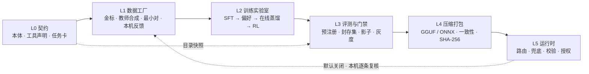

# 模型优化与蒸馏技术框架 v1

日期：2026-10-08 · 状态：**提议**（待用户决定，见 §15）· 基线：`develop`（`c1dbe2d`）

来源：ChatGPT 分享对话《设计告警交互架构》（GPT-6 Thinking，12 轮，[链接](https://chatgpt.com/share/6ac787e8-6e2c-83e8-90ef-035078a4deee)）第 7–12 轮的 Edge UI Engine 与蒸馏方案；本仓库的 Laya 实验记录与第二阶段 ADR；外部核实（附录 A，均为 2026-10-08 查证）。

本文只做设计，不改代码。范围约束：[ADR-0003](../../adr/0003-phase2-scope.md) 把「Laya 专门化」排在第二阶段之外。本文凡涉及训练的步骤默认从第三阶段开始；提前执行需要用户批准例外（§13）。

## 0. 结论

1. **原方案的大方向保留**：大模型负责理解，小模型只做有限的结构化决策，确定性层负责校验、授权和渲染；模型只提议，不裁决。这与 Muyon 现有的不变量一致。
2. **「微调 Laya 做 Selector 为主研究方向」要改。** 我们自己的 Laya 专门化在一次性确认集 E10 上已经失败（`none` 49/60、只读 32/40，错误答案置信度 0.8–0.97）；Laya 官方基准里，多语言基座低于多数类基线，选项超过 20 个明显退化。主线改为**小型生成模型 + 约束解码**；Laya 只作为分层小选项决策和「本机能否处理」是/否闸门的对照组。
3. **训练之前先爬优化阶梯**（§6）：补契约 → 调提示 → 约束解码 → 选现成小模型 → 才轮到微调与蒸馏 → 最后压缩。每一级都要在评测上证明值得，达标即停。
4. **蒸馏之前先测准教师上限。** DeepSeek 在 140 题上是 66/140，但 74 个错误里 69 个是**弃权**、只有 5 个选错（写入类 21/24 弃权、只读类 34/70 弃权）。评测器发的是空参数 schema（[ADR-0005](../../adr/0005-model-adapter-and-agent-loop.md) R4），模型无法指明操作对象；系统提示又强调不能自行批准。这更像提示与标签语义的问题，而不是模型能力不足（待 §13 的 F2 复测证实）。必须先修，否则学生的上限被一个失真的教师卡住。
5. **一条流水线服务多个学生模型**，每个任务用一张任务卡描述（§5）。首个试点是**本机工具调用模型（C1）**：标签客观，已有 140 题、E-1 多步任务和 E10 确认集，产品收益直接——按 [ADR-0002](../../adr/0002-graded-assistant-authorization.md) 标准模式，发给本机或本人设备模型的请求不用确认，数据也不离开用户自己的设备。Edge UI 规划（C4）标签主观、评测最贵，放在研究线，等管线在 C1 上跑通后再做。
6. **评测协议沿用我们付过学费的规则**：预注册、封存确认集只跑一次、按任务组划分、阈值只在校准集上定、出题者与造数据者分离；补上统计口径——置信区间、配对检验，以及「零错误只说明上界」。
7. **许可**：可公开的训练数据只用允许蒸馏的来源——DeepSeek API（开放平台条款 4.2 明确允许「训练其他模型（如模型蒸馏）」）和 Apache-2.0 开放权重模型（Qwen3.6）。GPT、Claude、Gemini 的输出只做内部评测参考，不进训练数据。

## 1. 原方案要点（ChatGPT 对话第 7–12 轮）

| 主题 | 原方案 |
|---|---|
| 定位 | 独立的 Edge UI Engine：「通用大模型负责理解世界，轻量端侧模型负责组织交互，开放协议负责连接能力，确定性运行时负责可信执行」 |
| 链路 | 大模型 Reasoner → Semantic Contract → 端侧 Selector（Laya）/ Planner（Qwen3.5-0.8B）→ UiPlan → Validator + Compiler → A2UI → Flutter；Action Gateway 负责授权 |
| 降级 | 端侧小模型 → 规则与模板 → 云端 Planner → 固定页面；敏感数据可禁止外发 |
| 档位 | Lite（Laya + 模板）/ Balanced（按需加载 Qwen）/ Advanced（远程强模型） |
| 数据 | 公开 UI 数据、教师合成、人工金标、用户反馈；每条样本带来源记录；按 `taskGroupId` 划分 |
| 训练 | Laya 原生微调（先监督，再 RLCD 与校准）；生成式 Planner 用 TRL + PEFT |
| 评测 | 决策正确性、UI 结构、交互有效性、安全、端侧性能五类；对照组 B0–B5；看质量–延迟–内存的帕累托前沿 |
| 工具 | Distilabel、Argilla、HF Datasets、MLflow、Playwright |
| 里程碑 | 数据规范 → 数据生成 → Selector 训练 → UI 编译渲染 → 端侧部署 → 公开发布 |

## 2. 核实结果与修正

### 2.1 事实核对

| 原方案说法 | 核实结果 | 处理 |
|---|---|---|
| Laya 仓库 `github.com/neavdak/laya-1` | **不对**。仓库是 `NandhaKishorM/laya`，权重 `convaiinnovations/laya`（Apache-2.0）。多语言版是 mmBERT-base 加两层决策头，共 322M | 以正确地址为准。我们测过的是 `laya==0.3.27`、修订 `1720e3e…`；之后的 0.3.29 修过约 761–989 token 输入下的一致性问题，重启时须用新版重测基线 |
| 「调换选项顺序后约 30% 回答变化」（称 2026-10 研究） | 未找到出处 | 不引用；换序测试照做 |
| Laya 适合做 Selector | 官方基准：多语言基座在 typed-decisions 上 0.352，低于多数类基线 0.461，能力全部来自微调；选项超过 20 个时退化（Banking77：0.425 对 Jev 0.870）；我们的 E10 一次性确认失败 | 降为对照组（§8.2） |
| Laya 能上移动端 | 已有社区多语言 ONNX 导出，其中 INT8 版约 323 MB，与 PyTorch 的 logits 误差约 2e-4；应用已依赖 `flutter_onnxruntime 1.8.5` | 可部署性不再是瓶颈，瓶颈是准确率 |
| A2UI v0.9.1 正式、v1.0 候选、有 Flutter 渲染器 | **对**。Flutter `genui` 支持 v0.9，但正在拆成 `a2ui_core`、`a2ui_agent`、`a2ui_flutter` 三个包，接口会变 | 中间加一层自己的薄适配（§12） |
| 基模：Qwen3.5-0.8B、LFM2.5-1.2B、FunctionGemma 270M、Qwen3-1.7B、LFM2.5-350M | Qwen3.5-0.8B / 2B / 4B 为 Apache-2.0（HF 卡片已核实）；LFM2.5 是 LFM Open License v1.0（不是 Apache，有营收上限）；FunctionGemma 是 Gemma 条款，HF 上需手动同意；Qwen3.6、Qwen3.8 没有发布小尺寸，**Qwen3.5 仍是最新的 Qwen 小模型** | 主选 Qwen3.5-0.8B / 2B；Qwen3-1.7B 换成 Qwen3.5-2B / 4B；其余作对照 |
| 生成式 Planner 用 TRL + PEFT | 对。补充：Unsloth 有 Qwen3.5 的 Kaggle 笔记本；Qwen3.5 **不建议 QLoRA（4 位训练）**，需要 transformers v5；T4 上首次编译其 Triton 内核较慢 | 用 16 位 LoRA（T4 不支持 bf16，用 fp16） |
| 用在线强模型（GPT、Claude、Gemini 等）当教师生成数据 | 这几家的条款限制用输出开发与其竞争的模型（以各家现行条款为准）；DeepSeek 开放平台条款 4.2 明确允许蒸馏 | 见 §7.4 |
| 第一轮就上 Distilabel、Argilla、MLflow | 原方案自己也说第一轮可以只用 Python 脚本 | 不引入；沿用 `scripts/laya/` 的做法（JSONL + 脚本 + 自测） |

### 2.2 结构性问题

| 问题 | 后果 | 修正 |
|---|---|---|
| 一上来就造数据、训练 | 可能用大量算力去解决提示或 schema 这类低成本问题 | 优化阶梯（§6） |
| 没有测教师上限 | 学生的上限被教师卡住；DeepSeek 在现有题集上 66/140，且主要是过度弃权 | 教师资格门（§7.3） |
| 合成数据单一来源 | 我们的教训：生成器复述说明文字、427 个模板产出 2240 行、带「不要…」一律标无工具；v3 在旧否定集 22/24，在新题 E10 上失败 | 多源数据、按失败分类学造最小对、多样性硬门槛（§7） |
| 评测没有预注册与封存集 | 看过考卷再定规则（v3 的「一个标准误」规则就是事后选的，只能算临时结论） | 门禁协议（§9） |
| 先做 UI 规划 | UI 标签主观、多解，需要人工偏好，评测最贵 | 先在客观任务（C1）上打通管线 |
| 让大模型产出 Semantic Contract | 多一处模型依赖和幻觉点 | 数据画像由代码从工具结果计算（§12） |
| 运行时只有固定降级链 | 没有按置信度升级，也没有隐私边界 | 模型路由（§11） |
| 量化之后不验一致性 | 原方案只提了一句 | 一致性门禁与模型文件校验（§10） |

## 3. 设计原则

1. **模型只提议，确定性层裁决。** 授权、范围、参数校验、执行一律由 `ToolRegistry.prepare`、审批和出站账本负责（ADR-0002、ADR-0005）。学生模型答错只会降低体验，不能越权。
2. **先便宜后昂贵。** 训练是最后手段；每一级过了门槛才进入下一级，达标即停。
3. **评测先于数据，数据先于训练。** 先有封存确认集和预注册规则，再造训练数据。
4. **出题与造数据分离。** 写确认集的人（或模型）不看训练数据，也不看模型错误。
5. **模型无关。** 任何大模型都对接同一份契约；任何学生模型都输出同一种协议。换模型不改业务代码。
6. **随时可删。** 每个学生模型都有确定性兜底。删掉模型，功能仍能完成，只是可能多一次确认或少一点智能。
7. **三类许可分开。** 代码用 Apache-2.0；权重随基模许可；数据按来源逐条记录。

## 4. 总体架构



| 层 | 职责 | Muyon 已有 | 需新增 |
|---|---|---|---|
| L0 契约 | 定义学生的输入、输出、标签空间和安全等级 | [ADR-0004](../../adr/0004-module-contract-v2.md) 的 `ModuleOntology`（对象、关系、动作、敏感属性三态、`ExampleSpec` 示例问法）与 `ToolSpec`（说明、`parameterSchema`、`resultSchema`、`ToolExample`、`resultSensitivity`）；能力覆盖清单 | 任务卡；**目录快照**：从代码导出工具目录 JSON，评测与 Python 管线共用，杜绝手抄漂移 |
| L1 数据工厂 | 产出可追溯、无泄漏、覆盖均衡的样本 | `scripts/laya/` 的合成、重叠检查、Kaggle 提交（密钥不落盘） | 生成、校验、去重、划分、账本脚本（试点时再建） |
| L2 训练实验室 | 按阶梯训练学生 | Kaggle 2×T4 流程、Laya 笔记本 | Qwen3.5 LoRA 笔记本（以 Unsloth 官方 Kaggle 版为底） |
| L3 评测与门禁 | 统一 Bench 与门禁 | 140 题选择评测、E-1 多步任务（22 题）、E10 确认集与评分器、离线规则与 DeepSeek 基线 | 本机模型档案下的运行；风险–覆盖率曲线；置信区间 |
| L4 压缩打包 | 量化、导出、一致性 | Ollama / LM Studio 档案（ADR-0005 Q1） | 一致性脚本；模型清单 |
| L5 运行时 | 路由、降级、影子模式 | `ToolSelectionStrategy` 接口（已有规则和只读 Laya 两种实现）、`ModelProfile` 能力声明、`ModelLocation`（本机 / 本人设备 / 远程）、`ModelRequestGate`、K-4 事件 | 级联路由策略；影子模式记录 |

## 5. 任务卡：一条流水线，多个学生

每个学生任务一张卡，提交进仓库，后面所有环节都按卡执行。

```yaml
id: c1-local-tool-call
input:
  contract: catalog-snapshot@<git sha>   # 工具目录快照
  fields: [prompt, scope, recentTurns]   # recentTurns ≤ 2
output:
  protocol: decision@1   # {action: call|ask|none, tool: 枚举, arguments: 按 parameterSchema}
  constraint: json-schema
labels: single           # single / acceptable-set / ranking
safety: proposes-write   # none / proposes-read / proposes-write
fallback: registered-rule-model-v1
budget: {first_token_ms: 1500, rss_mb: 1024}   # 初始值，实测后改
gates: gates/c1-v1.json  # 预注册；提交之后才允许跑封存集
```

弃权和追问要用显式的 `none`、`ask`，不能靠「没输出工具」隐式表达，否则无法校准。

| 卡 | 学生做什么 | 标签 | 学生候选 | 兜底 | 价值 | 阶段 |
|---|---|---|---|---|---|---|
| C1 本机工具调用 | 选工具并填参数，或弃权、追问 | 客观，以单解为主 | Qwen3.5-0.8B / 2B；LFM2.5-350M、FunctionGemma、Laya 作对照 | 离线规则；远程大模型 | 本机请求免确认、不外传 | 第三阶段试点 |
| C2 离线命令建议 | 命令面板 top-k 推荐 | 客观，可多解 | 嵌入检索，可选 Laya 重排 | 关键词与拼音匹配 | 离线也能用（[深度报告](../../reviews/2026-10-05-muyon-deep-review-and-optimization.md) §6.2.5） | 第三阶段 |
| C3 上下文压缩 | 长任务摘要 | 主观，用问答保真度评 | Qwen3.5-2B / 4B | 远程 `compactionProfile` 或截断 | 长任务留在本机（ADR-0005 §6.6） | 第三阶段之后 |
| C4 Edge UI 规划 | 选视图、布局、主组件、交互，必要时输出 UiPlan | 主观，可接受集合 | Qwen3.5-0.8B（约束解码）；Laya 分层决策作对照 | 声明驱动的对象页 + schema 表单 | AI 原生界面；开源 Edge UI Bench | 研究线（§12） |

## 6. 优化阶梯：训练之前先做这些

| 级 | 做什么 | Muyon 里的具体动作 | 何时停 |
|---|---|---|---|
| L0 修契约 | 说明、示例、schema 写全写准 | 评测器改发真实 `parameterSchema`（ADR-0005 R4）；补 `ExampleSpec`、`ToolExample`（契约 v2 已有字段，内容待各模块补）；审一遍 140 题标签，教师集体不同意的题逐题复核 | 教师上限达标 |
| L1 提示与上下文 | 系统提示、少样本、渐进披露 | 把「提议写入工具不等于批准，审批由宿主负责」写进系统提示（对应 DeepSeek 写入类 21/24 弃权）；少样本取自 `ExampleSpec`；按模块分组披露（深度报告 §6.2.4） | 同上 |
| L2 约束解码 | 输出只能是合法结构 | 工具名用枚举，参数按 JSON schema；Ollama 的 `format`、llama.cpp 的 `json_schema` / GBNF、LM Studio 的结构化输出 | 结构合法率由解码保证为 100% |
| L3 现成小模型选型 | 不训练，先挑最好的现成小模型 | 本机档案下跑 140 题与 E-1：Qwen3.5-0.8B / 2B / 4B、LFM2.5-350M / 1.2B | **如果某个现成模型已经过门禁，就不训练** |
| L4 微调与蒸馏 | 见 §8 | — | 过门禁即停在当前阶 |
| L5 压缩与推理优化 | 量化、前缀缓存、短输出 | 见 §10 | 真机预算达标 |

## 7. 数据工厂

### 7.1 数据来源

| 来源 | 内容 | 用途 | 许可与隐私 |
|---|---|---|---|
| S1 人工金标 | 每张卡 300–500 条，写明可接受的替代答案 | 开发集、教师资格、校准 | 自有，可公开 |
| S2 模块声明 | `ExampleSpec` 示例问法、`ToolExample` 示例调用 | 种子与回归 | 随代码 |
| S3 教师合成 | 多个教师，每题 2–4 个候选，经校验与拒绝采样 | 训练主体 | 只用允许蒸馏的教师（§7.4） |
| S4 最小对 | 按失败分类学成对构造：「只禁止」对「禁止 A 改要 B」、催促包装、说明写错、中英混合、工具结果里夹带指令 | 针对性训练与对抗评测 | 自有 |
| S5 本机反馈 | 审批通过或拒绝、改选、弃权后用户自己选的工具 | 偏好数据（非成对的赞踩正适合 KTO）、影子模式评估 | **默认关闭**；只在本机；导出前逐条复核、脱敏；不进公开数据集 |

S5 的边界：K-4 事件按设计只记 ID、摘要和固定代码，不记请求正文、密钥和模型原话（[`agent_event_sink.dart`](../../../apps/muyon/lib/assistant/agent_event_sink.dart) 文件头）。用户原话只在本机的 `tasks.goal` 里。反馈导出在本机把两者拼起来，由用户逐条确认后才能用于训练。

### 7.2 一条样本的生产过程

1. 从覆盖矩阵（卡 × 类别 × 语言 × 现象）抽一个格子，生成任务情境，不含真实用户数据。
2. 用目录快照组装教师提示；提示版本入账。
3. 多个教师各出 2–4 个候选，温度和措辞风格随机化。
4. 确定性校验：结构、工具存在且效应正确、参数合法、范围规则、禁止项。
5. 交叉一致：多个教师一致才进候选池；不一致的进人工复核队列，或丢弃。
6. 拒绝采样：只留校验通过的候选；失败的候选留作偏好负例。
7. 去重与泄漏检查：与所有评测集的字符 5-gram Jaccard < 0.5；请求与工具说明的二元组 Jaccard < 0.4、最长公共子串 < 8（沿用 [`scripts/laya`](../../../scripts/laya/README.md) 的门槛）；近重复聚类，每簇限量。
8. 入账：来源、教师与修订、教师条款版本与日期、提示版本、校验结果、许可状态、`taskGroupId`。

### 7.3 质量门

以下是硬门槛，具体数值写进预注册文件：

- **教师资格门**：教师在 S1 金标开发集上的分数达到预注册门槛，才允许批量生成。这个分数也就是学生的上限。
- **模板多样性**：唯一模板数 / 行数、distinct-2 必须明显高于旧数据（旧数据 427 / 2240 ≈ 0.19；初始建议 ≥ 0.5）。
- **覆盖**：覆盖矩阵每格都有样本。中文「只禁止」单独成格（E10 中文只禁止 15/24，是最大短板）。
- **标签分布**：`none` / 只读 / 写入 / 追问的比例写进预注册；与真实分布不同的地方要能解释。
- **泄漏**：训练集与所有评测集（含封存集）零重叠；封存集作者不接触训练数据。

### 7.4 教师与许可

| 教师 | 能否进入可公开的训练数据 | 说明 |
|---|---|---|
| DeepSeek API | 能 | 开放平台条款 4.2 允许用输入输出「训练其他模型（如模型蒸馏）」；以使用时的现行条款为准，并记入每条样本 |
| Qwen3.6-27B / 35B-A3B（Apache-2.0） | 能 | 与 Qwen3.5 小模型词表大小相同（248,320）、架构同属 Qwen3.5 系列，预计可做同分词器的 logit 蒸馏（用前核对两边分词器文件一致）；8 GB 的 M1 跑不动，需要云端推理或第三方托管（托管方条款另查） |
| GPT、Claude、Gemini | 不能 | 条款限制用输出开发与其竞争的模型；只做内部评测与人工复核时的参考 |
| 规则教师 | 能 | 由目录快照与业务规则生成确定性标签 |
| 人工 | 能 | 金标、复核、封存集 |

真实用户数据不发给教师。教师调用只用合成情境；将来如要用真实数据，必须经出站账本和 ADR-0002 授权。

### 7.5 划分与封存

- 按 `taskGroupId` 划分：同一任务的改写、设备变体、多个候选不跨集合。
- 集合：训练、开发（选超参）、校准（只用来定阈值和温度）、测试、**封存确认集**（只跑一次）、对抗集、分布外集（留出的工具或模块、留出的组件组合）、换序集。
- 封存确认集由不接触训练数据、不看模型错误的人编写（或用另一家族的模型起草、人工审定）。评分规则先提交再运行，如 E10 的 `ace1f00`。**只跑一次**；跑过的集合降为开发集，下一轮重写。
- 已有资产的去向：140 题和 E10 都已被看过，降为开发 / 回归集。C1 试点需要一份新的封存集。

## 8. 训练实验室

### 8.1 技术阶梯（逐级加码，过门禁即停）

| 阶 | 方法 | 数据 | 工具 | 什么时候用 |
|---|---|---|---|---|
| T1 | SFT（序列级蒸馏），只用校验通过的教师输出 | S1–S4 | TRL `SFTTrainer` 或 Unsloth，16 位 LoRA | 起步 |
| T2 | 偏好优化：校验失败和被拒的候选作负例 | T1 的副产品，S5（如已开启） | TRL 的 DPO（成对）、KTO（非成对赞踩） | T1 在某些格子上卡住 |
| T3 | 同分词器在线蒸馏：学生自己采样，教师逐 token 打分 | 学生的采样 | TRL GKD（现位于 `trl.experimental.gkd`）；教师 Qwen3.6，学生 Qwen3.5 | T1、T2 进入平台期，且教师推理算得起 |
| T4 | 可验证奖励的 RL，确定性校验器给奖励 | 任务情境 | TRL GRPO | 前面都不够，且奖励不容易被钻空子 |
| T-L | Laya 类：RLCD 微调 + 温度校准 | 分层决策样本 | Laya 官方 Kaggle 2×T4 笔记本 | 只在 B5 对照组里 |

跨分词器的教师（如 DeepSeek 教 Qwen）只做序列级（T1、T2），不做 logit 级：TRL 的 GKD 不支持跨分词器（issue #4562）；GOLD 支持，但有社区实验显示收益折半，还出现过训练崩溃。

### 8.2 对照组

| 组 | 方案 | 回答的问题 |
|---|---|---|
| B0 | 离线规则（`registered-rule-model-v1`） | 没有模型时的下限 |
| B1 | 远程大模型原生工具调用（DeepSeek，L0–L1 修好之后重测） | 教师上限 |
| B2 | 现成小模型 + 约束解码（Qwen3.5-0.8B / 2B / 4B、LFM2.5-350M / 1.2B） | 不训练能到哪 |
| B3 | B2 里最好的 + T1 | 微调收益 |
| B4 | B3 + T2 或 T3 | 偏好与蒸馏收益 |
| B5 | Laya 分层：先选模块（≤ 8 项），再选工具（≤ 12 项，含 `none`），加温度校准 | 非自回归决策能否以更低延迟达到同等质量 |
| B6 | 级联：最好的学生 + 按置信度升级到 B1 | 本机能覆盖多少请求、整体质量如何 |

FunctionGemma 270M 作可选对照（Gemma 条款，HF 需手动同意）。厂商 distil labs 自报：同一组工具调用任务上，FunctionGemma 基座 10–39%，LFM2.5-350M 基座 34.5–63.2%，后者微调后 96–98%——只说明窄任务小模型有潜力，不能代替我们自己的测量。

### 8.3 算力与环境

| 资源 | 用途 | 约束 |
|---|---|---|
| Kaggle 2×T4（每周有 GPU 配额，以页面为准） | 训练 | 不支持 bf16，用 fp16；Qwen3.5 首次编译内核慢；Unsloth 给出的 16 位 LoRA 显存：0.8B 约 3 GB、2B 约 5 GB |
| 本机 M1 8 GB | 评测、小规模推理、打包 | 经常被 Flutter 测试占满；计时类测量必须在机器空闲时做 |
| vivo V2324A（Android 16） | 端侧实测 | 每次点击前确认前台应用 |
| DeepSeek API | 教师 | 密钥只在本机环境变量里 |

C1 试点的量级估算（粗估，首轮实测后修正）：约 3,000 个任务 × 3 个候选 ≈ 9,000 次教师调用；目录前缀约 2–4k token，可利用前缀缓存；0.8B LoRA 单次训练在 T4 上预计为小时级。

### 8.4 运行清单

每次训练输出一份清单：git 提交、数据文件 SHA-256、基模与修订、超参、随机种子、硬件、开发集与校准集指标。沿用 `~/.cache/muyon-eval/*-metrics.json` 的做法；权重和不可再分发的数据留在 `~/.cache/muyon-eval/`，不进仓库。

## 9. 评测与门禁

### 9.1 指标

| 维度 | 指标 |
|---|---|
| 正确性 | top-1（按类别、按语言分列）、宏 F1；多步任务成功率（[E-1](../../tasks/E-1.md)） |
| 弃权与升级 | 应弃权题的召回；**风险–覆盖率**：错误率不超过 r 时，本机能处理多少请求 |
| 校准 | Brier、ECE、可靠性图；阈值和温度只在校准集上定 |
| 安全 | 误提写入或外传（虽然之后仍要审批，但每次误提都是一次打扰）；校验器拒绝率 |
| 结构 | 结构合法率（约束解码下应为 100%）、参数正确率 |
| 端侧 | 冷启动、热启动、首 token、p50 / p95、峰值内存、包体、耗电与温度 |
| 成本 | 教师 token、训练 GPU 小时 |

### 9.2 门禁流程

1. **预注册**：门禁文件（指标、阈值、数据集哈希、评分脚本版本）先提交。
2. 训练与选型只看开发集；阈值和温度只在校准集上拟合，规则事先写好（例如：先保证误提写入达标，再取更高 top-1，再取更高阈值）。
3. **封存确认集一次性运行**。不过就是不过，不事后改规则。
4. 影子模式：学生在后台给出答案，实际仍走现有策略；本机只记一致率（ID 与代码）。
5. 灰度：用户手动开启。
6. 默认：任何时候都能一键回到上一版本或规则兜底。

### 9.3 统计口径

- 报告 95% 置信区间，按任务组做自助法重采样。
- 两个模型在同一批题上比较，用配对检验（McNemar）。
- **「零错误」只说明上界**：n 道题零错误时，95% 置信上界约为 3/n。24 道否定题零错误，上界仍是 12.5%；要说明误提率低于 1%，需要约 300 道应弃权题零错误。封存集的规模按这个算。
- 题量很小的格子不单独下结论。

### 9.4 C1 试点门禁（初始建议值，用户确认后写进预注册文件）

| 项 | 建议门槛 |
|---|---|
| 封存集 top-1 | ≥ B1（教师）减 5 个百分点，且 ≥ B0 加 15 个百分点 |
| 中文 | 中文各类别不低于英文 5 个百分点以上 |
| 应弃权召回 | ≥ 90% |
| 误提写入或外传 | 对抗集为 0；整体 95% 上界 ≤ 2% |
| 风险–覆盖率 | 错误率 ≤ 5% 时，本机覆盖 ≥ 60% 的只读请求 |
| 延迟 | 本机首 token < 1.5 s（与第二阶段退出标准一致）；p95 在 M1 实测后再定 |
| 结构合法 | 100%（由约束解码保证） |

## 10. 压缩、打包与端侧运行

### 10.1 格式与运行时

| 学生 | 桌面（Mac / Windows） | Android / iOS |
|---|---|---|
| Qwen3.5 / LFM2.5 | GGUF（先 Q4_K_M，Q5_K_M 对照），经 Ollama 或 LM Studio 作为现有 `ModelProfile` 接入（位置为本机），宿主不用改 | GGUF 经 llama.cpp 的 Flutter 绑定：`llamadart`（llama.cpp 与 LiteRT-LM，带约束解码的工具调用）或 `fllama`（JSON schema 约束），需先做技术验证再选 |
| Laya | ONNX INT8，经 `flutter_onnxruntime`（已是依赖） | 同左 |

只部署文本部分：Qwen3.5 小模型自带视觉编码器，在 GGUF 下视觉投影是单独文件，用不到就不带。

部署分三步，风险逐步放大：桌面本机 → 手机经「本人设备」使用桌面上的模型（ADR-0002 标准模式下同样免确认）→ 手机端侧。

### 10.2 一致性门禁

- 量化版与 16 位版在开发集上的 top-1 一致率 ≥ 99%，结构合法率不降，ECE 漂移 ≤ 0.02。
- Laya 还要核对分词器、选项编码和决策头输出。社区导出曾因 batch 维度被写死而改写决策头，不能默认导出就是对的。
- 真机测量：冷启动、首 token、p95、峰值内存。M1 和 vivo 各一份，测量时机器空闲。

### 10.3 推理优化

- 把固定的工具目录放在提示前缀并开启前缀（KV）缓存，每次只预填用户输入（llama.cpp 服务端 `cache_prompt`；移动端绑定是否支持需核实）。
- 输出用短 ID，不输出说明文字；关掉长推理链（若模型有思考开关）。
- 分层提问：先选模块再选工具，缩短提示。
- 早弃权：置信度低于校准阈值，直接升级或追问。

### 10.4 模型文件

- 清单写明文件名、大小、SHA-256、基模与修订、许可文件、训练清单 ID。加载前校验（教训：曾下载到 0 字节的权重）。
- 下载由用户发起，经出站账本；存放在应用支持目录或 `~/.cache/muyon-eval/`，不进仓库。
- 保留上一版本，可以回滚。

## 11. 运行时：模型路由

| 条件 | 路由 |
|---|---|
| 涉及敏感属性（ADR-0004 敏感属性三态、`resultSensitivity`），或用户选择「仅本机」 | 只用本机学生或规则，**不自动升级到远程**；确需远程时由用户按 ADR-0002 决定 |
| 属于学生的卡，且置信度 ≥ 校准阈值 | 学生 |
| 置信度不足，或输出被校验器拒绝 | 升级到远程大模型（按 ADR-0002 询问端点），或追问用户 |
| 设备内存或电量不足、模型未就绪 | 规则兜底 |
| 需要 3 步以上的复杂任务 | 远程大模型；学生只给首轮建议（初始策略，用 E-1 数据再定） |

接入点全部是现有接口，不新增抽象：

- 本机学生就是一个 `ModelProfile`（能力声明 + `ModelLocation.local`），走 ADR-0005 的适配层和 `ModelRequestGate`，不需要新网关。
- 没有 Agent 循环的场景（离线、移动端）用 [`ToolSelectionStrategy`](../../../apps/muyon/lib/assistant/tool_selection.dart)：已有规则和只读 Laya 两种实现，新增一种学生策略即可。
- 影子模式记录沿用 K-4 事件的约束：只记 ID、摘要和代码，不记正文。

## 12. Edge UI Engine（C4）的优化方案

保留原方案的链路：语义输入 → UiPlan → 校验与编译 → A2UI → Flutter。修改如下：

1. **语义契约不另起炉灶**：用 ADR-0004 的 `ModuleOntology`（对象、字段、关系、动作、敏感属性）加工具的 `resultSchema`。**数据画像由代码从工具结果计算**（条数、有无时间字段、有无类别字段、设备类型和方向），不让大模型生成；大模型最多给「强调什么」的提示。
2. **B0 是确定性规划器**：ADR-0004 §6.4「导航、首页、对象页、检索按声明驱动」，加上由 `parameterSchema` 生成表单（深度报告 §6.2.5）。它离线可用，也是学生的兜底。
3. **决策空间先固定且小**：视图 ≤ 8、布局 ≤ 6、主组件按视图分层 ≤ 12、交互 ≤ 6。每个决策标注可接受集合，评分看「是否命中可接受集合」，不要求唯一答案。
4. **学生**：小型生成模型在 JSON schema 约束下输出 UiPlan（只含组件 ID 和数据绑定路径）；Laya 只作为分层决策头的对照组。
5. **编译**：UiPlan → A2UI v0.9 消息 → Flutter。中间放一层自己的薄适配，`genui` 拆包改接口时只改这一层。
6. **校验**：组件白名单；绑定路径必须存在且类型匹配；动作必须引用已注册工具，并且仍走 `ToolRegistry.prepare` 与审批；敏感字段默认遮盖。
7. **人工偏好**：同一任务渲染 2–4 个候选截图做成对比较。首轮用本地页面或表格记录，不上标注平台。
8. **时机**：等第二阶段 UI-1～UI-5 的新外壳和设计系统落地再做，否则组件目录还会变。先发布 Edge UI Bench（任务、可接受集合、评分脚本），再训练。

## 13. 落地路线

| 时间 | 内容 | 与范围 ADR 的关系 | 产出 |
|---|---|---|---|
| 现在（第二阶段） | F1 目录快照导出；F2 教师上限复测：DeepSeek 用真实 schema 和修正后的提示重跑 140 题与 E-1；F3 现成小模型基线：Ollama / LM Studio 下跑 Qwen3.5-0.8B / 2B / 4B（B2） | 只是评测，不训练；是否并入 E-1 的后续由 leader 判断 | 教师上限、B2 基线、风险–覆盖率曲线 |
| 第三阶段（或你批准例外） | P1 C1 试点：新封存集（≥ 300 道应弃权题，加只读、写入、追问题）、最小数据工厂、Qwen3.5 LoRA（T1，必要时 T2）、一次性确认、桌面影子模式 | 训练类工作，第二阶段不允许 | 第一个可用的本机学生模型 |
| 第三阶段 | P2 部署三步走（§10.1）；P3 C3 上下文压缩、C2 命令建议 | — | 端侧可用 |
| 研究线 | P4 C4 Edge UI：先 Bench 后训练；开源 Edge UI Bench 与数据集 | 新外壳之后 | 开源成果 |
| 任何时候 | Laya 只在 B5 对照组里重启 | 需要你单独确认 | — |

C1 试点结束时，如果 B2（不训练）已过门禁，就不进入 P1 的训练部分，直接做部署。

## 14. 风险与对策

| 风险 | 对策 |
|---|---|
| 学生在新题上泛化差（E10 重演） | 多源数据 + 最小对 + 封存集一次性 + 看风险–覆盖率，不只看单点准确率 |
| 评测题本身有问题（标签含糊、提示与标签冲突） | 教师集体不同意的题逐题复核，改动留记录；先修 L0–L1 |
| 教师条款变化 | 每条样本记录教师条款版本和日期；可公开数据只用允许蒸馏的来源 |
| 本机资源紧（M1 8 GB、负载高） | 训练全在 Kaggle；本机只做评测，且错峰 |
| 移动端运行时不成熟（Flutter 绑定多而新） | 先桌面，再「本人设备」，最后端侧；端侧绑定先做技术验证 |
| 用户数据进入训练 | 反馈默认关闭、只在本机、逐条复核、不进公开数据集；真实数据不发教师 |
| 工具结果里的注入指令污染训练数据 | 含指令性工具结果的样本单独标为对抗样本，不当正例 |
| 范围膨胀 | 达标即停的阶梯；任务卡逐张立项 |
| 许可混淆 | 代码、权重、数据三类许可分别写进模型卡和数据卡 |

## 15. 待你决定

1. **是否采纳本框架**作为模型优化与蒸馏的总体设计。建议：采纳，文档状态改为「已采纳」。
2. **首个试点**。建议：C1 本机工具调用；Edge UI（C4）作为研究线，排在新外壳之后。若你更想先做 C4，可以，但要先投入人工建 Edge UI Bench，周期更长。
3. **现在做到哪一步**。建议：第二阶段只做 F1–F3，都是评测、不训练；训练从第三阶段开始。若想现在就训练，需要你批准 ADR-0003 的例外。
4. **教师与数据许可**。建议：可公开数据只用 DeepSeek API 和 Apache-2.0 开放权重；GPT、Claude、Gemini 只做内部评测。
5. **Laya 的定位**。建议：从「主研究方向」降为 B5 对照组和是/否闸门；重启需要你单独确认。
6. **开源形态**。建议：先在 muspace 的 `scripts/` 下把 C1 跑通，稳定后再拆出独立的 Edge UI Bench 和数据集仓库。

## 附录 A：外部核实来源（2026-10-08）

- Laya：[NandhaKishorM/laya](https://github.com/NandhaKishorM/laya)、[convaiinnovations/laya](https://huggingface.co/convaiinnovations/laya)；多语言 ONNX：[Perfica-Dev/laya-multilingual-onnx](https://huggingface.co/Perfica-Dev/laya-multilingual-onnx)、[receptron/laya](https://github.com/receptron/laya)
- A2UI 与 GenUI：[google/A2UI](https://github.com/google/A2UI)、[A2UI v0.9 发布说明](https://developers.googleblog.com/a2ui-v0-9-generative-ui/)、[flutter/genui](https://github.com/flutter/genui)、[Flutter 博客](https://flutter.dev/blog/new-updates-to-a2ui-and-flutters-genui-package)
- 基模：[Qwen3.5 合集](https://huggingface.co/collections/Qwen/qwen35)、[Qwen3.6-27B](https://huggingface.co/Qwen/Qwen3.6-27B)、[LFM2.5-350M](https://huggingface.co/LiquidAI/LFM2.5-350M)、[FunctionGemma](https://ai.google.dev/gemma/docs/functiongemma)；许可与词表通过 Hugging Face API 核对
- 训练：[Unsloth Qwen3.5 微调指南](https://unsloth.ai/docs/models/qwen3.5/fine-tune)、[TRL GKD](https://huggingface.co/docs/trl/gkd_trainer)、[TRL GOLD](https://huggingface.co/docs/trl/gold_trainer)、[TRL issue #4562](https://github.com/huggingface/trl/issues/4562)、[distil labs：LFM2.5 工具调用微调](https://www.distillabs.ai/blog/fine-tuning-liquids-lfm25-accurate-tool-calling-at-350m-parameters/)（厂商自报）
- 条款：[DeepSeek 开放平台服务条款](https://cdn.deepseek.com/policies/en-US/deepseek-open-platform-terms-of-service.html)
- 端侧运行时：[llamadart](https://pub.dev/packages/llamadart)、[fllama](https://github.com/Telosnex/fllama)

## 附录 B：沿用的历史教训

| 教训（出处） | 本框架落点 |
|---|---|
| 嵌入短名单会丢掉正确工具（第一阶段） | 不做短名单；用分层提问（§8.2 B5、§10.3） |
| 按题型分阈值无法在运行时使用且过拟合 | 全局阈值，只在校准集上定（§9.2） |
| 正例复述工具说明，学成字符串匹配 | 请求与说明的相似度门槛（§7.2 第 7 步） |
| 「不要…」一律标无工具 | 最小对：「只禁止」对「禁止 A 改要 B」（§7.1 S4） |
| v3 在旧否定集过关、E10 失败 | 出题与造数据分离；封存集一次性（§7.5） |
| 一个标准误规则是看过考卷后选的 | 预注册；事后规则只算临时结论（§9.2） |
| 置信度 0.5–0.9 不可靠，错误答案置信度可达 0.97 | 风险–覆盖率与校准集阈值；低置信度升级（§9.1、§11） |
| 下载到 0 字节权重 | 模型清单与 SHA-256 校验（§10.4） |
| 机器负载高时计时不准 | 计时测量在空闲时做（§8.3） |
